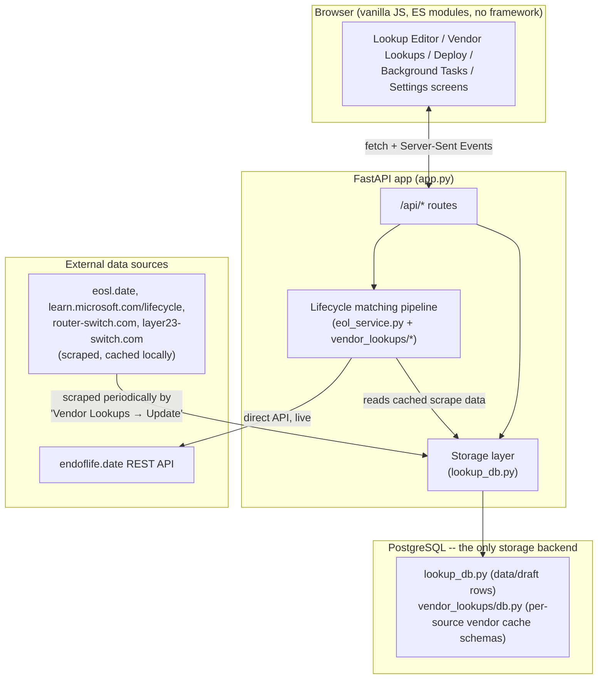
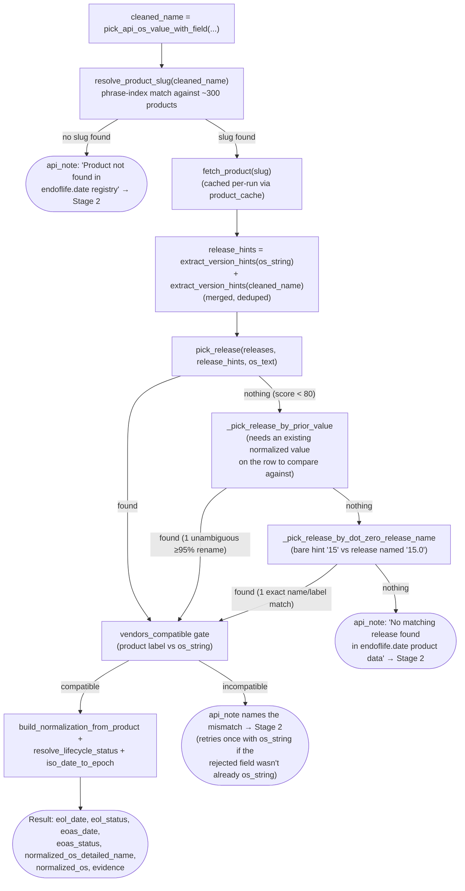
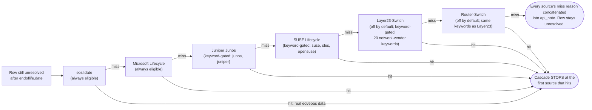
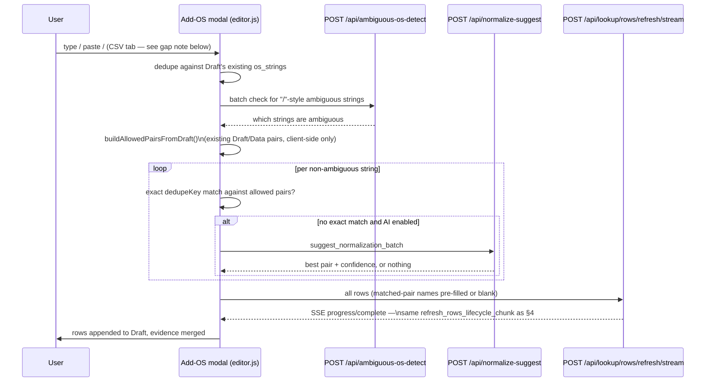
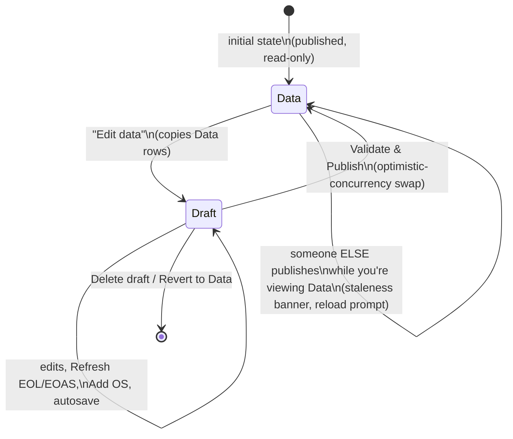
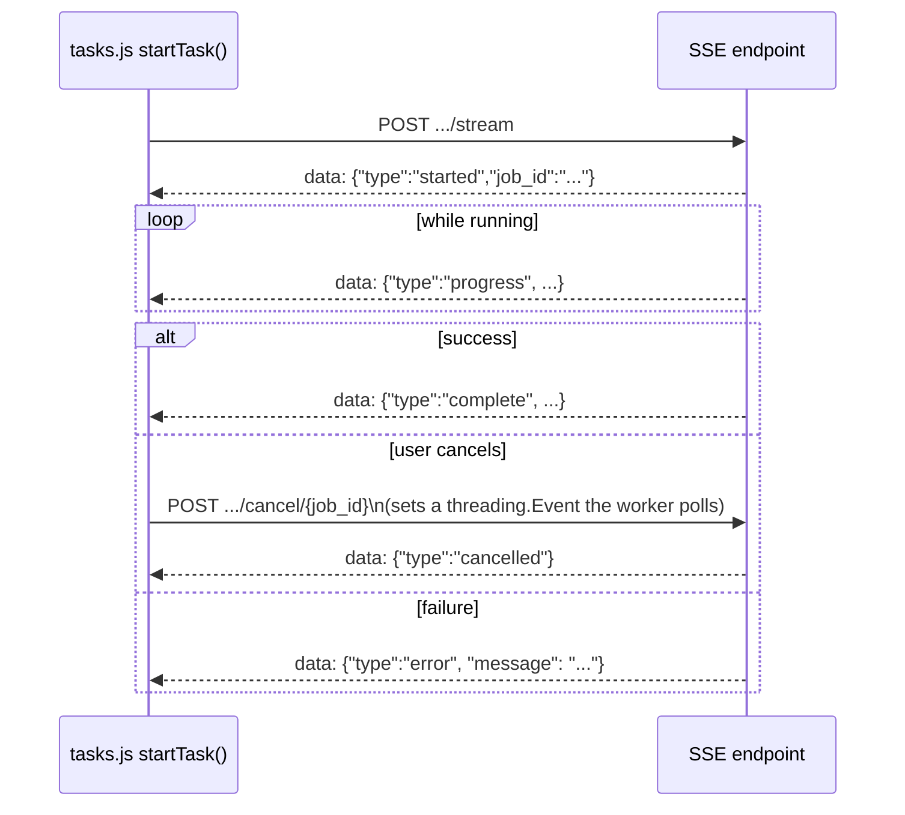

# OS Health Check — Architecture

> **What this document is for.** A complete, technically precise map of how this
> application works end to end — for a new engineer, and equally for an AI
> coding assistant that needs to modify this codebase correctly without
> re-deriving everything from scratch by reading every file. Every claim below
> is backed by an exact `file:line` (or function name) reference into the real
> code, and the core matching pipeline (§4) is walked through with fully
> worked, real examples showing actual intermediate values at each step — not
> just the rules, but a trace of them actually firing.
>
> Companion doc: [MATCHING.md](MATCHING.md) goes even deeper on the
> endoflife.date release-picking algorithm specifically (more edge cases, more
> worked examples) if §4 here isn't enough detail on that one piece.

---

## Table of contents

1. [What this app does](#1-what-this-app-does)
2. [System architecture](#2-system-architecture)
3. [The row: the one data shape everything revolves around](#3-the-row-the-one-data-shape-everything-revolves-around)
4. [The core pipeline: os_string → normalized names + EOL/EOAS](#4-the-core-pipeline-os_string--normalized-names--eoleoas)
5. [Add OS](#5-add-os)
6. [Data / Draft / Publish lifecycle](#6-data--draft--publish-lifecycle)
7. [Storage layer](#7-storage-layer)
8. [Settings](#8-settings)
9. [Background tasks & the SSE streaming pattern](#9-background-tasks--the-sse-streaming-pattern)
10. [Deploy](#10-deploy)
11. [Concurrency & safety mechanisms](#11-concurrency--safety-mechanisms)
12. [Known gaps / discrepancies as of this writing](#12-known-gaps--discrepancies-as-of-this-writing)
13. [File map](#13-file-map)
14. [Glossary of thresholds and constants](#14-glossary-of-thresholds-and-constants)

---

## 1. What this app does

**OS Health Check** ingests a raw inventory of OS strings (e.g. from a CMDB —
`"Red Hat Enterprise Linux release 9.7 (Plow)"`, `"Windows Server 2019
Datacenter"`, `"SUSE Linux Enterprise Server 15 SP7"`) and, for each one,
resolves:

- `normalized_os_detailed_name` — a clean, specific display name (product +
  release, e.g. `"Microsoft Windows 11 24H2 (W)"`)
- `normalized_os` — a coarser version of the same (e.g. `"Microsoft Windows 11
  24H2"`)
- `eol_date` / `eoas_date` — end-of-life / end-of-active-support dates
- `eol_status` / `eoas_status` — `"true"`/`"false"`/`""` when a date isn't
  available but a lifecycle source still gave a definite yes/no answer

Users review and hand-edit the results in a **Draft**, then **publish** it to
become the read-only **Data** that other systems consume (a CSV, or a
Postgres-backed shared table). The app is FastAPI + Jinja2 + vanilla ES-module
JS — no build step, no frontend framework.

---

## 2. System architecture



**Required configuration** — checked once, at process import time, from
environment variables (`app.py`):

```python
if not (
    bool(os.environ.get("DATABASE_URL"))
    and str(os.environ.get("LOOKUP_DB_ENABLED", "")).strip().lower() in ("1", "true", "yes", "on")
):
    raise RuntimeError(...)  # fails loudly -- no file-based fallback exists
```

Both vars are required together — a `DATABASE_URL` set only for vendor
caches (which always use Postgres) is not by itself enough; the app refuses
to start unless `LOOKUP_DB_ENABLED=true` is explicit too. There is no
"file mode" — every data-access function in `app.py` (`load_rows`/
`save_rows`, `load_evidence`/`save_evidence`, etc.) is a thin wrapper around
the matching `lookup_db.db_*(...)` call.

Multiple app instances can point at the **same** shared Postgres database
(e.g. several docker-compose stacks, or several environments) — see
[§11](#11-concurrency--safety-mechanisms) for the cross-instance coordination
this requires and how it's implemented.

**Tech stack**: FastAPI, Pydantic v2, Jinja2 templates, `psycopg`
(`psycopg_pool.ConnectionPool`) for Postgres, `requests`/`curl_cffi` for
external HTTP, `openpyxl` for Excel export, plain `fetch`/SSE + vanilla ES
modules on the frontend (no bundler, no framework).

---

## 3. The row: the one data shape everything revolves around

Every row — in Data, in Draft, in a vendor cache, everywhere — is the same 7
fields, `CSV_HEADERS` / the `LookupRow` Pydantic model (`app.py:135-143`,
`282-289`), in this exact order:

| Field | Meaning |
|---|---|
| `os_string` | The raw inventory string, unmodified. The row's identity key (trimmed + lowercased) for diffing. |
| `normalized_os_detailed_name` | Product + specific release, e.g. `"Microsoft Windows 11 24H2 (W)"` |
| `normalized_os` | Product + coarser release, e.g. `"Microsoft Windows 11 24H2"` |
| `eol_date` | End-of-life date, stored as a Unix epoch-seconds string |
| `eol_status` | `"true"` / `"false"` / `""` — only meaningful when `eol_date` is blank |
| `eoas_date` | End-of-active-support date, same format as `eol_date` |
| `eoas_status` | Same convention as `eol_status`, for EOAS |

`eol_status`/`eoas_status` are constrained by a Pydantic validator
(`app.py:291-297`) to exactly `"true"`, `"false"`, or `""`.

**Evidence sidecar** — a separate JSON structure, `{"by_os": {<os_string>:
{...}}, "updated_at": ""}` (`empty_evidence_payload`, `app.py:668-669`), that
records *how* each field was resolved without polluting the row itself. Each
`by_os` entry has up to three slots — `eol`, `detailed`, `normalized` — each
built by `build_eol_evidence_slot` (defined in `lookup_extras.py`, called
from `app.py:1684`) with a `method`
(`"api"` for direct endoflife.date, or the vendor source id — `eosl`,
`microsoft-lifecycle`, `junos`, `suse`, `layer23-switch`, `router-switch` —
for a cascade match, or `"manual"`/`"fuzzy"`/`"ai"` for non-lifecycle
matches), plus the exact query string used and the resolved product/release
identifiers. This is what powers the row drawer's evidence panel and the
**Matched by** column filter.

---

## 4. The core pipeline: os_string → normalized names + EOL/EOAS

This is the heart of the application — the answer to "how does a raw
inventory string turn into dates and normalized names."

### 4.1 Where this runs from

| UI action | Code path | Scope |
|---|---|---|
| Toolbar **Refresh EOL/EOAS** (no selection) | `POST /api/lookup/refresh/stream` → `lookup_refresh_events` → `refresh_rows_lifecycle_chunk` | every row in Data/Draft, chunked |
| Toolbar **Refresh EOL/EOAS** (with a selection) / bulk bar **Refresh lifecycle** | same, `rows` limited to the selection | selected rows only |
| Row drawer **Re-run lookup** | `POST /api/lookup/row/refresh` → `refresh_rows_lifecycle_chunk` (chunk of 1) | one row |
| **Add OS** pipeline's final step ([§5](#5-add-os)) | `POST /api/lookup/rows/refresh/stream` → `lookup_rows_refresh_events` → `refresh_rows_lifecycle_chunk` | newly added rows |

All four funnel into the same function, `refresh_rows_lifecycle_chunk`
(`app.py:1720`), which runs an identical two-stage cascade per row.

### 4.2 Master flowchart


**Critical safety rule** (`_apply_lifecycle_result`, `app.py:1647-1688`): a
lookup only overwrites `eol_date`/`eol_status`/`eoas_date`/`eoas_status` when
this attempt *actually* produced lifecycle data, and only overwrites
`normalized_os_detailed_name`/`normalized_os` when this attempt *actually*
produced a name. A miss (network issue, catalog no longer has this product,
etc.) never wipes a row's previously-good values — it just leaves them alone.
This is why a refresh is always safe to re-run.

### 4.3 Step 0 — which field gets queried (`pick_api_os_value_with_field`)

Every lookup function first picks **one** value to actually query with, in
priority order (`eol_service.py:284-313`):

1. `normalized_os` (if set)
2. `normalized_os_detailed_name` (if set)
3. `os_string` (always available, final fallback)

...but a candidate is only accepted if it's **vendor-compatible** with the
raw `os_string` (§4.4.6) — this stops a wrongly-set `normalized_os` (e.g. a
bad earlier manual edit or AI match) from querying with the *wrong* vendor's
product entirely. If `normalized_os="AlmaLinux OS 9"` but `os_string="Oracle
Linux Server 9.5"`, the AlmaLinux value is rejected and the raw `os_string`
is used instead, so the lookup still resolves against the correct vendor.

### 4.4 Stage 1 — endoflife.date direct API (`eol_service.py`)



#### 4.4.1 Resolving the product (`resolve_product_slug`)

endoflife.date's product catalog (~460 products total, fetched once and
cached via `get_product_catalog`/`lru_cache`) covers far more than operating
systems — languages, frameworks, databases, server apps, services, and
hardware **devices**, distinguished only by each product's own `"category"`
field. `get_product_catalog` filters to **`category == "os"` only** (~66
products) before anything downstream ever sees the list — since this app's
`os_string` is specifically an OS version string, a non-OS category product
is never a valid match target, regardless of how closely its name overlaps
the query.

**Real incident:** Apple's `ipad` product (`category: "device"`, tracking
hardware generations, not software) has no alias distinguishing it from
`ipados` (`category: "os"`, the real iPadOS lifecycle) — but its own slug/
label *is* the bare word `"ipad"`, so every real-world `"iPad <version>"`
os_string (which never spells out "iPadOS") matched the hardware product on
naming coincidence alone, before release-level scoring ever ran. The fix
removes the entire class of non-OS products at the source; `ipados` then
gets a new `_INVENTORY_PHRASE_EXTRAS` alias for the bare `"ipad"` phrase,
safe now that its former competitor is gone.

The filtered catalog is turned into a **phrase index**: every remaining
product's slug, display label, and aliases become searchable phrases mapped
back to that slug (`build_slug_index`, `eol_service.py:123-152`).

Resolution order:
1. **Priority overrides** — a short regex→slug list checked first, to force
   disambiguation where a generic name would otherwise collide (e.g.
   `windows[\s-]?server` → `windows-server`, outranking the bare `windows`
   product). A second override catches a common real-world shorthand that
   drops "Server" entirely: two order-independent zero-width lookaheads
   requiring both a `win`/`windows` mention *and* a server-only generation
   year (`2008`/`2011`/`2012`/`2016`/`2019`/`2022`/`2025` — client Windows is
   only ever named `"7"`/`"8"`/`"10"`/`"11"`/`"XP"`/`"Vista"`, never a year)
   anywhere in the text → `windows-server`. **Real incident:** `"Windows
   2008 R2 Standard"`/`"Win 2008 R2"` (the word "Server" simply never
   appears) resolved to the generic client `windows` product, which has no
   release for a year it was never versioned by, and the row silently fell
   through to the vendor cascade.
2. **Phrase index scan** — every phrase appearing in the query as a whole
   word/phrase is a candidate; the **longest** matching phrase wins.
3. **Hyphenated fallback** — if nothing matched, hyphenate the query and try
   it directly as a slug.

Whichever step finds a candidate slug is then passed through
`_generic_family_match_is_trustworthy` before being returned: a product
whose own slug/label is a single, universally generic word (currently just
`linux`, whose endoflife.date label is literally "Linux Kernel") is only
trusted when the query contains an extra, specific trust word (`"kernel"`,
in any glued/hyphenated/spaced form) — otherwise the match is discarded and
`resolve_product_slug` returns `None`, same as never having matched at all.
**Real incident:** `"Linux 6.4.7.3762 7"` resolved to endoflife.date's
`linux` product — which tracks the Linux **kernel project's own** release
schedule, not any particular distribution — purely because the phrase
index's `"linux"` phrase (the product's own bare slug/label) is a whole
word in the query, and adopted that specific kernel release's own EOL
date, even though nothing in the string ever said "kernel". A distro
string that also happens to mention "linux" (`"Ubuntu Linux 22.04"`) is
unaffected — the guard is keyed to the `linux` slug specifically, not to
the word "linux" appearing anywhere.

Query text is cleaned first (`_normalize_for_slug_lookup`): underscores/
slashes/hyphens → spaces, glued product names un-glued (`ubuntulinux` →
`ubuntu linux`), and a letter↔digit boundary gets a space (`Linux8.2` →
`linux 8.2`).

If no slug resolves at all, the row moves to Stage 2 — **never** guesses the
"closest" product.

#### 4.4.2 Extracting version hints (`extract_version_hints`)

The query text is turned into a list of version hints: every run of digits
(optionally dotted), with deliberate exclusions (`eol_service.py:348-382`):

```python
extract_version_hints("Microsoft Windows 10 Build 26100")        # -> ["10", "26100"]
extract_version_hints("Windows 10.0.26100.7171")                 # -> ["10.0.26100.7171"]
extract_version_hints("Microsoft Windows 11 24H2")                # -> ["11", "24"]
extract_version_hints("Microsoft Windows 7 Service Pack 2")       # -> ["7"]   ("2" dropped — SP marker)
extract_version_hints("Android 16")                               # -> ["16"]  (real major version, kept)
extract_version_hints("Windows 7 (64-bit)")                       # -> ["7"]   ("64" dropped — bitness context)
extract_version_hints("SUSE Linux Enterprise Server 15 SP7")     # -> ["15"]  ("7" dropped — SP marker)
extract_version_hints("WindowsServer2008R2")                     # -> ["2008"] (glued to preceding word, still extracts in full)
```

Exclusions, each added after a real false-match incident:
- **Bitness numbers (16/32/64/86/128/256) dropped only in bitness *context***
  (`_looks_like_bitness_marker`) — immediately followed by `bit`/`-bit`, or
  preceded by `x` (`x86`/`x64`). A bare one of these numbers *without* that
  context is kept, because it's also a legitimate major version — Android's
  own major version reached **16** ('Baklava') in 2025; blanket-excluding
  would make any product whose version lands on 16/32/64/… permanently
  unmatchable.
- **`N.x` ranges dropped** — `"3.x or later"` isn't version 3.
- **Lone SP/R/U/Pack digits dropped** — the trailing digit in `SP2`/`R2`/
  `U1`/`"Service Pack 2"` is a patch marker, not a version.
- **A compound tag doesn't leak a stray digit, but a glued-on version still
  extracts in full** — `"24H2"` yields only `"24"`, never also a stray
  `"2"`, via a negative lookbehind excluding a digit run preceded by
  exactly `[digit][single-letter]` (`(?<![0-9][A-Za-z])`). **Real
  incident:** an earlier, broader lookbehind (`(?<![A-Za-z])`, excluding
  *any* preceding letter) also blocked a genuine version number glued
  directly onto a preceding word with no space at all — a bulk-reported
  `"WindowsServer2008R2"` extracted `"008"` (truncated, unmatchable)
  instead of `"2008"`, because the `"r"` in `"...Server2008..."` preceded
  it. Narrowing the lookbehind to require a *digit* immediately before the
  letter (not any letter) still catches `"24H2"`'s stray `"2"` (preceded by
  digit `"4"`) while correctly extracting `"2008"` in full (preceded by
  letter `"r"`, itself preceded by another letter, not a digit).
- **A parenthesized build number is combined with the dotted version right
  before it** — `"Windows 10.0 (14393)"` yields `["10.0", "14393",
  "10.0.14393"]`, not just the first two. Without the combined hint, `"10.0"`
  alone is a genuine numeric *prefix* of every Windows 10/11 build (they all
  start `"10.0."`), so it ties across the **entire** family, and the bare
  `"14393"` never breaks that tie (the scoring function only recognizes a
  hint being a prefix of a release's version, never its trailing segment).
  See the worked example below — this was a real, reported production bug.
- **A trailing, whitespace-separated `"- <year>"` at the end of the string
  is dropped as metadata, not a second version** — only once a hint has
  already been captured earlier in the string. `"Microsoft Windows Server
  2008 R2 - 2012"` yields `["2008"]` only, not `["2008", "2012"]` — real
  inventory data routinely appends a bare `"- <year>"` to an already-
  complete OS name as metadata (install/license/audit-year), not a claim
  that the row is ALSO the other named generation. The whitespace-before-
  hyphen requirement is what keeps `"Android 14-11"` (hyphen glued directly
  between two digits, no spaces) completely unaffected — see the worked
  example below.

#### 4.4.3 Picking a release (`pick_release`)

The single most safety-critical function in the app. For each release, up to
three candidate strings are tried: `release.name` (internal slug, e.g.
`11-24h2-w`), `release.label` (human string, `"11 24H2 (W)"`), and
`release.latest.name` (raw build, `"10.0.26100"`, when present). Each is
scored against **all** hints at once, two ways (`_release_score`,
`eol_service.py:410-433`):

1. **Whole-string, dot-aware comparison** (`score_release_against_hint`,
   `version_match.py:23-47`):
   - **100** — exact match.
   - **90** — genuine numeric prefix (release `17.9` vs hint `17.09.08`) —
     **except** a single bare-part hint/release can never prefix-match a
     multi-part one this way (`"11"` must not match `"11.4"`, in *either*
     direction).
   - **55** — both multi-part, share only the leading number — weak,
     tie-only signal.
   - **0** — anything else, including a bare single-part hint against a
     multi-part release (**the "bare major must not guess" rule** — this
     single rule is why "Windows 10" alone never resolves to a specific
     build, and why several fallbacks below exist to recover *legitimate*
     cases this rule otherwise blocks).
2. **Compound-token full match** — a slug like `11-24h2-w` isn't a dotted
   version at all, so comparison #1 always scores it 0. Instead its embedded
   number tokens (`_release_name_tokens`, e.g. `["11","24"]`) are checked as
   a *set*: if the release has **at least one** token and **every** one is
   present among the hints, that's a full match (100).
   `_release_name_tokens` excludes SP/R/U/Pack marker digits the same way
   `extract_version_hints` does (`"2008-r2-sp1"` → `["2008"]`, not
   `["2008","2","1"]`). This is what lets a **name-only** query (no build
   number at all) resolve a release — see the worked Windows 11 24H2
   example below, and the Windows Server compound-slug example (a
   real, reported incident: `"2008-sp2"`/`"2008-r2-sp1"` couldn't score a
   full match at all until both the marker-digit exclusion *and* the
   more-than-one-token requirement were relaxed to "at least one" —
   applied identically to a second, separate copy of this same restriction
   in `_release_required_hints`, used by tie-breaker 3 below).
3. **Build-number-suffix match** (`_hint_matches_build_suffix`) — comparison
   #1 only ever tests a numeric *prefix* relationship, never a suffix. A
   bare, undotted hint of 4+ digits that exactly equals the **last** segment
   of a multi-part release version (hint `"17763"` vs release `"10.0.17763"`)
   is scored 100 — a build number this specific is effectively a unique
   identifier, same reasoning as the existing build-number-combining pass in
   `extract_version_hints`. **Real incident:** `"Windows Server 2019
   Datacenter AD Version 1809 Build 17763"` (hints `["2019", "1809",
   "17763"]`) refused outright — releases `"2019"` and `"1809-sac"` share
   build `10.0.17763` and each independently scores 100 via its own name, a
   genuine tie, but the standalone `"17763"` (no adjacent `"10.0"` for the
   existing combining pass to attach to) matched neither release under the
   old prefix-only comparison, leaving no hint in common and refusing before
   dominant-evidence (which would have correctly preferred `"2019"`) ever
   ran. See the worked example below.

The release with the single highest score wins, **provided that score is ≥
80** (`_MIN_RELEASE_SCORE`). Below that, or with no hints at all, `pick_release`
returns nothing.

**Ties** (more than one release shares the best score) go through six
tie-breakers, in order:
1. **Dotted-hint preference** — before anything else, rerun the scoring pass
   using **only** the dotted hints (those containing a `.`); if that pass
   resolves to a single, **unique** release (scoring ≥ 80) that disagrees
   with the full-hint-set result, prefer the dotted-only result outright.
   **Real incident:** products whose entire catalog is bare major-version-
   only names (RHEL `"4"`–`"10"`, CentOS `"5"`–`"8"`, iOS `"5"`–`"26"`) can
   never exactly match a dotted hint like `"6.6"` — the best they reach is a
   90-point *prefix* score. A coincidental standalone bare number elsewhere
   in the query (a kernel-version fragment, a space-separated point-release
   digit) can exact-match some *other* release's own bare name at a full
   100, outright outscoring the correct match. `"RHEL 6.6 3 8"` (kernel
   `3.8`, space-separated) resolved to release `"8"` instead of `"6"`; the
   same shape broke `"CentOS 7.9 5 4"` and `"iOS 16.7 10"` too. See the
   worked example below.

   **The dotted-only pass must itself be unique, or it's not trusted** — a
   real regression caught while verifying this fix against the live
   catalog: `"WindowsServer2016 10.0"` already resolves uniquely and
   correctly on the *full* hint set (release `"2016"`'s own name is one of
   the hints — compound-token full match, 100). But `"10.0"` alone is a
   numeric prefix of every modern Windows Server build, so the dotted-only
   pass ties roughly a dozen releases at 90 — *less* specific than the full
   hint set here, not more. The first version of this fix unconditionally
   preferred the dotted-only pass on mere disagreement, so this coarse
   12-way tie clobbered the correct unique answer, which then failed
   tie-breaker 5 below and silently became "no match" — sending a row
   endoflife.date could resolve correctly to the eosl.date fallback
   instead. Requiring the dotted-only pass to itself be unique before
   trusting it fixes this without weakening the original RHEL/CentOS/iOS
   fix — their bare-major-only catalogs always give a unique dotted-only
   winner (`"6.6"` can only ever prefix-match release `"6"`). See the
   worked example below.
2. **Edition narrowing** — if `os_text` names an edition (`"IoT"`,
   `"LTSC"`/`"LTS"`, `"R2"`, or `"Enterprise"`/`"(E)"`), narrow to releases
   whose label contains that substring. Checked most-specific-first: IoT,
   then LTSC/LTS, then R2, then bare Enterprise — every LTS release's label
   is a strict superset of Enterprise's (`"... (E) (LTS)"` vs `"... (E)"`),
   so LTSC/LTS must be checked before bare Enterprise or a string naming
   both narrows only as far as `"(e)"`, leaving the LTS and non-LTS releases
   tied against each other (see the worked example below — a real, reported
   incident). **R2 must likewise be checked before Enterprise, not after**
   — `"Windows Server 2008 R2 Enterprise"` names a real edition (2008 R2
   genuinely ships an Enterprise SKU), so checking Enterprise first would
   match immediately and R2 would never get a chance to narrow the
   2008-vs-2008-R2 compound-slug tie at all. **R2's own pattern tolerates
   being glued directly to the preceding digit** —
   `(?<![A-Za-z])r2(?![0-9A-Za-z])`, not `\br2\b` — since `\b` never fires
   between two word characters (a digit and a letter both count as one),
   so `\br2\b` silently never matched `"WindowsServer2012R2 9600"` (real,
   reported incident, same glued-word shape as the digit-truncation bug in
   §4.4.2). See the worked example below.
3. **Shared-hint check** — a tie is only safe to resolve further when every
   tied release is explained by the *same* hint(s), computed as the
   **union** of every hint reaching the score alone (an ordinary
   exact/prefix/suffix match) *and* every token the compound-token rule
   confirms — a release can be confirmed by both mechanisms at once, and
   treating them as mutually exclusive alternatives (return whichever
   reaches the score first) can silently drop real evidence (real,
   reported incident — see the worked example below). If the intersection
   of each tied release's full required-hint set is empty, that's not
   "several editions of one thing" — it's **two+ genuinely different
   releases each independently matched by a different hint** — refuse
   outright.

   **Exception:** skipped when every tied candidate shares the exact same
   `latest.name` (build) — a structural fact from the catalog itself,
   independent of which hints the query happens to contain. Real, reported
   incident: `"Microsoft Hyper-V Windows Server 2019  Version 1809"` (no
   build number anywhere) ties `"2019"` (required `{"2019"}`) against
   `"1809-sac"` (required `{"1809"}`) — empty intersection, same shape as
   `"Android 14-11"` by hint alone. But both share build `10.0.17763` —
   Windows Server 2019 genuinely *is* internally versioned "1809" — so the
   refusal is skipped and the dominant-evidence check below still decides
   the winner. Never applies when the tied builds genuinely differ (or
   are missing) — see the worked example below.
4. **Dominant-evidence check** — a tied candidate confirmed by *strictly
   more* of the query's own hints than every other tied candidate isn't
   "one of several equally-plausible editions" — it wins outright instead
   of being averaged with the weaker-evidence ones. If exactly one tied
   release's required-hint set is a strict superset of every other tied
   release's, narrow to just that one. Never fires when every tied release
   needs the identical hint-set (e.g. the Windows 24H2 case above — no
   superset relationship exists there at all). See the worked example
   below — a real, reported incident (Windows Server 2019 vs. 1809 SAC).
   Compares only the **strong** hints (ordinary exact/prefix/suffix
   matches, `_release_strong_hints`) here, NOT the fuller union tie-breaker
   3 computes — a compound-token match is a looser, name-only heuristic and
   shouldn't by itself outweigh another tied release's equally-weak
   compound-token match (real, reported incident — see the worked example
   below for why comparing the full union here reopens the Windows Server
   2019 vs. 1809 SAC case).
5. **Exact-score requirement** — even when every tied release *does* share
   a hint (and none dominates), that tie is only safe to merge when the
   shared best score is a genuine **100** (an exact string match, or the
   compound-token rule's "every token present" full match) — never the
   *weaker* 90-point numeric prefix score. A shared hint that only ever
   reached 90 means the hint was *coarser* than every tied release's own
   version — e.g. a bare `"10.0"` is a genuine numeric prefix of **every**
   Windows 10/11 build ever released, so it used to tie the entire family
   and "conservative-merge" to whichever release has the earliest EOL, as
   if a query that named no build number at all had confirmed a specific
   one. Below 100, refuse instead — this guard only applies to an actual
   multi-candidate tie; a single, non-tied 90-score match (e.g. `"RHEL
   7.4"` → release `"7"`) is unaffected.
6. **Conservative merge** — a tie that survives every check above resolves
   to the **earliest** EOL/EOAS date among the tied releases (assume the
   worst case when several editions genuinely can't be told apart).

#### 4.4.4 If the strict pass finds nothing: three narrow fallbacks

All three fire **only** when the pass above returns nothing at all, and the
first two refuse (rather than guess) whenever more than one candidate would
qualify:

**A. Prior-value fallback** (`_pick_release_by_prior_value`,
`eol_service.py:624-666`) — for a row that already has a normalized value on
record. endoflife.date's catalog gets more precise over time (a release once
tracked generically as `"15"` can later be split into per-service-pack
releases like `"15.2"`). Compares each release's *prospective* new name
(product label + release label/name — the exact shape
`build_normalization_from_product` writes) against the row's existing
`normalized_os_detailed_name`/`normalized_os`, via
`difflib.SequenceMatcher`. Accepts only when **exactly one** release is a
**≥95%** textual match, the prior value isn't blank/placeholder junk
(`is_placeholder_os_value`), AND that release's own version is a genuine
numeric prefix/extension of the prior value's version
(`_is_plausible_version_extension`) — added after a real incident where a
prior value of `"Apple iOS 27"` scored 95.65% *text* similarity against
unrelated release `"7"` purely from string length, with no genuine
`"15"`-style extension relationship at all; see worked example below.

**B. Dot-zero fallback** (`_pick_release_by_dot_zero_release_name`,
`eol_service.py:582-618`) — for a *bare* hint (e.g. `"15"`) against a catalog
whose release for that exact version is literally named `"<hint>.0"` (e.g.
`"15.0"`). Deliberately **not** implemented as "append `.0` and re-run the
normal scoring pipeline" — an earlier attempt at exactly that let a
synthesized `"10.0"` hint prefix-match Windows' own `"10.0.NNNNN"` build
numbering (every 10/11 build starts with `10.0.`), which would have made a
bare `"Windows 10"` query wrongly resolve to a specific build. Instead this
only accepts an **exact string match** on a release's `name`/`label` (never
`latest.name`), and only when **exactly one** release matches.

**C. Product-level release fallback** (`_PRODUCT_RELEASE_FALLBACK_SLUGS`,
`lookup_os_eol`) — for when the resolved *product* has no release covering
the query at all (both fallbacks above still found nothing). Unlike A/B,
this operates one level up — retrying an entirely different product,
mapped via `_PRODUCT_RELEASE_FALLBACK_SLUGS` (currently just `ipados` →
`ios`), still within the direct endoflife.date path.

**Real incident:** endoflife.date's `ipados` product only tracks major
version **12 and up** (Apple didn't introduce "iPadOS" as a distinct
product name until 2019). `"iPad 10.0.2"`/`"iPad 11.4.1"` correctly resolve
to product `ipados` (via the `_INVENTORY_PHRASE_EXTRAS` alias, §4.4.1), but
`ipados` has nothing before major 12, so both fallbacks above find nothing
too, and the row fell all the way through to the eosl.date vendor cascade
for a lookup endoflife.date could answer directly — just under its *older*
`ios` product name, which genuinely covers those versions (real iPads ran
plain "iOS" before "iPadOS" existed as a name). This fallback retries the
same `release_hints`/`os_text` against `ios`'s own release list; a genuine
match reassigns `product_slug`/`product_result`/`product_label` to `ios`
before the row is built, so the evidence correctly shows which product
actually answered. A version `ipados` *does* cover never reaches this
fallback, since the ordinary scoring pass already succeeds first.

#### 4.4.5 Vendor compatibility gate (`vendors_compatible`)

`normalization_service._vendor_tags()` scans a string for known vendor/
product-family signal words (`cisco`, `apple`, `microsoft`, `android`,
`redhat`, `ubuntu`, `oracle`/`solaris`, `vmware`, `suse`, `juniper`,
`google`/ChromeOS, … 20 vendors). `vendors_compatible(a, b)` is true when
neither side has a recognized tag (nothing to disagree about), or the two
tag sets share at least one vendor. Checked twice: before trusting a
coarser field over `os_string` (§4.3), and after a product resolves,
comparing the query actually used against the resolved product's name.

#### 4.4.6 What gets written

`build_normalization_from_product` (`eol_service.py:684-695`):

```python
normalized_os_detailed_name = join_labels(product_label, release_label)
normalized_os                = join_labels(product_label, presentable_release_name)
```

`join_labels` avoids duplicating an overlapping phrase (product `"Microsoft
Windows Server"` + release `"Windows Server 2019 (LTSC)"` →
`"Microsoft Windows Server 2019 (LTSC)"`, not a doubled "Windows Server").
`presentable_release_name` uses the release's plain dotted `name` when it
already reads as a clean version (Ubuntu `"24.04"`), else falls back to
`label` (Windows' internal slug `10-22h2` isn't presentable; its label
`"10 22H2"` is).

Dates and statuses: `iso_date_to_epoch` converts endoflife.date's
`YYYY-MM-DD` to a Unix-epoch-seconds string (the row's own format).
`resolve_lifecycle_status` (`eol_service.py:631-650`):

```
date present            → status blank (the date is enough)
date missing, isEol=true  → status "true"
date missing, isEol=false → status "false"
date missing, isEol absent → status "" (unresolved)
```

### 4.5 Stage 2 — the local vendor cascade



Fixed order, not user-configurable (`vendor_lookups/vendor_settings.py:19-26`).
Per row, per source (`lookup_vendor_batch`,
`vendor_lookups/vendor_lookup_service.py:417-465`): skip if the source is
disabled in Settings; skip if it's keyword-gated and none of `os_string`/
`normalized_os_detailed_name`/`normalized_os` contain any of its keywords as
a **whole word/phrase** (case-insensitive, via `query_matches_keywords`);
otherwise query it and stop at the first real hit.

**Default enabled/keywords**:

| Source | Enabled by default | Keyword-gated? | Default keywords |
|---|---|---|---|
| `eosl` | ✅ | no | — (always eligible) |
| `microsoft-lifecycle` | ❌ | no | — (gated instead by product resolution) |
| `junos` | ✅ | yes | `junos`, `juniper` |
| `suse` | ✅ | yes | `suse`, `sles`, `opensuse` |
| `layer23-switch` | ❌ | yes | `cisco` (narrower than the full vendor list it could technically match) |
| `router-switch` | ❌ | yes | `cisco` (same scoping as layer23-switch) |

**Per-source differences**:

- **eosl.date** (`vendor_lookups/eosl_service.py`) — scraped HTML (not an
  API) from eosl.date's own product pages. Product resolution is
  substring-scored, accept threshold **95**. A vague-query guard rejects
  `"Other … Linux"`/`"unknown"`/`"or later"`-style text from silently
  absorbing into the generic `linux`/`windows`/`unix` product pages.
  Release threshold **80**.
- **Microsoft Lifecycle** (`vendor_lookups/microsoft_lifecycle_service.py`)
  — JSON API from learn.microsoft.com/lifecycle. **Excludes the `"windows"`
  family entirely** — that family mixes real OS releases with unrelated
  tools (PowerShell, FSLogix, …) under slugs whose bare-major token collides
  across dozens of releases; endoflife.date's own `windows`/`windows-server`
  products (tried first) already cover this precisely. Release ties (unlike
  the direct API) simply refuse rather than conservative-merge.
- **Juniper Junos** (`vendor_lookups/junos_service.py`) — a single fixed
  product, no product-table lookup. Its own **X-train mismatch rule**:
  `15.1X49` and `15.1X53` are different, non-overlapping trains sharing the
  `15.1` base — scores 0 against each other, and a family-only hint (`15.1`)
  can never guess a specific X-train.
- **SUSE Lifecycle** (`vendor_lookups/suse_service.py`) — edition-aware
  bonus scoring: explicit `"sap"`/`"hpc"`/`"desktop"` keywords in the query
  push resolution toward that edition's product even when the generic SLES
  product name also textually overlaps. Accept threshold **60** (lower than
  elsewhere, because the edition bonuses already do most of the
  disambiguation). SP-aware release matching: `"15.3"` and `"15 SP3"` are
  treated as equal; different SP trains are explicitly scored 0 against each
  other.
- **Layer23-Switch / Router-Switch** — hardware EOL by manufacturer +
  part number (not OS version scheme), scraped via `curl_cffi` (Chrome TLS
  impersonation — layer23-switch.com sits behind Cloudflare). Restricted to
  a user-selected manufacturer subset per source. Layer23-switch literally
  imports and reuses router-switch's scoring code — the two are near-
  duplicate catalogs over different manufacturer part-number listings.

**Vendor cache storage** (`vendor_lookups/db.py`) — one Postgres **schema
per source** (`eosl`, `microsoft_lifecycle`, `junos`, `suse`,
`layer23_switch`, `router_switch`), each with an identical 3-table layout:
`metadata` (sync status KV), `products` (slug/name/category/url), `releases`
(product_slug FK, release_name, released_date, eol_date, eoas_date,
latest_raw, is_supported). A sync writes atomically **per product**
(`DELETE` + `INSERT` inside one transaction) so a cancelled sync leaves
already-processed products fully updated and untouched ones intact.

### 4.6 Fully worked examples

**1. Name-only match via compound tokens + conservative merge — "Windows 11
24H2"**

Input: `os_string = "Microsoft Windows 11 24H2"`, no build number anywhere,
`normalized_os`/`normalized_os_detailed_name` both blank.

endoflife.date's `windows` product has, among others:

| `name` | `label` | `latest.name` | `eolFrom` |
|---|---|---|---|
| `11-24h2-e-lts` | `11 24H2 (E) (LTS)` | `10.0.26100` | `2029-10-09` |
| `11-24h2-e` | `11 24H2 (E)` | `10.0.26100` | `2027-10-12` |
| `11-24h2-w` | `11 24H2 (W)` | `10.0.26100` | `2026-10-13` |

1. `extract_version_hints("Microsoft Windows 11 24H2")` → `["11", "24"]`.
2. Product resolves to `windows`.
3. Each release's slug (`11-24h2-e-lts`, `11-24h2-e`, `11-24h2-w`) yields
   embedded tokens `["11","24"]` — every token present in the hints, more
   than one token → **compound-token full match, score 100**, for all
   three.
4. All three tie at 100. `os_text` has no `"Enterprise"`/`"(E)"`/`"IoT"`
   substring, so edition narrowing doesn't apply.
5. Shared-hint check: every tied release's requirement is the same `{"11",
   "24"}` pair → shared, safe to merge.
6. Conservative merge picks the **earliest** `eolFrom` — `2026-10-13`,
   belonging to `11-24h2-w`.

**Result**: `normalized_os_detailed_name = "Microsoft Windows 11 24H2 (W)"`,
`eol_date`/`eoas_date` = epoch of `2026-10-13`, evidence `method: "api"`.

**2. A bare version number that's also a legitimate major — "Android 16"**

Input: `os_string = "Android 16"`. Before a documented fix,
`extract_version_hints` blanket-excluded 16/32/64/86/128/256 as "bitness
noise" regardless of context, so this yielded **zero** hints — permanently
unmatchable. `_looks_like_bitness_marker` now only excludes these numbers
when the surrounding text actually reads as an architecture marker (`"64-bit"`,
`"x86"`). `"Android 16"` has no such context, so `"16"` is kept as a real
hint, correctly resolving to Android's own major-version-16 release
('Baklava').

**3. Refusing to guess between two unrelated releases — "Android 14-11"**

Input: `os_string = "Android 14-11"` (two independent digit runs — the
hyphen isn't a dot, so this is never one compound version).
`extract_version_hints` → `["14", "11"]`. Android release `"14"` scores 100
against hint `"14"` alone; release `"11"` scores 100 against hint `"11"`
alone — both tie at the top score. But the shared-hint check finds release
`14`'s requirement is `{"14"}` and release `11`'s is `{"11"}` — the
**intersection is empty**. This isn't "several editions of one release" (the
24H2 case above, where every tied candidate needs the *same* pair) — it's
**two genuinely different releases each independently matched by a
different hint**. `pick_release` returns nothing rather than picking
whichever has the earliest date (which, before this rule existed, silently
produced `"Android 11"` as if that were a confirmed answer).

**4. The prior-value fallback — SUSE's catalog gets more specific
("15" → "15.2")**

A row was previously resolved when endoflife.date's SLES product had a
generic release named `"15"`; the row's stored `normalized_os_detailed_name`
= `"SUSE Linux Enterprise Server 15"`. Later, the catalog is updated to
track service packs individually and now only lists `"15.2"`. On refresh:
`extract_version_hints` still yields a bare `"15"`; scored against the
multi-part `"15.2"` release → 0 (bare-major rule) → `pick_release` returns
nothing. The prior-value fallback then compares the release's *prospective*
new name — `"SUSE Linux Enterprise Server 15.2"` — against the row's stored
value: `difflib.SequenceMatcher` ratio ≈ **0.9688** (≥ 0.95) → accepted as
the one, unambiguous rename. If the catalog instead listed `15.1`, `15.2`,
*and* `15.3` (all similarly ~0.97 close to the old bare `"15"`), the
fallback refuses — genuine ambiguity about which specific service pack this
really is.

**5. The dot-zero fallback — a bare hint against a `"<n>.0"`-named release**

Input: `os_string = "SUSE Linux Enterprise Server 15 SP7"` (a brand-new row,
no prior value to anchor a similarity comparison to). `extract_version_hints`
drops the SP-marker digit (`"7"` from `"SP7"`), yielding a bare `"15"`
alone. endoflife.date's actual SLES release for this exact version is named
`"15.0"` — scores 0 against the bare hint (bare-major rule). The dot-zero
fallback checks: is there **exactly one** release whose `name` or `label` is
literally `"15.0"`? Yes → accepted, without ever touching the general
scoring pipeline's prefix-match rule (which — if this had been implemented
as "append `.0` and rescore" instead — would have let a synthesized `"10.0"`
hint falsely prefix-match Windows' `"10.0.26100"`-style build numbers; this
was caught as a real regression while building this fallback and is why it's
implemented as a narrow, exact-match-only check instead).

**6. Juniper's X-train rule — "Juniper Junos 15.1X49-D40"**

`query_matches_keywords(["junos","juniper"], ...)` passes.
`_junos_version_hints` extracts the X-train token `15.1X49` (the plain
`15.1` fragment is suppressed once an X-train starting with `15.1X` is
found; the trailing `-D40` isn't part of either version regex, so it's
dropped). Scoring: release `"15.1X49"` vs hint `"15.1X49"` → exact, **100**.
A release `"15.1X53"` (same `15.1` base, *different* train) → **forced 0**
by the X-train mismatch rule, even though it shares the family number. A
release `"15.1"` (family-only, no train) vs the X-train hint → **0** — never
guesses which train a bare family number belongs to.

**7. SUSE's edition-aware bonus — "SUSE Linux Enterprise Server for SAP 15
SP3"**

Product resolution: the query contains `"sap"`, and the candidate product's
slug also contains `"sap"` → **edition bonus forces score 96**, beating the
generic core-SLES product's own 90-94 tier even though "SUSE"/"Enterprise
Server" substrings match both. Release matching: `_SP_IN_TEXT_RE` extracts
`"15 SP3"` directly from the text; a stored release named `"15 SP3"` scores
**100** (SP-normalized exact match); a release `"15 SP2"` — same major,
*different* SP train — is explicitly scored **0** against it (not merely
low), the same "don't guess across a compatible-looking but wrong specific
version" philosophy as Junos's X-trains.

**8. A build number disconnected from its version — "Windows 10.0 (14393)",
"(15063)", "(16299)", "(17763)", "(18363)", and bare "Windows 10.0" itself**

A real, reported production bug, actually two compounding bugs in the same
family. Rows each naming a *different*, specific Windows 10 build — in
parentheses (`"Windows 10.0 (14393)"`) or space-separated (`"Windows 10.0
22631 64-bit"`) — were all resolving to the exact same release, and even a
row with **no build number at all** (bare `"Windows 10.0"`) was resolving to
a specific release as if that were confirmed:

| `os_string` | `latest.name` this build should match |
|---|---|
| `Windows 10.0 (14393)` | `10.0.14393` (release `10-1607`) |
| `Windows 10.0 (15063)` | `10.0.15063` (release `10-1703`) |
| `Windows 10.0 (16299)` | `10.0.16299` (release `10-1709`) |
| `Windows 10.0 (17763)` | `10.0.17763` (release `10-1809`) |
| `Windows 10.0 (18363)` | `10.0.18363` (release `10-1909`) |
| `Windows 10.0 22631 64-bit` | `10.0.22631` |
| `Windows 10.0` (no build at all) | *nothing — must refuse* |

**Bug 1 — the two halves never got combined.**
`extract_version_hints("Windows 10.0 (14393)")` → `["10.0", "14393"]` — two
independent, disconnected hints, since neither the parenthesis nor a bare
space is part of the digit-run regex. Scoring: `"10.0"` (2-part) is a
genuine numeric *prefix* of `[10, 0, 14393]`, `[10, 0, 15063]`, … — **every**
Windows 10/11 build starts `"10.0."` — so it scores 90 against *all six*
candidate releases at once, tying them all. The bare `"14393"` (1-part)
scores **0** against `[10, 0, 14393]`: it isn't a prefix of the release
(`rel_nums[:1] = [10]`, not `[14393]`), so it contributes nothing.

**Bug 2 — the tie-break trusted a hint that wasn't actually specific
enough.** With every release tied at the *same* 90-point score via the
*same* `"10.0"` hint, the shared-hint check passed (every tied release
genuinely is explained by that one hint) — but "explained by the same hint"
isn't the same as "confirmed," when that hint is coarser than every tied
release's own version. The conservative merge then picked the **earliest
EOL among all six** — `10-1507` — for *every* row sharing this pattern,
including the bare `"Windows 10.0"` row that named no build at all.

**The two fixes**:
1. `extract_version_hints` now also scans for `"<dotted version>
   (<build number>)"` and `"<dotted version> <build number>"` (space-
   separated, guarded to 4+ digit numbers that already survived the
   bitness/SP exclusions — so the `"64"` in `"64-bit"` is never absorbed)
   and synthesizes the combined hint: `["10.0", "14393", "10.0.14393"]`.
   `"10.0.14393"` **exactly** matches release `10-1607`'s `latest.name`
   (score 100), strictly beating the other five releases' 90-point
   family-wide tie — no tie left to break, `10-1607` wins outright. Each
   row with a real build number now resolves to its own distinct release.
2. `pick_release`'s tie-break now additionally requires `best_score == 100`
   before conservative-merging a multi-candidate tie — a tie that only ever
   reached the weaker 90-point prefix score refuses instead. This is what
   makes the bare `"Windows 10.0"` row (hints `["10.0"]` only, nothing to
   combine with) correctly resolve to **nothing** rather than guessing
   `10-1507` — "10.0" alone can't even pin down one specific release, so
   several releases sharing that same coarse hint isn't safe to average
   away. A *single*, non-tied 90-score match (e.g. `"RHEL 7.4"` resolving
   to release `"7"`) is unaffected — this guard only applies when there's
   an actual tie to break.

**9. A row that resolves nowhere**

If neither stage resolves anything: `normalized_os_detailed_name`/
`normalized_os` stay exactly whatever they were before the refresh (blank,
for a brand-new row); `eol_date`/`eol_status`/`eoas_date`/`eoas_status` stay
blank too. `matched_by` (via `row_matched_by`, `lookup_extras.py`) computes
to `"No match"`. The evidence sidecar's `eol.api_note` (and each vendor
source's own miss note, concatenated) records *why*, viewable in the row
drawer.

**10. A hardware product coincidentally sharing a software product's name —
"iPad 10.0.2" resolving to the wrong catalog entry**

A real, reported production bug. `os_string = "iPad 10.0.2"` was resolving
to `"Apple iOS 10"`/`"Apple iOS 11"`-style names — plainly wrong, since these
are iPadOS versions, not iOS. Root cause: endoflife.date's catalog has
**three** relevant products — `ios` (`category: "os"`), `ipados`
(`category: "os"`, the real iPadOS lifecycle), and `ipad` (`category:
"device"`, tracking hardware generations like "iPad (9th generation)", not
software at all). `ipad`'s own slug *and* label is the bare word `"iPad"` —
and since it had no alias distinguishing it from `ipados`, and real-world
inventory strings almost never spell out "iPadOS" (just "iPad 10.0.2"), the
phrase index matched the *hardware* product every time, purely on naming
coincidence, before release-level scoring ever had a chance to run.

The fix: `get_product_catalog` now filters to `category == "os"` only —
`ipad` (and the ~400 other language/framework/database/hardware/etc.
products that were never valid OS-lifecycle targets to begin with) is
excluded at the source, before it can ever reach the phrase index. With the
hardware product gone, a new `_INVENTORY_PHRASE_EXTRAS` entry safely maps
the bare `"ipad"` phrase to `ipados` (safe *specifically because* its former
competitor for that exact word no longer exists). `"iPad 10.0.2"` now
resolves to product `ipados`, and `"iPadOS 10.0.2"` (already correct before)
is unaffected.

**A related, second gap**: this doesn't help a row whose normalized fields
were *already* wrongly set — e.g. `os_string="iPad 10.3.4"` with
`normalized_os="Apple iOS 10"` already saved (manually, or from before this
fix existed). [Step 0](#step-0--which-field-gets-queried) prefers
`normalized_os` when set, and `vendors_compatible` only rejects a
*cross-vendor* mismatch — both `"iPad ..."` and `"Apple iOS 10"` are
`"apple"` vendor, so that gate never fires, and the lookup would
confidently query with the stale value and pull **iOS's own EOL/EOAS
dates** instead of iPadOS's. `lookup_os_eol` now also checks: does the raw
`os_string`, resolved independently, land on a product covered by
`_INVENTORY_PHRASE_EXTRAS` (currently just `ipados`) that *differs* from
what the preferred field resolved to? If so, retry with `os_string` instead
— the preferred field is more likely stale than this deliberate,
hand-curated override is wrong. A genuinely correct `"Apple iOS 10"` on a
real iPhone row is unaffected, since its own `os_string` never
independently resolves to `ipados` at all.

**A real, non-bug limit to be aware of**: endoflife.date's `ipados` product
only has releases for major version **12 and up** — Apple didn't introduce
"iPadOS" as a distinct product name until 2019 (what would have been "iOS
13"); before that, iPads genuinely ran plain "iOS", and there is no
"iPadOS 10"/"iPadOS 11" in real life. So `"iPad 10.0.2"` correctly redirects
to try `ipados` first (per the fix above), finds no matching release there
(`ipados` has nothing before major 12), and falls through to the vendor
cascade, landing on `"Apple iOS 10"` from eosl.date — which **is** the
historically accurate answer for that version, not a bug. Only `"iPad
13.x"` and later resolve as `ipados` end to end.

**11. LTSC must narrow before Enterprise, not after — "Microsoft Windows 10
Enterprise LTSC 10.0.17763 0"**

A real, reported production bug. Microsoft Lifecycle's Windows 10 1809
build has three tied editions sharing the same `latest.name`:

| `name` | `label` | `eolFrom` |
|---|---|---|
| `10-1809-e-lts` | `10 1809 (E) (LTS)` | `2029-01-09` |
| `10-1809-e` | `10 1809 (E)` | `2021-05-11` |
| `10-1809-w` | `10 1809 (W)` | `2020-11-10` |

Before the fix, `_EDITION_LABEL_HINTS` only recognized `"IoT"` and
`"Enterprise"`/`"(E)"`. `os_string = "Microsoft Windows 10 Enterprise LTSC
10.0.17763 0"` mentions `"Enterprise"`, which narrows to the label
substring `"(e)"` — but **both** `"10 1809 (E) (LTS)"` and `"10 1809 (E)"`
contain `"(e)"` as a substring, so edition narrowing didn't actually
disambiguate anything; they stayed tied. The exact-score check passed (both
100, exact `latest.name` match), so the conservative "earliest EOL" merge
fired and picked `10-1809-e` (2021) — the *non-LTS* release — even though
the string explicitly said `"LTSC"`.

The fix: `_EDITION_LABEL_HINTS` now checks `"LTSC"`/`"LTS"` **before** bare
Enterprise (analogous to IoT already outranking Enterprise) — every LTS
release's label is a strict superset of Enterprise's own (`"... (E)
(LTS)"` contains `"(E)"` too), so without checking it first, a string
naming both would only ever narrow as far as the coarser `"(e)"` signal.
With the fix, `"LTSC"` narrows straight to `"(lts)"`, which **only**
`"10 1809 (E) (LTS)"` contains — a single candidate, no tie left to break.
`10-1809-e-lts` wins outright, `eolFrom = 2029-01-09`. A string mentioning
plain `"Enterprise"` with no `"LTSC"`/`"LTS"` at all is unaffected — it
still narrows only to `"(e)"` and conservative-merges to the earliest EOL
among the LTS/non-LTS pair, exactly as before this fix.

**12. Two releases sharing a build, resolved by strictly-more evidence, not
by date — "Microsoft Windows Server 2019 Datacenter 10.0.17763 0"**

A real, reported production bug. Windows Server's `2019` release (label
`"Windows Server 2019 (LTSC)"`) and `1809-sac` release (label `"Windows
Server 1809 SAC"`) share the **exact same** `latest.name`, `"10.0.17763"` —
Server 2019 LTSC and the 1809 Semi-Annual-Channel release happen to be the
same underlying build. Hints merged from `os_string` + the coarser
`cleaned_name` (`"Microsoft Windows Server 2019"`) are `["2019",
"10.0.17763", "0"]`. Both releases score 100 (exact match via
`"10.0.17763"`) — a genuine tie, and the shared-hint check passes (they
share that hint). But their *required*-hint sets differ: `1809-sac`'s
name/label never match `"2019"` at all, so its required set is just
`{"10.0.17763"}`; release `2019`'s own `name` **is** literally `"2019"`, an
additional exact match, giving it `{"2019", "10.0.17763"}` — a strict
superset.

Before this fix, the tie-break stopped at "do they share a hint" (yes) and
conservative-merged to whichever has the earliest EOL — `1809-sac`'s much
shorter 18-month Semi-Annual-Channel window — silently discarding the
`"2019"` the query explicitly named, and producing `"Windows Server 1809
SAC"` for a string that plainly said `"2019"`. The dominant-evidence check
now catches this: `2019` is confirmed by strictly more of the query's own
evidence than `1809-sac`, so it wins outright — no averaging. A tie where
every candidate needs the *identical* hint-set (no superset relationship at
all, e.g. the Windows 24H2 case above) is unaffected by this check and
still falls through to the ordinary conservative merge.

**13. A glued-together os_string truncates its own version number —
"WindowsServer2008R2"**

A real, reported production bug, from a batch of ~113 inventory strings
that were all falling through to the eosl.date vendor cascade despite
endoflife.date having a strong direct match available. One shape in that
batch had no spaces at all between words and version: `"Microsoft
WindowsServer2008R2 Standard"`. Before the fix, `extract_version_hints`'s
digit-run regex used a negative lookbehind `(?<![A-Za-z])`, meant to stop a
compound tag like `"24H2"` from leaking its trailing digit as its own
spurious hint (`"2"`, from `"H2"`). But that lookbehind excludes a digit run
preceded by *any* letter at all — including the `"r"` in `"...Server2008..."`
— so the regex actually matched starting mid-number, yielding `"008"`
instead of `"2008"`. `"008"` doesn't prefix- or exact-match any real Windows
Server release, so the row scored 0 everywhere and endoflife.date reported
no match at all.

**The fix:** narrow the lookbehind to `(?<![0-9][A-Za-z])` — exclude a digit
run only when it's immediately preceded by exactly *one digit, then one
letter* (the true compound-tag shape: `"24H2"`'s stray `"2"` is preceded by
digit `"4"` then... actually preceded directly by letter `"H"`, which is
itself preceded by digit `"4"` — the 2-character lookbehind window). Applied
identically to `_release_name_tokens` (used by the compound-token release-
name matching rule) for consistency. `extract_version_hints("WindowsServer
2008R2")` now yields `"2008"` in full, while `extract_version_hints("Windows
11 24H2")` still correctly yields only `["11", "24"]`, never a spurious
`"2"`.

**14. Windows Server's own release names are compound slugs — "2008-sp2",
"2008-r2-sp1"**

Same batch of ~113 strings. Once Bug 13's fix let `"2008"` extract in full,
Windows Server queries for the 2008/2012 generations *still* failed to
resolve, because endoflife.date's own release **names** for these
generations are compound slugs, not the bare year: `"2008-sp2"`,
`"2008-r2-sp1"`, `"2012"`, `"2012-r2"` (2019/2022 happen to use the bare
year, which is why those already worked). `_release_name_tokens("2008-r2-
sp1")` read this as **three** tokens — `["2008", "2", "1"]`, the `"2"` from
`"r2"` and the `"1"` from `"sp1"` both misread as version numbers — and the
compound-token rule required **every** token present in the query's hints.
Unless the query happened to also contain a coincidental bare `"2"` and
`"1"`, this could never score a full match.

**The two-part fix:** (1) `_release_name_tokens` now excludes SP/R/Pack
marker digits, the same exclusion `extract_version_hints` already applied to
the *query* side — `"2008-r2-sp1"` now yields only `["2008"]`. (2) Once
marker digits are correctly excluded, a release like plain `"2008-sp2"` has
only a *single* genuine token left, so the compound-token rule's "more than
one token" requirement was relaxed to "at least one" — one confirmed token
is still an unambiguous match. This relaxation had to be applied to **two
separate, un-synced copies** of the same restriction: `_release_score`
(which computes the match score) and `_release_required_hints` (which
computes what the shared-hint tie-break, §4.4.3 step 3, considers "the
evidence for this release"). The first debugging pass fixed only
`_release_score` — the score correctly reached 100, but `pick_release`
*still* refused, because `_release_required_hints`'s own unfixed copy
returned an empty required-set, and the shared-hint check's empty-
intersection rule fired as if the tied releases had nothing in common. Only
finding and fixing this second, independent copy resolved it — the subtlest
bug in this whole batch.

A companion fix adds `"R2"` to `_EDITION_LABEL_HINTS` (§4.4.3 step 2, edition
narrowing), checked *before* bare Enterprise, so a query naming both (a real
edition name — 2008 R2 genuinely ships an Enterprise SKU) narrows a
same-year 2008-vs-2008-R2 tie to the R2 release specifically.

**15. A dotted hint loses to a coincidental bare exact-match — "RHEL 6.6 3
8", "CentOS 7.9 5 4", "iOS 16.7 10"**

Same batch. RHEL, CentOS, and iOS all track lifecycle at bare, major-
version-only granularity in endoflife.date's own catalog (RHEL `"4"`
through `"10"`, CentOS `"5"`–`"8"`, iOS `"5"`–`"26"` — no release is ever
named with a dot). A release name can therefore never *exactly* match a
dotted hint like `"6.6"`; the best it reaches is the release's own bare
major number scored as a 90-point numeric *prefix*. Several of the reported
strings had an unrelated standalone bare number elsewhere in the text — a
kernel-version fragment rendered space- instead of dot-separated (`"RHEL
6.6 3 8"`, kernel `3.8`; `"CentOS 7.9 5 4"`, kernel `5.4`), or a genuine
iOS point release rendered the same way (`"iOS 16.7 10"`, actually iOS
16.7.10) — and that stray bare number could **exactly** match some *other*,
completely unrelated release's own bare name (a full 100), outright
outscoring the correct 90-point match rather than merely tying it. `"RHEL
6.6 3 8"` resolved to release `"8"` instead of `"6"`.

**The fix:** tie-breaker 1 in §4.4.3 — before any of the existing tie-break
logic runs, rerun the whole scoring pass using only the hints that contain a
`.`. If the dotted-only result resolves to a single, unique release (and
still scores ≥ 80) that disagrees with the full-hint-set result, prefer the
dotted-only one. A dotted hint is always at least as specific as a bare one,
and products like RHEL/CentOS/iOS never have a dotted *release name* to
compare against in the first place, so this recovers the correct release
without the code needing to special-case which specific products are
bare-major-only.

**A regression this fix introduced, caught by re-verifying against the live
catalog: "WindowsServer2016 10.0"**

The first version of the fix above preferred the dotted-only pass whenever
it merely *disagreed* with the full-hint-set result — with no requirement
that the dotted-only pass itself be unambiguous. `"WindowsServer2016 10.0"`
(hints `["2016", "10.0"]`) already resolved correctly on the full hint set
alone: release `"2016"`'s own name is itself one of the hints — a
compound-token full match, scoring 100, and uniquely so (no other release
shares that token). But `"10.0"` is a genuine numeric prefix of **every**
modern Windows Server release's build number (`10.0.14393`, `10.0.17763`,
`10.0.20348`, `10.0.26100`, …) — scoring with *only* that dotted hint ties
roughly a dozen releases at 90. Here the dotted-only pass is *coarser* than
the full hint set, not more specific — yet the unconditional "prefer on
disagreement" rule replaced the correct, unique 100-score answer with this
12-way 90-point tie. That tie then failed tie-breaker 5 (the exact-score
requirement) below, silently turning a clean, confident match into "no
match found" at all — sending the row to the eosl.date fallback even
though endoflife.date had the right answer the whole time.

**The fix:** require the dotted-only pass to itself resolve to exactly
**one** release before it's trusted. This keeps the RHEL/CentOS/iOS fix
intact — a genuinely bare-major-only catalog always gives a *unique*
dotted-only winner (`"6.6"` can only ever numeric-prefix-match release
`"6"`, never `"7"` or `"8"`, so there's nothing else it could tie with) —
while no longer letting an overly coarse dotted hint (one that matches
nearly the entire catalog) override an already-unambiguous answer.

**16. A year-only Windows Server string with no word "Server" at all —
"Windows 2008 R2 Standard"**

Same batch. Real-world inventory tooling routinely drops the word "Server"
from a Windows Server os_string entirely — `"Windows 2008 R2 Standard"`,
`"Win 2008 R2"`, `"Windows 2008 - Standard"`. The existing priority override
(`windows[\s-]?server` → `windows-server`) requires the literal word
"server" and never fired for these, so they fell through to the generic
`windows` (client) phrase-index entry — which has no release for a year it
was never versioned by (client Windows only ever uses `"7"`/`"8"`/`"10"`/
`"11"`/`"XP"`/`"Vista"`, never a year).

**The fix:** a second `_SLUG_PRIORITY_OVERRIDES` entry using two order-
independent zero-width lookaheads — `(?=.*\bwin(?:dows)?\b)(?=.*\b(?:2008|
2011|2012|2016|2019|2022|2025)\b)` → `windows-server` — firing whenever both
a `win`/`windows` mention and a server-only generation year appear anywhere
in the text, regardless of order. Verified this correctly excludes a typo'd
`"Widows 2008"` (missing the `n`, so no `win`/`windows` substring at all)
and doesn't sweep up genuine client versions (`"Windows 10"`, `"Windows 11
24H2"` — neither contains a server-only year).

**17. A trailing build number with nothing adjacent to combine with —
"Windows Server 2019 Datacenter AD Version 1809 Build 17763"**

A follow-up batch, reported after the fixes above: several Windows Server
2019 os_strings in varied real-world formats (`Datacenter`/`Standard`,
`64 bit Edition`, `AD`, `Version 1809 Build 17763`) all refused to resolve.
Hints: `["2019", "1809", "17763"]`. Releases `"2019"` (label `"Windows
Server 2019 (LTSC)"`) and `"1809-sac"` (label `"Windows Server 1809 SAC"`)
share the exact same build, `10.0.17763` — and each independently scores
100 via its **own** name being one of the hints (`"2019"` matches hint
`"2019"`; `"1809-sac"`'s compound token `"1809"` matches hint `"1809"`) — a
genuine tie, the same shape as worked example #12 above. But this time,
`"17763"` — the trailing segment of their shared build, quoted standalone
with no adjacent `"10.0"` in the text (`"...Version 1809 Build 17763"`, not
`"...10.0 17763..."`) for the existing dotted+trailing-build-number
combining pass in `extract_version_hints` to stitch onto — matched
**neither** release at all: `score_release_against_hint` only ever tests a
numeric *prefix* relationship, never a suffix, so a bare `"17763"` could
never confirm `"10.0.17763"`. With no hint recognized as common to both
tied releases, the shared-hint check (tie-breaker 3) saw an empty
intersection and refused *before* the dominant-evidence check (tie-breaker
4) — which would have correctly preferred `"2019"` for carrying the extra
`"2019"` hint — ever got a chance to run.

**The fix:** `_hint_matches_build_suffix` — a bare, undotted hint of 4+
digits that exactly equals the release's own trailing build segment is now
scored 100, the same confidence already trusted for the existing
prefix/exact-match/compound-token rules. `"17763"` now confirms both tied
releases (their shared build), giving `"2019"`'s required-hint set
(`{"2019", "17763"}`) a strict superset relationship over `"1809-sac"`'s
(`{"17763"}` alone) — the dominant-evidence check now has the common ground
it needs, and correctly narrows to `"2019"`. 5 of the 7 reported variants in
this shape now resolve; the remaining 2 lack even a build number (just
`"Windows Server 2019 ... Version 1809"`, no `"17763"` at all) — with
*nothing* tying `"2019"` and `"1809-sac"` together at all, refusing is the
correct, conservative behavior, the same as worked example #3
(`"Android 14-11"`).

**18. A version an endoflife.date product doesn't cover retries an older
sibling product — "iPad 10.0.2", "iPad 11.4.1"**

A follow-up to worked example #10 above. That fix correctly routes
`"iPad <version>"` strings to product `ipados` — but `ipados` only tracks
major version **12 and up**, so `"iPad 10.0.2"`/`"iPad 11.x"` (real,
common inventory values, since plenty of deployed iPads never left iOS
10/11) resolved to `ipados`, found no matching release there at all (as
example #10 already documented as an expected limit, not a bug), and fell
through to the eosl.date vendor cascade for a lookup endoflife.date could
actually answer directly — just under its **older** `ios` product name,
which genuinely has release/EOL data for those earlier majors (real
pre-2019 iPads ran plain "iOS", not "iPadOS").

**The fix:** `_PRODUCT_RELEASE_FALLBACK_SLUGS` maps `ipados` → `ios`. When
`ipados` resolves but yields zero matching releases (both the ordinary
scoring pass and the prior-value fallback come up empty), `lookup_os_eol`
retries the *same* hints against `ios`'s own release list, still entirely
within the direct endoflife.date path. `"iPad 10.0.2"` now resolves to
`ios` release `"10"` (`eolFrom` `2019-07-22`); `"iPad 11.4.1"` resolves to
`ios` release `"11"` (`eolFrom` `2018-10-08`) — both previously fell to
eosl.date's `"Apple iOS 10"`/`"11"`, the same historically-accurate answer,
but now sourced directly from endoflife.date instead. A version `ipados`
genuinely covers (major 12+) is never affected, since the ordinary scoring
pass already succeeds first and this fallback is never reached.

**19. A required-hint set must union every confirming mechanism, and
dominance must weigh them unequally — "WindowsServer2008R2 7601",
"WindowsServer2012R2 9600"**

Found immediately after shipping fix #17. Hints `["2008", "7601"]` tie
release `"2008-r2-sp1"` (build `6.1.7601`) against `"2008-sp2"` (build
`6.0.6003`) — both score 100 via the compound-token rule on `"2008"`, but
`"2008-r2-sp1"`'s own build *also* ends in `"7601"` (the new build-suffix
rule from fix #17), a signal `"2008-sp2"` doesn't share at all. Before this
fix, `_release_required_hints` treated "reaches the score via a single hint
alone" and "reaches it via the compound-token rule" as **mutually
exclusive** — whichever mechanism happened to confirm the release first
was returned, the other was never even computed. Since `"2008-r2-sp1"`
reached its score via the single-hint build-suffix match on `"7601"`
alone, its required set was reported as just `{"7601"}` — silently
**dropping** the `"2008"` it was *also* genuinely confirmed by — leaving it
with nothing in common with `"2008-sp2"`'s `{"2008"}`, an empty
intersection, refusing a release with objectively *more* evidence than its
tied sibling.

**First fix attempt:** take the union of both mechanisms in
`_release_required_hints`. This correctly resolved the 2008/2012 case
(`"2008-r2-sp1"`'s union `{"2008", "7601"}` is now a strict superset of
`"2008-sp2"`'s `{"2008"}`) — but reopened worked example #17 above:
`"1809-sac"` would then *also* gain `"1809"` (its own compound-token
match, from its bare `"1809-sac"` slug), making it exactly as "evidenced"
as `"2019"` (which gains `"2019"` via a genuine ordinary *exact* match, not
compound-token) — under a naive union, **neither** dominates, silently
falling back to conservative-merging on `1809-sac`'s much-shorter EOL
window, undoing fix #17.

**The real fix:** keep the union for the *shared-hint / empty-intersection*
check (tie-breaker 3 — this only needs to know "is there ANYTHING these
tied releases have in common," so it should count every confirming
mechanism), but change the **dominant-evidence** check (tie-breaker 4) to
compare only `_release_strong_hints` — ordinary exact/prefix/suffix
matches, excluding the weaker, name-only compound-token rule.
`"1809-sac"`'s strong evidence stays just `{"17763"}` (its `"1809"` match
is compound-token-only, so it's excluded from this comparison), while
`"2019"`'s stays `{"2019", "17763"}` — a genuine strict superset, so `2019`
still wins outright. Meanwhile `"2008-sp2"` never had ANY strong evidence
of its own at all (its compound slug never matches anything via an
ordinary exact/prefix comparison) — `"2008-r2-sp1"`'s `{"7601"}` is a
superset of `"2008-sp2"`'s `{}`, so it also still wins. Both worked
examples #17 and this one resolve correctly at once.

**A related discovery while investigating "WindowsServer2012R2 9600"
specifically:** it kept "resolving correctly" through every iteration of
the fix above, which was suspicious given `"2012"`'s own bare release name
(unlike `"2008-sp2"`) is a CLEAN exact match on hint `"2012"` — genuine
strong evidence of its own, symmetric with `"2012-r2"`'s strong evidence
(`{"9600"}` alone). Neither should dominate the other by evidence alone.
Investigating why it worked anyway revealed it was **resolving via a
coincidence**, not confirmation: `_conservative_release`'s tie-break falls
back to whichever release the real catalog lists *first* when EOL dates
are exactly equal — and `"2012"` and `"2012-r2"` happen to share the exact
same `eolFrom` (`2023-10-10`) in the real catalog, with `"2012-r2"` listed
first. The GENUINE fix: `_EDITION_LABEL_HINTS`'s `"R2"` pattern was still
`\br2\b`, and `\b` never fires between two word characters — a digit
immediately followed by a letter, as in `"2012R2"`, has no boundary at all
— so edition narrowing (tie-breaker 2) never recognized `"R2"` in this
glued-word string in the first place, the same shape as the
`"WindowsServer2008R2"` digit-truncation bug in §4.4.2. Changed the
pattern to `(?<![A-Za-z])r2(?![0-9A-Za-z])`, which excludes "r2" only when
a **letter** (not a digit) immediately precedes it — `"2012R2"` now
correctly narrows via genuine edition recognition instead of an accidental
date coincidence, and `"R2D2"`/`"SuperR2000"` still correctly don't match.

**20. A shared build proves relatedness even with zero shared hints —
"Microsoft Hyper-V Windows Server 2019  Version 1809"**

The last 2 unresolved Windows Server 2019 variants from fix #17 (both
missing any build number at all) turned out not to be an inherent limit —
just one more layer of the same "2019 vs 1809-sac" ambiguity, resolvable
with one more piece of reasoning. Hints `["2019", "1809"]`. `"2019"`'s
required set is `{"2019"}`; `"1809-sac"`'s is `{"1809"}` — **zero** overlap,
by hint alone indistinguishable from `"Android 14-11"` (worked example #3
— two genuinely different releases, each independently named). The
shared-hint check (tie-breaker 3) refused outright, exactly as designed for
that shape.

But this isn't actually that shape. Both releases' `latest.name` is the
identical `"10.0.17763"` — a fact the *catalog* already establishes,
completely independent of what hints the query happens to contain.
Windows Server 2019 genuinely *is* internally versioned "1809" (Microsoft's
own lifecycle docs literally call it "Windows Server 2019, Version 1809");
`"1809-sac"` is a separate, distinctly-named product that happens to
collide with that number. When a query names a release two different valid
ways with no other release involved at all, the empty hint-intersection
isn't evidence of two different products — it's an artifact of the query
not needing a build number to be unambiguous to a human reader.

**The fix:** when the shared-hint intersection is empty, check whether
every tied candidate shares the exact same `latest.name`. If so — and only
then — skip the refusal and let the dominant-evidence check (still
comparing `_release_strong_hints` only) decide the winner: `"2019"`'s
`{"2019"}` (an ordinary exact match) still beats `"1809-sac"`'s `{}` (its
own `"1809"` match is compound-token-only), so `"2019"` still wins outright,
now via one additional, purely structural piece of reasoning rather than
any new hint-matching mechanism.

**Confirms the boundary is correct:** a query genuinely tying four releases
with four **different** builds (no shared build to prove relatedness at
all) still correctly refuses — see worked example #21 below for exactly
this shape, and why the one remaining string that looked like it belonged
here turned out not to.

**21. A trailing year is metadata, not a second named OS — "Microsoft
Windows Server 2008 R2 - 2012"**

The very last unresolved string. Hints `["2008", "2012"]` tied **four**
releases (`2008-sp2`, `2008-r2-sp1`, `2012`, `2012-r2`) — each of the four
has a **different** build, so unlike worked example #20, there's no shared
build for the bypass there to lean on, and no hint at all in common between
the "2008" pair and the "2012" pair either. By every mechanism available so
far, this is indistinguishable from `"Android 14-11"` — two genuinely
different releases, correctly refused.

Except it isn't that shape at all. The user pointed out that `"2008 R2"`
alone is already a **complete, unambiguous** OS description — nothing about
it is missing or coarser without the trailing `"- 2012"`. In their real
inventory data, a bare `"- <year>"` appended to an already-complete OS name
is a common formatting convention for metadata (an install date, a license
year, an audit-year stamp) — not a claim that the row is *also* the other
named generation. `"2012"` here was never meant as a second OS-version
assertion at all.

**The fix:** `extract_version_hints` now drops a bare (undotted) 4-digit
hint when **all** of the following hold: it's the LAST token in the string,
it's immediately preceded by a hyphen with at least one whitespace
character before that hyphen, and at least one OTHER hint was already
captured earlier in the string (so this never discards the *only* version
information present — a lone `"Server - 2012"` with nothing before the
dash still keeps `"2012"`). `"Microsoft Windows Server 2008 R2 - 2012"` now
yields `["2008"]` only; the remaining tie between `"2008-sp2"` and
`"2008-r2-sp1"` resolves via ordinary edition narrowing (tie-breaker 2 —
the string literally says `"R2"`), landing on `"2008-r2-sp1"`, exactly the
answer the user expected.

**The whitespace-before-hyphen requirement is the entire safety margin**
here: `"Android 14-11"` has its hyphen glued directly between two digits
with no spaces at all — a fundamentally different shape (two independent
version numbers glued together, not a name followed by a metadata stamp)
— and is completely unaffected. A dash-year with more text *after* it, or
with nothing *before* it, is likewise unaffected; the exclusion only ever
fires on the specific "complete name, then a spaced dash, then a bare
trailing year" shape.

**Final verification for this second batch:** all five fixes (17-21) were
verified end-to-end against the real, live endoflife.date API. All 16
reported `"iPad 10.x"`/`"iPad 11.x"` strings now resolve directly via
endoflife.date's `ios` product. All 7 reported Windows Server 2019/1809
variants now resolve; all 5 reported `"WindowsServer2008R2"`/
`"WindowsServer2012R2"`/`"Windows Server 2011"` build-number variants now
resolve; and `"Microsoft Windows Server 2008 R2 - 2012"` — the one string
in the entire batch that still didn't resolve after fix #20 — now resolves
too.

**22. A prior value that merely looks similar as text, not a genuine
version extension — "iPhone 27.0" adopting iOS 7's decade-old dates**

A separate, later-reported incident, this time in the **prior-value
fallback** (§4.4.4.A), not `pick_release` itself. Row: `os_string = "iPhone
27.0"`, with `normalized_os_detailed_name = normalized_os = "Apple iOS 27"`
already on record (someone had typed an invalid/future version number).
Ordinary hint scoring correctly found nothing — iOS's real catalog only
goes up to `"26"`, and hints `["27.0", "27"]` score 0 against every actual
release. The prior-value fallback then ran, comparing `"Apple iOS 27"`
against every release's prospective name via plain `difflib.SequenceMatcher`
— and release `"7"` (iOS 7, from 2013) scored **95.65%**, clearing the
≥95% bar, while every other release scored under 92%.

That 95.65% is real, but meaningless: it comes purely from `"Apple iOS 7"`
being **one character shorter** than `"Apple iOS 27"` — `SequenceMatcher`'s
ratio formula (`2×matching / total-length-of-both`) rewards the shorter
pairing regardless of whether the removed character represents a genuine
version relationship. `"27"` and `"7"` share no real prefix/extension
relationship at all (unlike the genuine `"15"` → `"15.2"` case this
fallback exists for) — the fallback confidently adopted release `"7"`'s
EOL (2014-10-20) and EOAS (2014-09-17) dates onto a row that was never
iOS 7 at all.

**The fix:** `_is_plausible_version_extension` — extracts the prior
value's own version hint and the release's bare/dotted version number, and
requires one to be a genuine numeric prefix of the other, in *either*
direction (`"15"` → `"15.2"`, or `"15.2"` → `"15"`). `"27"` is not a
prefix of `"7"`, nor `"7"` of `"27"` — now correctly refuses. Verified
against the real numbers: comparing `"Apple iOS 27"` against every actual
release `"4"` through `"26"`, only `"7"` ever clears 95% text similarity
(0.9565); `"12"`/`"17"`/`"20"`–`"26"` all score ~0.9167, `"4"`–`"6"`/`"8"`–`"9"`
score ~0.8696 — none of them are genuine extensions of `"27"` either, so
this fix correctly rejects all of them, not just `"7"`. The genuine SUSE
`"15"` → `"15.2"` case (worked example under §4.4.4.A) is unaffected, since
`"15"` genuinely is a numeric prefix of `"15.2"`.

**23. A generic single-word product name matched on the word alone —
"Linux 6.4.7.3762 7" adopting the Linux kernel project's own EOL date**

Back in product resolution (§4.4.1), not release scoring. `os_string =
"Linux 6.4.7.3762 7"` — an inventory string whose actual distribution was
never identified (or a vague placeholder), just the generic word "Linux"
plus some version-looking numbers. `resolve_product_slug` matched it to
endoflife.date's `linux` product via the ordinary phrase-index scan — that
product's own slug **and** label are both just the bare word
`"linux"`/`"Linux Kernel"`, so any query containing that one common word
matches it, with nothing to distinguish "a distro whose name never got
recognized" from "a query that genuinely means the Linux kernel project's
own tracking page." Hint scoring then picked release `"6.4"` and adopted
**that specific kernel release's own EOL date** — but `linux` tracks the
Linux **kernel's** upstream release schedule specifically, categorically
different from any distribution's own lifecycle (a distro bundles a
particular kernel version but has its own, separate support window) — and
the os_string never said "kernel" at all, so there was no basis to assume
that's what was meant.

**The fix:** `_generic_family_match_is_trustworthy` — after any of the
three resolution steps finds a candidate slug, check whether that slug's
own name is registered as "too generic to trust on the word alone." Only
`linux` is currently registered this way (checked against the real
catalog: no other OS-category product has a comparably bare single-word
slug/label). Trusting it now requires the word `"kernel"` to actually
appear in the query — checked as a **plain substring**, not word-bounded,
specifically so it still matches endoflife.date's own recognized glued
alias shape (`"linuxkernel"`, no separator at all) the same as
`"Linux kernel"`/`"Linux-kernel"` written with a separator. Verified:
`"Linux 6.4.7.3762 7"` (no "kernel" in any form) now correctly refuses and
falls through to the vendor cascade instead of confidently mislabeling a
row as a specific upstream kernel release; `"Linux kernel 6.4.7"`,
`"Linux-kernel 6.4.7"`, and `"Linuxkernel 6.4.7"` all still resolve
correctly. A real distro string that also happens to mention "linux"
(`"Ubuntu Linux 22.04"`, `"Red Hat Linux 7.4"`) is completely unaffected —
the guard only ever applies to the `linux` slug's own match, never to a
different product's.

---

## 5. Add OS



**Ambiguity check**: `POST /api/ambiguous-os-detect` (`app.py:2640-2652` →
`normalization_service.detect_ambiguous_os_batch`) flags any string
containing `/` that AI classifies as listing multiple distinct products. A
flagged row gets `normalized_os_detailed_name = normalized_os = "Ambiguous
OS"` immediately and is excluded from every subsequent lookup stage
(`is_ambiguous_row`) — never queried even as a fallback.

**Pre-lifecycle matching** — before ever calling a lifecycle source, the
pipeline checks whether the new string already matches an existing
`(normalized_os_detailed_name, normalized_os)` pair already in the lookup:

1. **Allowed pairs** (`buildAllowedPairsFromDraft`, `editor.js:1162-1175`) —
   built entirely client-side from the current Draft/Data rows that already
   have both normalized fields filled, deduped by
   `dedupeKey(collapseConsecutiveDuplicateWords(os_string))`.
2. **Exact match** — a case-insensitive, trimmed, duplicate-word-collapsed
   **string-equality** check against the allowed pairs' keys. *(Note: the
   modal's own UI copy describes this step as "Fuzzy match ≥ 95%,
   vendor-gated" — see [§12](#12-known-gaps--discrepancies-as-of-this-writing)
   for why that text doesn't match the actual code.)*
3. **AI match** (if no exact match and AI is enabled) — `POST
   /api/normalize-suggest` → `suggest_normalization_batch`
   (`normalization_service.py:857-964`). Candidate pairs are grouped by
   vendor tag first (an Oracle string never even sees AlmaLinux pairs), then
   filtered to `pair_compatible_with_os` (`vendors_compatible`). The AI
   provider picks (if any) at or above the confidence threshold, and every
   pick is **re-validated in code** afterward (`ai_pair_acceptable`):
   rejects rubbish/placeholder values on either side, cross-vendor picks,
   edition/SKU drift (`"Windows 11 Pro"` must not match `"Windows 11 Pro
   Enterprise"`), and version-family mismatches (`"Ubuntu 20.04"` must not
   match `"Ubuntu 22.04"`) — because model providers tend to over-match
   otherwise.
4. **Final handoff**: regardless of whether a pair was found, every new row
   is sent through `POST /api/lookup/rows/refresh/stream` →
   `lookup_rows_refresh_events` → the exact same `refresh_rows_lifecycle_chunk`
   from [§4](#4-the-core-pipeline-os_string--normalized-names--eoleoas) — a
   reused pair's names are a head start, not a substitute for actually
   resolving fresh EOL/EOAS dates.

**Worked example**: Draft already has `os_string="Ubuntu 22.04"`,
`normalized_os_detailed_name="Ubuntu 22.04 LTS"`. User adds `"Ubuntu 22.04.3
LTS"`. Exact-key match fails (`"ubuntu 22.04.3 lts"` ≠ `"ubuntu 22.04"`). If
AI is enabled: `_versions_compatible` compares version tokens — `"22.4.3"`
vs `"22.4"` — the shorter is a genuine prefix → version-compatible; both
vendor-tagged `ubuntu`; editions match → accepted, reusing the existing
pair's names as a starting point, then still routed through the refresh step
to (re)confirm EOL/EOAS. A genuinely new string like `"Rocky Linux 9.3"`
(no compatible existing pair) enters the refresh step with blank normalized
fields, so [§4](#4-the-core-pipeline-os_string--normalized-names--eoleoas)'s
own product/release resolution derives everything from scratch.

---

## 6. Data / Draft / Publish lifecycle



**Row identity & equality** (`lookup_extras.py`): identity =
`os_string.strip().lower()` (`_dedupe_key`). Equality compares every
`CSV_HEADERS` column except `os_string` (`_rows_equal`), with `eol_status`/
`eoas_status` compared case-insensitively. Used by the Data-vs-Draft diff
(`compute_lookup_diff`) to classify added/edited/deleted/unresolved rows. A
duplicate `os_string` on either side is never diffed row-by-row — the diff
treats it as `unresolved` rather than silently picking one.

**Publish — no per-row merge**: `db_publish` (`lookup_db.py:255-319`) takes
an `expected_revision` and, inside `pg_advisory_xact_lock(...)` (serializing
all publishes), compares it against the current `data_revision` in the
`meta` table. Mismatch → `PublishConflictError` → HTTP 409, telling the
client to re-check and reapply. On success: the previous `data` rows/
evidence are snapshotted into a `backups` table (JSONB), `draft` is
deleted, and `data_revision` bumps by one — all inside one transaction.
There's exactly one shared Draft per database, not a per-user one — two
people editing it at the same time can still step on each other's
in-progress edits.

**Staleness banner** (`static/js/staleness.js`) polls `GET /api/lookup?source=data`
periodically for `data_revision`. On a draft, compares against
`state.draftBasedOnRevision`; if they differ, shows *"Data was published
again since you started this draft"*. Outside a draft, a simpler *"Data has
been updated"* banner offers a reload.

**Backups**: `db_publish` inserts the pre-publish rows/evidence into the
`backups` table in the same transaction as the publish, so a failed publish
never orphans a backup. There's no restore/rollback endpoint yet — see
[§12](#12-known-gaps--discrepancies-as-of-this-writing).

---

## 7. Storage layer

PostgreSQL is the only storage backend — `app.py` raises `RuntimeError` at
import time if `DATABASE_URL` / `LOOKUP_DB_ENABLED=true` aren't both set, so
there's no code path that ever falls back to local files for the lookup
data itself. `CONFIG_DIR` (`_config/`) is the one exception: Settings
(`app_settings.json`, `ai_model_choices.json`, `azure.json`, `aws.json`) and
the always-file-based vendor-Refresh preference files
(`vendor_lookup_settings.json`, `layer23_switch_sync.json`,
`router_switch_sync.json`) live there regardless of storage mode — it's a
separate concern from the lookup rows/evidence/draft themselves, and is
what a Kubernetes PVC persists (see `k8s/README.md`).

`lookup_db.py` — schema `lookup` (constant `SCHEMA`):

- `rows(source, row_order, os_string, normalized_os_detailed_name,
  normalized_os, eol_date, eol_status, eoas_date, eoas_status)`, PK
  `(source, row_order)` — `source` is the literal string `'data'` or
  `'draft'`. Row order (not `os_string`) is the identity key here, preserving
  duplicate-`os_string` semantics exactly like the CSV format does.
- `evidence(source PK, payload JSONB, updated_at)`
- `meta(key PK, value)` — `data_revision`, `draft_based_on_revision`,
  `published_at`, and (see below) the cross-instance sync lock.
- `backups(id, created_at, suffix, rows_json, evidence_json)`

`vendor_lookups/db.py` — one schema **per vendor source** (`eosl`,
`microsoft_lifecycle`, `junos`, `suse`, `layer23_switch`, `router_switch`),
each with an identical `metadata`/`products`/`releases` layout (§4.5). Both
modules share one process-global `psycopg_pool.ConnectionPool`
(`vendor_lookups/db.py:81-91`).

**Auto-import on startup** (`lookup_db.import_from_files_if_empty`, invoked
by `docker/import_if_empty.py`, run from `docker/entrypoint.sh` before
`exec uvicorn`): if the `data` source has **zero** rows in Postgres, the
CSV + evidence sidecar baked into the image at `_data/eol_lookup.csv` (via
`app.DATA_PATH`/`app.DATA_EVIDENCE_PATH`) is loaded in automatically —
seeding a brand-new, empty database on first boot without a separate manual
step. `lookup_db._read_files_data_source` reads those two files directly
off disk via `app._read_rows_csv`/`app._load_evidence_file` — the only
remaining callers of either function; everything else in `app.py` always
goes through `lookup_db`. Idempotent and safe on every container start: a
no-op once the DB has rows at all (from this import or a real publish).
`_import_from_files` still exists for an explicit, forced re-import
(`python lookup_db.py --force`) — it refuses outright without `--force` if
the DB already has `data` rows, since the automatic hook already covers the
"first deploy, DB is empty" case without ever needing to be run by hand.

### Cross-instance vendor-sync lock

With **multiple app instances pointed at the same shared Postgres
database**, a plain in-process `asyncio.Lock` only protects the instance
running a sync — another instance has no visibility into it at all, and a
vendor sync's per-product `DELETE`+`INSERT` can race with a concurrent read
from Add OS / Refresh EOL/EOAS in a different instance, risking a
torn/incomplete result.

```mermaid
sequenceDiagram
    participant A as Instance A
    participant DB as Postgres meta table\n(sync_lock_holder / _label / _heartbeat_at)
    participant B as Instance B

    A->>DB: db_acquire_sync_lock("Vendor sync: eosl.date")\n(SELECT ... FOR UPDATE)
    DB-->>A: holder token (was empty/stale)
    loop every 30s while syncing
        A->>DB: db_heartbeat_sync_lock(holder)
    end
    B->>DB: db_sync_lock_status() (Add OS / Refresh EOL/EOAS check)
    DB-->>B: {label: "Vendor sync: eosl.date", heartbeat_at: ...}
    B--xB: HTTP 409 — blocked until A finishes
    Note over A,DB: If A crashes without releasing,\nheartbeat stops advancing;\nafter 180s another instance may steal the lock.
    A->>DB: db_release_sync_lock(holder)\n(only clears it if still the current holder)
```

Implemented entirely with the existing `meta` KV table (no new table): three
keys (`sync_lock_holder`, `sync_lock_label`, `sync_lock_heartbeat_at`),
`SELECT ... FOR UPDATE` on the holder row to serialize concurrent acquire
attempts across instances, and a 180-second staleness timeout
(`_SYNC_LOCK_STALE_AFTER_SECONDS`) so a crashed instance's lock self-heals
instead of deadlocking the app. All 5 vendor-sync start points acquire it;
all 4 Add-OS/Refresh-EOL/EOAS entry points check it (read-only) before
proceeding — see `app.py`'s `acquire_vendor_sync_lock_or_409`/
`hold_vendor_sync_lock_heartbeat`/`raise_if_vendor_sync_running` and
`lookup_db.py`'s `db_acquire_sync_lock`/`db_heartbeat_sync_lock`/
`db_release_sync_lock`/`db_sync_lock_status`.

---

## 8. Settings

**App settings** (`AppSettings`, `app.py:544-628`) — always **file-based**
(`_config/app_settings.json`), a separate concern from the Postgres-only
lookup data (§7):

- `refresh_eol_enabled` (default `True`) — disabling this blocks only the
  *whole-draft-in-one-shot* "Refresh EOL/EOAS" action; a deliberate bulk
  selection or a single-row "Re-run lookup" are always still allowed
  (`is_partial_refresh` flag, `app.py:2294-2298`).
- `ai_enabled`, `ai_provider` (openai/gemini/openrouter), `ai_match_prompt`,
  `ai_confidence_threshold` (clamped 50-100, default 95), `ai_models` (per-
  provider override).

`AppSettingsUpdateRequest` fields are non-Optional for the "core" three
(`refresh_eol_enabled`/`ai_enabled`/`ai_provider`) — the client must echo
current values back on every save or they'll reset, which is why
`settings.js` re-sends all three alongside whatever single field actually
changed.

**Vendor lookup settings** (`vendor_lookups/vendor_settings.py`) — per-source
`enabled` + `keywords`, persisted to a **separate plain JSON file**,
`_config/vendor_lookup_settings.json` — not Postgres. Deployment defaults:
`eosl`/`junos`/`suse` enabled; `microsoft-lifecycle`/`layer23-switch`/
`router-switch` disabled, with `layer23-switch`/`router-switch` scoped to
`["cisco"]` keywords rather than their full vendor list. Manufacturer
selections for layer23-switch/router-switch are separate again, in
`_config/layer23_switch_sync.json`/`_config/router_switch_sync.json`.
All three live in `_config/` (not `_data/`) specifically so a Kubernetes
PVC mounted over `_config/` never shadows `_data/`'s baked-in seed CSV.

---

## 9. Background tasks & the SSE streaming pattern

Every long-running operation (vendor sync, refresh EOL/EOAS, Add OS's
refresh step, publish validate, Azure/AWS upload) uses the same
Server-Sent-Events convention.

**Wire format** (`sse_event`, `app.py:1339-1340`):
```python
def sse_event(payload: dict[str, object]) -> str:
    return f"data: {json.dumps(payload)}\n\n"
```
Served via `StreamingResponse(generator, media_type="text/event-stream", ...)`.

**Event `type` vocabulary**:

| Type | Meaning | Carries |
|---|---|---|
| `started` (or `start` in deploy.js — a naming inconsistency, see §12) | Stream began | `job_id` for cancellable streams |
| `progress` | Incremental update | `stage`, `processed`, `total` (or `message`/`percent` for CLI passthrough) |
| `complete` | Finished successfully | `rows`/`evidence_by_os`, or `result`/`status` |
| `error` | Failed | `message` (+ `output` for CLI stderr lines) |
| `cancelled` | Honored a cancel request | — |
| `conflict` | Publish-validate only | `conflicts` (rows changed concurrently in Data) |



**Cancel mechanism**: `ACTIVE_VENDOR_SYNC_JOBS`/`ACTIVE_LOOKUP_REFRESH_JOBS`
(`app.py:196, 205`) map `job_id → threading.Event`. The `/cancel` endpoints
just `.set()` the event; the worker thread polls it and reports back a
`cancelled` event. Deploy uploads have no server-side registry — the client
aborts its own `fetch` via `AbortController`, and the CLI subprocess is
killed in the stream generator's `finally` block.

**Not persisted across reload**: `tasks.js` only ever writes *finished*
tasks to `localStorage` (capped at 40 entries). A page reload drops the live
connection and the in-memory task list — a still-running task simply
disappears from the Background Tasks screen; it isn't resumed or
reattached, even though the server-side operation itself keeps running to
completion.

---

## 10. Deploy

`static/js/deploy.js` manages Azure Blob and AWS S3, each as multiple named
profiles (`AzureSettingsStore`/`AwsSettingsStore`, `app.py:436-490`). Auth is
delegated entirely to a locally-configured CLI (`az login` / `aws
configure`) — no credentials pass through the app itself. Supported upload
formats: **CSV and Parquet only** (`UPLOAD_FORMATS`, `app.py:150`).
`azure_upload_events`/`aws_upload_events` (`app.py:1448`, `1571`) resolve the
current Data (converting to Parquet on the fly if needed), shell out to `az
storage blob upload` / `aws s3 cp` as a subprocess, and re-emit its stdout as
`progress` SSE events using the same convention as everywhere else.

---

## 11. Concurrency & safety mechanisms

| Mechanism | Where | Protects against |
|---|---|---|
| `_apply_lifecycle_result` never overwrites on a miss | `app.py:1647-1688` | A refresh's temporary miss (network blip, catalog gap) silently wiping a row's previously-good values |
| `is_ambiguous_row` — never queried | `is_ambiguous_row` | A `/`-listed multi-product string coincidentally matching one unrelated product via version overlap |
| Vendor cascade stops at first real hit | `lookup_vendor_batch` | Wasted lookups / conflicting sources overwriting each other |
| `_apply_lifecycle_result`'s name/date independence | same | A confirmed-resolved date getting attached to a stale, previously-set release name |
| In-process `VENDOR_SYNC_LOCK` / `LOOKUP_REFRESH_LOCK` | `app.py:183, 204` | Two operations of the same kind racing within one process |
| Cross-instance Postgres sync lock | `lookup_db.py`, [§7](#7-storage-layer) | The same race across *separate app instances* sharing one database |
| Optimistic-concurrency publish guard | `lookup_db.db_publish` | Silently overwriting Data if it was published again since this draft's expected revision |
| `pg_advisory_xact_lock('oshealth_lookup_publish')` | `lookup_db.py:274` | Two concurrent publishes both reading the same pre-publish revision |
| Staleness banner | `static/js/staleness.js` | A user unknowingly working against out-of-date Data |
| Every `pick_release` tie-break / fallback refuses on ambiguity | `eol_service.py` | Ever guessing among several similarly-plausible releases |

---

## 12. Known gaps / discrepancies as of this writing

Documented here deliberately — an AI tool reading only the UI copy or code
comments elsewhere could otherwise be misled.

- **The Add-OS modal's "CSV / Excel" tab has no working wiring.** The
  markup exists (`templates/_modals.html`, `#add-panel-file`,
  `#add-file-drop`, `#add-file-input`, `#add-file-columns`), and the backend
  endpoints exist (`POST /api/os-import/inspect`, `/extract` →
  `os_import_service.py`), and `editor.js` even reads
  `window.__oshcImportedOsStrings` expecting it to be populated — but
  **nothing** attaches a `change`/`drop` listener to the file input, calls
  either endpoint, or sets that variable. Clicking this tab and choosing a
  file currently does nothing.
- **The Add-OS modal's explainer text is inaccurate.** It says "Fuzzy match
  against existing normalized pairs (≥ 95%, vendor-gated)" — but the actual
  matching step (§5) is a strict, case-insensitive **exact**-key match, not
  a percentage score. `normalization_service.strict_match_percent`/
  `pair_match_percent` are defined but not called from this pipeline.
- **SSE event-type naming is inconsistent**: `deploy.js`'s upload streams
  emit `"start"` where every other stream in the app emits `"started"`.
- **No restore/rollback endpoint** for the `backups` table — recovering an
  older Data snapshot means reading a `backups` row by hand (SQL) and
  re-publishing it; there's no UI or API to do it automatically.

---

## 13. File map

| Concept | File(s) |
|---|---|
| FastAPI app, all routes, refresh orchestration, Data/Draft/Publish | `app.py` |
| endoflife.date direct-API matching (product/release/hints/fallbacks) | `eol_service.py` |
| Dot-aware version scoring shared across sources | `version_match.py` |
| Draft/Data diffing, evidence formatting | `lookup_extras.py` |
| Postgres storage for Data/Draft/evidence/meta/backups | `lookup_db.py` |
| Fuzzy/AI normalization matching (Add-OS pre-check) | `normalization_service.py` |
| CSV/Excel column extraction for bulk Add-OS (currently unwired — §12) | `os_import_service.py` |
| Vendor cascade order + keyword gating + per-source dispatch | `vendor_lookups/vendor_lookup_service.py`, `vendor_lookups/vendor_settings.py` |
| Per-source vendor matching | `vendor_lookups/eosl_service.py`, `microsoft_lifecycle_service.py`, `junos_service.py`, `suse_service.py`, `layer23_switch_service.py`, `router_switch_service.py` |
| Shared Postgres pool + per-source vendor cache schema | `vendor_lookups/db.py` |
| Client state + pub/sub | `static/js/state.js` |
| Screen wiring (`showScreen`) | `static/js/main.js` |
| Lookup Editor screen (mode bar, table, toolbar) | `static/js/editor.js` |
| Vendor Lookups screen | `static/js/vendor.js` |
| Deploy screen | `static/js/deploy.js` |
| Settings screen | `static/js/settings.js` |
| Background Tasks screen + task registry | `static/js/background.js`, `static/js/tasks.js` |
| Modal chrome + progress rendering | `static/js/modals.js` |
| Row detail/evidence side panel | `static/js/drawer.js` |
| Column filters side panel | `static/js/filters_panel.js` |
| Staleness banner | `static/js/staleness.js` |
| Fetch wrappers for every API endpoint | `static/js/api.js` |
| More matching detail/edge cases than §4 covers | `MATCHING.md` |

---

## 14. Glossary of thresholds and constants

| Constant | Value | Meaning |
|---|---|---|
| `_MIN_RELEASE_SCORE` (`eol_service.py` + every vendor source) | 80 | Minimum release-match score to accept a release at all |
| Product-name-in-query threshold (eosl.date, Microsoft Lifecycle) | 95 | Full product name must literally appear in the query |
| Product-name-in-query threshold (SUSE) | 60 | Lower — edition-aware bonuses already do most of the disambiguation |
| `score_release_against_hint` exact match | 100 | Identical version string/numeric parts |
| `score_release_against_hint` prefix match | 90 | One side is a genuine numeric prefix of the other (never for a bare single-part side) |
| `score_release_against_hint` shared-major-only | 55 | Both multi-part, share only the leading number — weak, tie-only |
| Compound-token full match | 100 | Every embedded token of a multi-token release name present among the hints |
| Build-number-suffix match floor (`_hint_matches_build_suffix`) | 4+ digits | Minimum hint length to be trusted as identifying a release's own trailing build segment |
| `_PRIOR_VALUE_SIMILARITY_THRESHOLD` (`eol_service.py`) | 0.95 | Minimum textual similarity for the prior-value rename fallback |
| Dot-zero fallback | exact match only | No score threshold — literal string equality on `name`/`label`, single-candidate only |
| `_SYNC_LOCK_STALE_AFTER_SECONDS` (`lookup_db.py`) | 180 | Cross-instance vendor-sync lock heartbeat staleness timeout |
| `_SYNC_LOCK_HEARTBEAT_INTERVAL_SECONDS` (`app.py`) | 30 | How often a running sync refreshes its lock heartbeat |
| `ai_confidence_threshold` default (Settings) | 95 | Default AI-match acceptance bar (configurable 50-100) |
| `LOOKUP_REFRESH_CHUNK_SIZE` (`app.py`) | 25 | Rows per chunk when streaming refresh progress |
