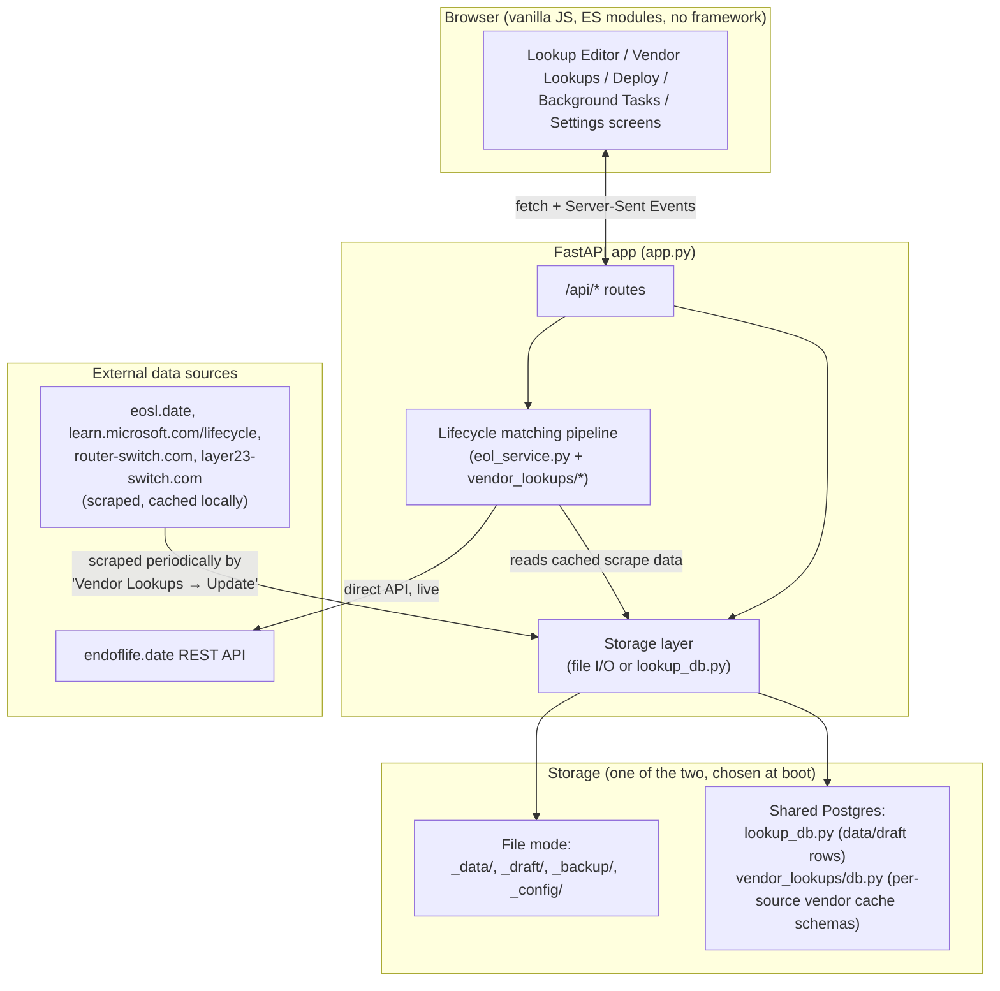
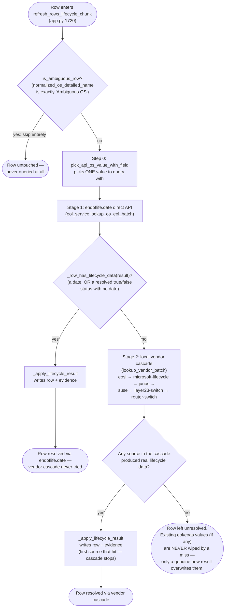
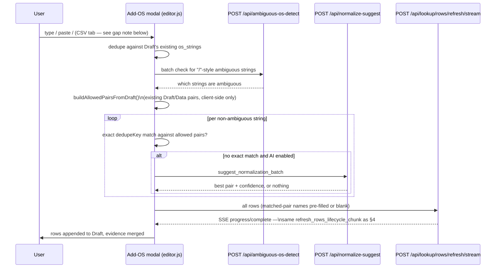
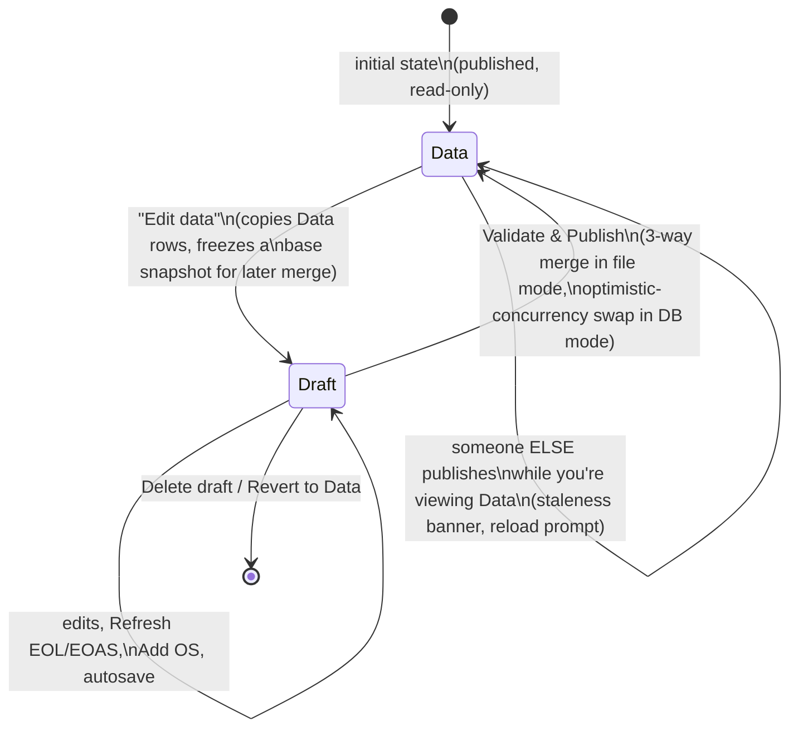
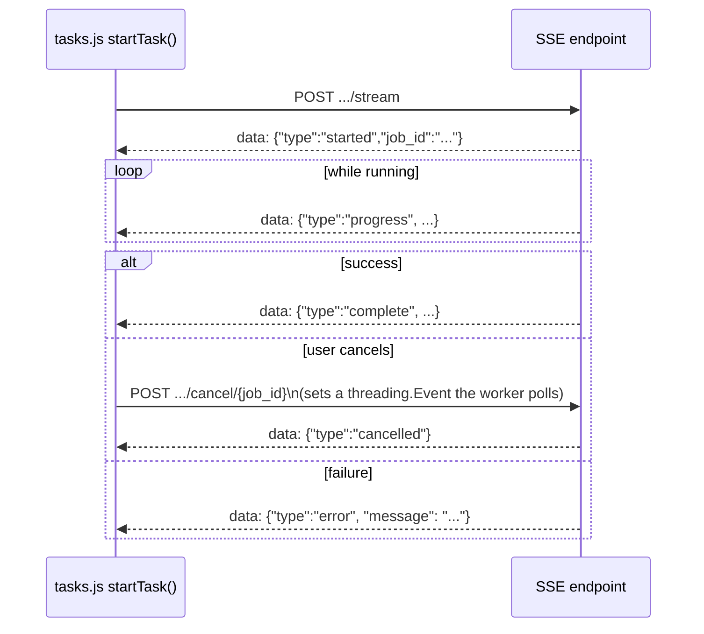

# OS Health Check — Architecture

> **What this document is for.** A complete, technically precise map of how this
> application works end to end — for a new engineer, and equally for an AI
> coding assistant that needs to modify this codebase correctly without
> re-deriving everything from scratch by reading every file. Every claim below
> is backed by an exact `file:line` (or function name) reference into the real
> code, and the core matching pipeline (§4) is walked through with fully
> worked, real examples showing actual intermediate values at each step — not
> just the rules, but a trace of them actually firing.
>
> Companion doc: [MATCHING.md](MATCHING.md) goes even deeper on the
> endoflife.date release-picking algorithm specifically (more edge cases, more
> worked examples) if §4 here isn't enough detail on that one piece.

---

## Table of contents

1. [What this app does](#1-what-this-app-does)
2. [System architecture](#2-system-architecture)
3. [The row: the one data shape everything revolves around](#3-the-row-the-one-data-shape-everything-revolves-around)
4. [The core pipeline: os_string → normalized names + EOL/EOAS](#4-the-core-pipeline-os_string--normalized-names--eoleoas)
5. [Add OS](#5-add-os)
6. [Data / Draft / Publish lifecycle](#6-data--draft--publish-lifecycle)
7. [Storage layer](#7-storage-layer)
8. [Settings](#8-settings)
9. [Background tasks & the SSE streaming pattern](#9-background-tasks--the-sse-streaming-pattern)
10. [Deploy](#10-deploy)
11. [Concurrency & safety mechanisms](#11-concurrency--safety-mechanisms)
12. [Known gaps / discrepancies as of this writing](#12-known-gaps--discrepancies-as-of-this-writing)
13. [File map](#13-file-map)
14. [Glossary of thresholds and constants](#14-glossary-of-thresholds-and-constants)

---

## 1. What this app does

**OS Health Check** ingests a raw inventory of OS strings (e.g. from a CMDB —
`"Red Hat Enterprise Linux release 9.7 (Plow)"`, `"Windows Server 2019
Datacenter"`, `"SUSE Linux Enterprise Server 15 SP7"`) and, for each one,
resolves:

- `normalized_os_detailed_name` — a clean, specific display name (product +
  release, e.g. `"Microsoft Windows 11 24H2 (W)"`)
- `normalized_os` — a coarser version of the same (e.g. `"Microsoft Windows 11
  24H2"`)
- `eol_date` / `eoas_date` — end-of-life / end-of-active-support dates
- `eol_status` / `eoas_status` — `"true"`/`"false"`/`""` when a date isn't
  available but a lifecycle source still gave a definite yes/no answer

Users review and hand-edit the results in a **Draft**, then **publish** it to
become the read-only **Data** that other systems consume (a CSV, or a
Postgres-backed shared table). The app is FastAPI + Jinja2 + vanilla ES-module
JS — no build step, no frontend framework.

---

## 2. System architecture



**Deployment modes** — chosen once, at process start, from environment
variables (`app.py:96-98`):

```python
_USE_DB = bool(os.environ.get("DATABASE_URL")) and str(os.environ.get("LOOKUP_DB_ENABLED", "")).strip().lower() in (
    "1", "true", "yes", "on",
)
```

Both vars are deliberately required together — a `DATABASE_URL` set only for
vendor caches (which *always* use Postgres, regardless of `_USE_DB`) must
never silently flip the app's Data/Draft storage into DB mode too. `_USE_DB`
is fixed for the life of the process; nearly every data-access function in
`app.py` is a thin `if _USE_DB: lookup_db.db_*(...) else: <file I/O>` branch
(e.g. `load_rows`/`save_rows` at `app.py:835-849`, `load_evidence`/
`save_evidence` at `app.py:749-758`).

Multiple app instances can point at the **same** shared Postgres database
(e.g. several docker-compose stacks, or several environments) — see
[§11](#11-concurrency--safety-mechanisms) for the cross-instance coordination
this requires and how it's implemented.

**Tech stack**: FastAPI, Pydantic v2, Jinja2 templates, `psycopg`
(`psycopg_pool.ConnectionPool`) for Postgres, `requests`/`curl_cffi` for
external HTTP, `openpyxl` for Excel export, plain `fetch`/SSE + vanilla ES
modules on the frontend (no bundler, no framework).

---

## 3. The row: the one data shape everything revolves around

Every row — in Data, in Draft, in a vendor cache, everywhere — is the same 7
fields, `CSV_HEADERS` / the `LookupRow` Pydantic model (`app.py:135-143`,
`282-289`), in this exact order:

| Field | Meaning |
|---|---|
| `os_string` | The raw inventory string, unmodified. The row's identity key (trimmed + lowercased) for diffing. |
| `normalized_os_detailed_name` | Product + specific release, e.g. `"Microsoft Windows 11 24H2 (W)"` |
| `normalized_os` | Product + coarser release, e.g. `"Microsoft Windows 11 24H2"` |
| `eol_date` | End-of-life date, stored as a Unix epoch-seconds string |
| `eol_status` | `"true"` / `"false"` / `""` — only meaningful when `eol_date` is blank |
| `eoas_date` | End-of-active-support date, same format as `eol_date` |
| `eoas_status` | Same convention as `eol_status`, for EOAS |

`eol_status`/`eoas_status` are constrained by a Pydantic validator
(`app.py:291-297`) to exactly `"true"`, `"false"`, or `""`.

**Evidence sidecar** — a separate JSON structure, `{"by_os": {<os_string>:
{...}}, "updated_at": ""}` (`empty_evidence_payload`, `app.py:668-669`), that
records *how* each field was resolved without polluting the row itself. Each
`by_os` entry has up to three slots — `eol`, `detailed`, `normalized` — each
built by `build_eol_evidence_slot` (defined in `lookup_extras.py`, called
from `app.py:1684`) with a `method`
(`"api"` for direct endoflife.date, or the vendor source id — `eosl`,
`microsoft-lifecycle`, `junos`, `suse`, `layer23-switch`, `router-switch` —
for a cascade match, or `"manual"`/`"fuzzy"`/`"ai"` for non-lifecycle
matches), plus the exact query string used and the resolved product/release
identifiers. This is what powers the row drawer's evidence panel and the
**Matched by** column filter.

---

## 4. The core pipeline: os_string → normalized names + EOL/EOAS

This is the heart of the application — the answer to "how does a raw
inventory string turn into dates and normalized names."

### 4.1 Where this runs from

| UI action | Code path | Scope |
|---|---|---|
| Toolbar **Refresh EOL/EOAS** (no selection) | `POST /api/lookup/refresh/stream` → `lookup_refresh_events` → `refresh_rows_lifecycle_chunk` | every row in Data/Draft, chunked |
| Toolbar **Refresh EOL/EOAS** (with a selection) / bulk bar **Refresh lifecycle** | same, `rows` limited to the selection | selected rows only |
| Row drawer **Re-run lookup** | `POST /api/lookup/row/refresh` → `refresh_rows_lifecycle_chunk` (chunk of 1) | one row |
| **Add OS** pipeline's final step ([§5](#5-add-os)) | `POST /api/lookup/rows/refresh/stream` → `lookup_rows_refresh_events` → `refresh_rows_lifecycle_chunk` | newly added rows |

All four funnel into the same function, `refresh_rows_lifecycle_chunk`
(`app.py:1720`), which runs an identical two-stage cascade per row.

### 4.2 Master flowchart



**Critical safety rule** (`_apply_lifecycle_result`, `app.py:1647-1688`): a
lookup only overwrites `eol_date`/`eol_status`/`eoas_date`/`eoas_status` when
this attempt *actually* produced lifecycle data, and only overwrites
`normalized_os_detailed_name`/`normalized_os` when this attempt *actually*
produced a name. A miss (network issue, catalog no longer has this product,
etc.) never wipes a row's previously-good values — it just leaves them alone.
This is why a refresh is always safe to re-run.

### 4.3 Step 0 — which field gets queried (`pick_api_os_value_with_field`)

Every lookup function first picks **one** value to actually query with, in
priority order (`eol_service.py:284-313`):

1. `normalized_os` (if set)
2. `normalized_os_detailed_name` (if set)
3. `os_string` (always available, final fallback)

...but a candidate is only accepted if it's **vendor-compatible** with the
raw `os_string` (§4.4.6) — this stops a wrongly-set `normalized_os` (e.g. a
bad earlier manual edit or AI match) from querying with the *wrong* vendor's
product entirely. If `normalized_os="AlmaLinux OS 9"` but `os_string="Oracle
Linux Server 9.5"`, the AlmaLinux value is rejected and the raw `os_string`
is used instead, so the lookup still resolves against the correct vendor.

### 4.4 Stage 1 — endoflife.date direct API (`eol_service.py`)


#### 4.4.1 Resolving the product (`resolve_product_slug`)

endoflife.date's product catalog (~300+ products, fetched once and cached via
`get_product_catalog`/`lru_cache`) is turned into a **phrase index**: every
product's slug, display label, and aliases become searchable phrases mapped
back to that slug (`build_slug_index`, `eol_service.py:123-152`).

Resolution order:
1. **Priority overrides** — a short regex→slug list checked first, to force
   disambiguation where a generic name would otherwise collide (e.g.
   `windows[\s-]?server` → `windows-server`, outranking the bare `windows`
   product).
2. **Phrase index scan** — every phrase appearing in the query as a whole
   word/phrase is a candidate; the **longest** matching phrase wins.
3. **Hyphenated fallback** — if nothing matched, hyphenate the query and try
   it directly as a slug.

Query text is cleaned first (`_normalize_for_slug_lookup`): underscores/
slashes/hyphens → spaces, glued product names un-glued (`ubuntulinux` →
`ubuntu linux`), and a letter↔digit boundary gets a space (`Linux8.2` →
`linux 8.2`).

If no slug resolves at all, the row moves to Stage 2 — **never** guesses the
"closest" product.

#### 4.4.2 Extracting version hints (`extract_version_hints`)

The query text is turned into a list of version hints: every run of digits
(optionally dotted), with deliberate exclusions (`eol_service.py:348-382`):

```python
extract_version_hints("Microsoft Windows 10 Build 26100")        # -> ["10", "26100"]
extract_version_hints("Windows 10.0.26100.7171")                 # -> ["10.0.26100.7171"]
extract_version_hints("Microsoft Windows 11 24H2")                # -> ["11", "24"]
extract_version_hints("Microsoft Windows 7 Service Pack 2")       # -> ["7"]   ("2" dropped — SP marker)
extract_version_hints("Android 16")                               # -> ["16"]  (real major version, kept)
extract_version_hints("Windows 7 (64-bit)")                       # -> ["7"]   ("64" dropped — bitness context)
extract_version_hints("SUSE Linux Enterprise Server 15 SP7")     # -> ["15"]  ("7" dropped — SP marker)
```

Exclusions, each added after a real false-match incident:
- **Bitness numbers (16/32/64/86/128/256) dropped only in bitness *context***
  (`_looks_like_bitness_marker`) — immediately followed by `bit`/`-bit`, or
  preceded by `x` (`x86`/`x64`). A bare one of these numbers *without* that
  context is kept, because it's also a legitimate major version — Android's
  own major version reached **16** ('Baklava') in 2025; blanket-excluding
  would make any product whose version lands on 16/32/64/… permanently
  unmatchable.
- **`N.x` ranges dropped** — `"3.x or later"` isn't version 3.
- **Lone SP/R/U/Pack digits dropped** — the trailing digit in `SP2`/`R2`/
  `U1`/`"Service Pack 2"` is a patch marker, not a version.
- **A compound tag doesn't leak a stray digit** — `"24H2"` yields only
  `"24"`, never also a stray `"2"`.
- **A parenthesized build number is combined with the dotted version right
  before it** — `"Windows 10.0 (14393)"` yields `["10.0", "14393",
  "10.0.14393"]`, not just the first two. Without the combined hint, `"10.0"`
  alone is a genuine numeric *prefix* of every Windows 10/11 build (they all
  start `"10.0."`), so it ties across the **entire** family, and the bare
  `"14393"` never breaks that tie (the scoring function only recognizes a
  hint being a prefix of a release's version, never its trailing segment).
  See the worked example below — this was a real, reported production bug.

#### 4.4.3 Picking a release (`pick_release`)

The single most safety-critical function in the app. For each release, up to
three candidate strings are tried: `release.name` (internal slug, e.g.
`11-24h2-w`), `release.label` (human string, `"11 24H2 (W)"`), and
`release.latest.name` (raw build, `"10.0.26100"`, when present). Each is
scored against **all** hints at once, two ways (`_release_score`,
`eol_service.py:410-433`):

1. **Whole-string, dot-aware comparison** (`score_release_against_hint`,
   `version_match.py:23-47`):
   - **100** — exact match.
   - **90** — genuine numeric prefix (release `17.9` vs hint `17.09.08`) —
     **except** a single bare-part hint/release can never prefix-match a
     multi-part one this way (`"11"` must not match `"11.4"`, in *either*
     direction).
   - **55** — both multi-part, share only the leading number — weak,
     tie-only signal.
   - **0** — anything else, including a bare single-part hint against a
     multi-part release (**the "bare major must not guess" rule** — this
     single rule is why "Windows 10" alone never resolves to a specific
     build, and why several fallbacks below exist to recover *legitimate*
     cases this rule otherwise blocks).
2. **Compound-token full match** — a slug like `11-24h2-w` isn't a dotted
   version at all, so comparison #1 always scores it 0. Instead its embedded
   number tokens (`["11","24"]`) are checked as a *set*: if the release has
   **more than one** token and **every** one is present among the hints,
   that's a full match (100). This is what lets a **name-only** query (no
   build number at all) resolve a release — see the worked Windows 11 24H2
   example below.

The release with the single highest score wins, **provided that score is ≥
80** (`_MIN_RELEASE_SCORE`). Below that, or with no hints at all, `pick_release`
returns nothing.

**Ties** (more than one release shares the best score) go through four
tie-breakers, in order:
1. **Edition narrowing** — if `os_text` names an edition (`"IoT"`,
   `"Enterprise"`/`"(E)"`), narrow to releases whose label contains that
   substring.
2. **Shared-hint check** — a tie is only safe to resolve further when every
   tied release is explained by the *same* hint(s). If the intersection of
   each tied release's "what hint(s) actually explain my score" set is
   empty, that's not "several editions of one thing" — it's **two+
   genuinely different releases each independently matched by a different
   hint** — refuse outright.
3. **Exact-score requirement** — even when every tied release *does* share
   a hint, that tie is only safe to merge when the shared best score is a
   genuine **100** (an exact string match, or the compound-token rule's
   "every token present" full match) — never the *weaker* 90-point numeric
   prefix score. A shared hint that only ever reached 90 means the hint was
   *coarser* than every tied release's own version — e.g. a bare `"10.0"`
   is a genuine numeric prefix of **every** Windows 10/11 build ever
   released, so it used to tie the entire family and "conservative-merge"
   to whichever release has the earliest EOL, as if a query that named no
   build number at all had confirmed a specific one. Below 100, refuse
   instead — this guard only applies to an actual multi-candidate tie; a
   single, non-tied 90-score match (e.g. `"RHEL 7.4"` → release `"7"`) is
   unaffected.
4. **Conservative merge** — a tie that survives both checks above resolves
   to the **earliest** EOL/EOAS date among the tied releases (assume the
   worst case when several editions genuinely can't be told apart).

#### 4.4.4 If the strict pass finds nothing: two narrow fallbacks

Both fire **only** when the pass above returns nothing at all, and both
refuse (rather than guess) whenever more than one candidate would qualify:

**A. Prior-value fallback** (`_pick_release_by_prior_value`,
`eol_service.py:624-666`) — for a row that already has a normalized value on
record. endoflife.date's catalog gets more precise over time (a release once
tracked generically as `"15"` can later be split into per-service-pack
releases like `"15.2"`). Compares each release's *prospective* new name
(product label + release label/name — the exact shape
`build_normalization_from_product` writes) against the row's existing
`normalized_os_detailed_name`/`normalized_os`, via
`difflib.SequenceMatcher`. Accepts only when **exactly one** release is a
**≥95%** textual match, and the prior value isn't blank/placeholder junk
(`is_placeholder_os_value`).

**B. Dot-zero fallback** (`_pick_release_by_dot_zero_release_name`,
`eol_service.py:582-618`) — for a *bare* hint (e.g. `"15"`) against a catalog
whose release for that exact version is literally named `"<hint>.0"` (e.g.
`"15.0"`). Deliberately **not** implemented as "append `.0` and re-run the
normal scoring pipeline" — an earlier attempt at exactly that let a
synthesized `"10.0"` hint prefix-match Windows' own `"10.0.NNNNN"` build
numbering (every 10/11 build starts with `10.0.`), which would have made a
bare `"Windows 10"` query wrongly resolve to a specific build. Instead this
only accepts an **exact string match** on a release's `name`/`label` (never
`latest.name`), and only when **exactly one** release matches.

#### 4.4.5 Vendor compatibility gate (`vendors_compatible`)

`normalization_service._vendor_tags()` scans a string for known vendor/
product-family signal words (`cisco`, `apple`, `microsoft`, `android`,
`redhat`, `ubuntu`, `oracle`/`solaris`, `vmware`, `suse`, `juniper`,
`google`/ChromeOS, … 20 vendors). `vendors_compatible(a, b)` is true when
neither side has a recognized tag (nothing to disagree about), or the two
tag sets share at least one vendor. Checked twice: before trusting a
coarser field over `os_string` (§4.3), and after a product resolves,
comparing the query actually used against the resolved product's name.

#### 4.4.6 What gets written

`build_normalization_from_product` (`eol_service.py:684-695`):

```python
normalized_os_detailed_name = join_labels(product_label, release_label)
normalized_os                = join_labels(product_label, presentable_release_name)
```

`join_labels` avoids duplicating an overlapping phrase (product `"Microsoft
Windows Server"` + release `"Windows Server 2019 (LTSC)"` →
`"Microsoft Windows Server 2019 (LTSC)"`, not a doubled "Windows Server").
`presentable_release_name` uses the release's plain dotted `name` when it
already reads as a clean version (Ubuntu `"24.04"`), else falls back to
`label` (Windows' internal slug `10-22h2` isn't presentable; its label
`"10 22H2"` is).

Dates and statuses: `iso_date_to_epoch` converts endoflife.date's
`YYYY-MM-DD` to a Unix-epoch-seconds string (the row's own format).
`resolve_lifecycle_status` (`eol_service.py:631-650`):

```
date present            → status blank (the date is enough)
date missing, isEol=true  → status "true"
date missing, isEol=false → status "false"
date missing, isEol absent → status "" (unresolved)
```

### 4.5 Stage 2 — the local vendor cascade


Fixed order, not user-configurable (`vendor_lookups/vendor_settings.py:19-26`).
Per row, per source (`lookup_vendor_batch`,
`vendor_lookups/vendor_lookup_service.py:417-465`): skip if the source is
disabled in Settings; skip if it's keyword-gated and none of `os_string`/
`normalized_os_detailed_name`/`normalized_os` contain any of its keywords as
a **whole word/phrase** (case-insensitive, via `query_matches_keywords`);
otherwise query it and stop at the first real hit.

**Default enabled/keywords**:

| Source | Enabled by default | Keyword-gated? | Default keywords |
|---|---|---|---|
| `eosl` | ✅ | no | — (always eligible) |
| `microsoft-lifecycle` | ✅ | no | — (gated instead by product resolution) |
| `junos` | ✅ | yes | `junos`, `juniper` |
| `suse` | ✅ | yes | `suse`, `sles`, `opensuse` |
| `layer23-switch` | ❌ | yes | cisco, arista, aruba, dell, fortinet, h3c, hpe, juniper, mellanox, palo alto/pan-os, ruckus, ios-xe/xr, nx-os |
| `router-switch` | ❌ | yes | same 20-keyword list as layer23-switch |

**Per-source differences**:

- **eosl.date** (`vendor_lookups/eosl_service.py`) — scraped HTML (not an
  API) from eosl.date's own product pages. Product resolution is
  substring-scored, accept threshold **95**. A vague-query guard rejects
  `"Other … Linux"`/`"unknown"`/`"or later"`-style text from silently
  absorbing into the generic `linux`/`windows`/`unix` product pages.
  Release threshold **80**.
- **Microsoft Lifecycle** (`vendor_lookups/microsoft_lifecycle_service.py`)
  — JSON API from learn.microsoft.com/lifecycle. **Excludes the `"windows"`
  family entirely** — that family mixes real OS releases with unrelated
  tools (PowerShell, FSLogix, …) under slugs whose bare-major token collides
  across dozens of releases; endoflife.date's own `windows`/`windows-server`
  products (tried first) already cover this precisely. Release ties (unlike
  the direct API) simply refuse rather than conservative-merge.
- **Juniper Junos** (`vendor_lookups/junos_service.py`) — a single fixed
  product, no product-table lookup. Its own **X-train mismatch rule**:
  `15.1X49` and `15.1X53` are different, non-overlapping trains sharing the
  `15.1` base — scores 0 against each other, and a family-only hint (`15.1`)
  can never guess a specific X-train.
- **SUSE Lifecycle** (`vendor_lookups/suse_service.py`) — edition-aware
  bonus scoring: explicit `"sap"`/`"hpc"`/`"desktop"` keywords in the query
  push resolution toward that edition's product even when the generic SLES
  product name also textually overlaps. Accept threshold **60** (lower than
  elsewhere, because the edition bonuses already do most of the
  disambiguation). SP-aware release matching: `"15.3"` and `"15 SP3"` are
  treated as equal; different SP trains are explicitly scored 0 against each
  other.
- **Layer23-Switch / Router-Switch** — hardware EOL by manufacturer +
  part number (not OS version scheme), scraped via `curl_cffi` (Chrome TLS
  impersonation — layer23-switch.com sits behind Cloudflare). Restricted to
  a user-selected manufacturer subset per source. Layer23-switch literally
  imports and reuses router-switch's scoring code — the two are near-
  duplicate catalogs over different manufacturer part-number listings.

**Vendor cache storage** (`vendor_lookups/db.py`) — one Postgres **schema
per source** (`eosl`, `microsoft_lifecycle`, `junos`, `suse`,
`layer23_switch`, `router_switch`), each with an identical 3-table layout:
`metadata` (sync status KV), `products` (slug/name/category/url), `releases`
(product_slug FK, release_name, released_date, eol_date, eoas_date,
latest_raw, is_supported). A sync writes atomically **per product**
(`DELETE` + `INSERT` inside one transaction) so a cancelled sync leaves
already-processed products fully updated and untouched ones intact.

### 4.6 Fully worked examples

**1. Name-only match via compound tokens + conservative merge — "Windows 11
24H2"**

Input: `os_string = "Microsoft Windows 11 24H2"`, no build number anywhere,
`normalized_os`/`normalized_os_detailed_name` both blank.

endoflife.date's `windows` product has, among others:

| `name` | `label` | `latest.name` | `eolFrom` |
|---|---|---|---|
| `11-24h2-e-lts` | `11 24H2 (E) (LTS)` | `10.0.26100` | `2029-10-09` |
| `11-24h2-e` | `11 24H2 (E)` | `10.0.26100` | `2027-10-12` |
| `11-24h2-w` | `11 24H2 (W)` | `10.0.26100` | `2026-10-13` |

1. `extract_version_hints("Microsoft Windows 11 24H2")` → `["11", "24"]`.
2. Product resolves to `windows`.
3. Each release's slug (`11-24h2-e-lts`, `11-24h2-e`, `11-24h2-w`) yields
   embedded tokens `["11","24"]` — every token present in the hints, more
   than one token → **compound-token full match, score 100**, for all
   three.
4. All three tie at 100. `os_text` has no `"Enterprise"`/`"(E)"`/`"IoT"`
   substring, so edition narrowing doesn't apply.
5. Shared-hint check: every tied release's requirement is the same `{"11",
   "24"}` pair → shared, safe to merge.
6. Conservative merge picks the **earliest** `eolFrom` — `2026-10-13`,
   belonging to `11-24h2-w`.

**Result**: `normalized_os_detailed_name = "Microsoft Windows 11 24H2 (W)"`,
`eol_date`/`eoas_date` = epoch of `2026-10-13`, evidence `method: "api"`.

**2. A bare version number that's also a legitimate major — "Android 16"**

Input: `os_string = "Android 16"`. Before a documented fix,
`extract_version_hints` blanket-excluded 16/32/64/86/128/256 as "bitness
noise" regardless of context, so this yielded **zero** hints — permanently
unmatchable. `_looks_like_bitness_marker` now only excludes these numbers
when the surrounding text actually reads as an architecture marker (`"64-bit"`,
`"x86"`). `"Android 16"` has no such context, so `"16"` is kept as a real
hint, correctly resolving to Android's own major-version-16 release
('Baklava').

**3. Refusing to guess between two unrelated releases — "Android 14-11"**

Input: `os_string = "Android 14-11"` (two independent digit runs — the
hyphen isn't a dot, so this is never one compound version).
`extract_version_hints` → `["14", "11"]`. Android release `"14"` scores 100
against hint `"14"` alone; release `"11"` scores 100 against hint `"11"`
alone — both tie at the top score. But the shared-hint check finds release
`14`'s requirement is `{"14"}` and release `11`'s is `{"11"}` — the
**intersection is empty**. This isn't "several editions of one release" (the
24H2 case above, where every tied candidate needs the *same* pair) — it's
**two genuinely different releases each independently matched by a
different hint**. `pick_release` returns nothing rather than picking
whichever has the earliest date (which, before this rule existed, silently
produced `"Android 11"` as if that were a confirmed answer).

**4. The prior-value fallback — SUSE's catalog gets more specific
("15" → "15.2")**

A row was previously resolved when endoflife.date's SLES product had a
generic release named `"15"`; the row's stored `normalized_os_detailed_name`
= `"SUSE Linux Enterprise Server 15"`. Later, the catalog is updated to
track service packs individually and now only lists `"15.2"`. On refresh:
`extract_version_hints` still yields a bare `"15"`; scored against the
multi-part `"15.2"` release → 0 (bare-major rule) → `pick_release` returns
nothing. The prior-value fallback then compares the release's *prospective*
new name — `"SUSE Linux Enterprise Server 15.2"` — against the row's stored
value: `difflib.SequenceMatcher` ratio ≈ **0.9688** (≥ 0.95) → accepted as
the one, unambiguous rename. If the catalog instead listed `15.1`, `15.2`,
*and* `15.3` (all similarly ~0.97 close to the old bare `"15"`), the
fallback refuses — genuine ambiguity about which specific service pack this
really is.

**5. The dot-zero fallback — a bare hint against a `"<n>.0"`-named release**

Input: `os_string = "SUSE Linux Enterprise Server 15 SP7"` (a brand-new row,
no prior value to anchor a similarity comparison to). `extract_version_hints`
drops the SP-marker digit (`"7"` from `"SP7"`), yielding a bare `"15"`
alone. endoflife.date's actual SLES release for this exact version is named
`"15.0"` — scores 0 against the bare hint (bare-major rule). The dot-zero
fallback checks: is there **exactly one** release whose `name` or `label` is
literally `"15.0"`? Yes → accepted, without ever touching the general
scoring pipeline's prefix-match rule (which — if this had been implemented
as "append `.0` and rescore" instead — would have let a synthesized `"10.0"`
hint falsely prefix-match Windows' `"10.0.26100"`-style build numbers; this
was caught as a real regression while building this fallback and is why it's
implemented as a narrow, exact-match-only check instead).

**6. Juniper's X-train rule — "Juniper Junos 15.1X49-D40"**

`query_matches_keywords(["junos","juniper"], ...)` passes.
`_junos_version_hints` extracts the X-train token `15.1X49` (the plain
`15.1` fragment is suppressed once an X-train starting with `15.1X` is
found; the trailing `-D40` isn't part of either version regex, so it's
dropped). Scoring: release `"15.1X49"` vs hint `"15.1X49"` → exact, **100**.
A release `"15.1X53"` (same `15.1` base, *different* train) → **forced 0**
by the X-train mismatch rule, even though it shares the family number. A
release `"15.1"` (family-only, no train) vs the X-train hint → **0** — never
guesses which train a bare family number belongs to.

**7. SUSE's edition-aware bonus — "SUSE Linux Enterprise Server for SAP 15
SP3"**

Product resolution: the query contains `"sap"`, and the candidate product's
slug also contains `"sap"` → **edition bonus forces score 96**, beating the
generic core-SLES product's own 90-94 tier even though "SUSE"/"Enterprise
Server" substrings match both. Release matching: `_SP_IN_TEXT_RE` extracts
`"15 SP3"` directly from the text; a stored release named `"15 SP3"` scores
**100** (SP-normalized exact match); a release `"15 SP2"` — same major,
*different* SP train — is explicitly scored **0** against it (not merely
low), the same "don't guess across a compatible-looking but wrong specific
version" philosophy as Junos's X-trains.

**8. A build number disconnected from its version — "Windows 10.0 (14393)",
"(15063)", "(16299)", "(17763)", "(18363)", and bare "Windows 10.0" itself**

A real, reported production bug, actually two compounding bugs in the same
family. Rows each naming a *different*, specific Windows 10 build — in
parentheses (`"Windows 10.0 (14393)"`) or space-separated (`"Windows 10.0
22631 64-bit"`) — were all resolving to the exact same release, and even a
row with **no build number at all** (bare `"Windows 10.0"`) was resolving to
a specific release as if that were confirmed:

| `os_string` | `latest.name` this build should match |
|---|---|
| `Windows 10.0 (14393)` | `10.0.14393` (release `10-1607`) |
| `Windows 10.0 (15063)` | `10.0.15063` (release `10-1703`) |
| `Windows 10.0 (16299)` | `10.0.16299` (release `10-1709`) |
| `Windows 10.0 (17763)` | `10.0.17763` (release `10-1809`) |
| `Windows 10.0 (18363)` | `10.0.18363` (release `10-1909`) |
| `Windows 10.0 22631 64-bit` | `10.0.22631` |
| `Windows 10.0` (no build at all) | *nothing — must refuse* |

**Bug 1 — the two halves never got combined.**
`extract_version_hints("Windows 10.0 (14393)")` → `["10.0", "14393"]` — two
independent, disconnected hints, since neither the parenthesis nor a bare
space is part of the digit-run regex. Scoring: `"10.0"` (2-part) is a
genuine numeric *prefix* of `[10, 0, 14393]`, `[10, 0, 15063]`, … — **every**
Windows 10/11 build starts `"10.0."` — so it scores 90 against *all six*
candidate releases at once, tying them all. The bare `"14393"` (1-part)
scores **0** against `[10, 0, 14393]`: it isn't a prefix of the release
(`rel_nums[:1] = [10]`, not `[14393]`), so it contributes nothing.

**Bug 2 — the tie-break trusted a hint that wasn't actually specific
enough.** With every release tied at the *same* 90-point score via the
*same* `"10.0"` hint, the shared-hint check passed (every tied release
genuinely is explained by that one hint) — but "explained by the same hint"
isn't the same as "confirmed," when that hint is coarser than every tied
release's own version. The conservative merge then picked the **earliest
EOL among all six** — `10-1507` — for *every* row sharing this pattern,
including the bare `"Windows 10.0"` row that named no build at all.

**The two fixes**:
1. `extract_version_hints` now also scans for `"<dotted version>
   (<build number>)"` and `"<dotted version> <build number>"` (space-
   separated, guarded to 4+ digit numbers that already survived the
   bitness/SP exclusions — so the `"64"` in `"64-bit"` is never absorbed)
   and synthesizes the combined hint: `["10.0", "14393", "10.0.14393"]`.
   `"10.0.14393"` **exactly** matches release `10-1607`'s `latest.name`
   (score 100), strictly beating the other five releases' 90-point
   family-wide tie — no tie left to break, `10-1607` wins outright. Each
   row with a real build number now resolves to its own distinct release.
2. `pick_release`'s tie-break now additionally requires `best_score == 100`
   before conservative-merging a multi-candidate tie — a tie that only ever
   reached the weaker 90-point prefix score refuses instead. This is what
   makes the bare `"Windows 10.0"` row (hints `["10.0"]` only, nothing to
   combine with) correctly resolve to **nothing** rather than guessing
   `10-1507` — "10.0" alone can't even pin down one specific release, so
   several releases sharing that same coarse hint isn't safe to average
   away. A *single*, non-tied 90-score match (e.g. `"RHEL 7.4"` resolving
   to release `"7"`) is unaffected — this guard only applies when there's
   an actual tie to break.

**9. A row that resolves nowhere**

If neither stage resolves anything: `normalized_os_detailed_name`/
`normalized_os` stay exactly whatever they were before the refresh (blank,
for a brand-new row); `eol_date`/`eol_status`/`eoas_date`/`eoas_status` stay
blank too. `matched_by` (via `row_matched_by`, `lookup_extras.py`) computes
to `"No match"`. The evidence sidecar's `eol.api_note` (and each vendor
source's own miss note, concatenated) records *why*, viewable in the row
drawer.

---

## 5. Add OS



**Ambiguity check**: `POST /api/ambiguous-os-detect` (`app.py:2640-2652` →
`normalization_service.detect_ambiguous_os_batch`) flags any string
containing `/` that AI classifies as listing multiple distinct products. A
flagged row gets `normalized_os_detailed_name = normalized_os = "Ambiguous
OS"` immediately and is excluded from every subsequent lookup stage
(`is_ambiguous_row`) — never queried even as a fallback.

**Pre-lifecycle matching** — before ever calling a lifecycle source, the
pipeline checks whether the new string already matches an existing
`(normalized_os_detailed_name, normalized_os)` pair already in the lookup:

1. **Allowed pairs** (`buildAllowedPairsFromDraft`, `editor.js:1162-1175`) —
   built entirely client-side from the current Draft/Data rows that already
   have both normalized fields filled, deduped by
   `dedupeKey(collapseConsecutiveDuplicateWords(os_string))`.
2. **Exact match** — a case-insensitive, trimmed, duplicate-word-collapsed
   **string-equality** check against the allowed pairs' keys. *(Note: the
   modal's own UI copy describes this step as "Fuzzy match ≥ 95%,
   vendor-gated" — see [§12](#12-known-gaps--discrepancies-as-of-this-writing)
   for why that text doesn't match the actual code.)*
3. **AI match** (if no exact match and AI is enabled) — `POST
   /api/normalize-suggest` → `suggest_normalization_batch`
   (`normalization_service.py:857-964`). Candidate pairs are grouped by
   vendor tag first (an Oracle string never even sees AlmaLinux pairs), then
   filtered to `pair_compatible_with_os` (`vendors_compatible`). The AI
   provider picks (if any) at or above the confidence threshold, and every
   pick is **re-validated in code** afterward (`ai_pair_acceptable`):
   rejects rubbish/placeholder values on either side, cross-vendor picks,
   edition/SKU drift (`"Windows 11 Pro"` must not match `"Windows 11 Pro
   Enterprise"`), and version-family mismatches (`"Ubuntu 20.04"` must not
   match `"Ubuntu 22.04"`) — because model providers tend to over-match
   otherwise.
4. **Final handoff**: regardless of whether a pair was found, every new row
   is sent through `POST /api/lookup/rows/refresh/stream` →
   `lookup_rows_refresh_events` → the exact same `refresh_rows_lifecycle_chunk`
   from [§4](#4-the-core-pipeline-os_string--normalized-names--eoleoas) — a
   reused pair's names are a head start, not a substitute for actually
   resolving fresh EOL/EOAS dates.

**Worked example**: Draft already has `os_string="Ubuntu 22.04"`,
`normalized_os_detailed_name="Ubuntu 22.04 LTS"`. User adds `"Ubuntu 22.04.3
LTS"`. Exact-key match fails (`"ubuntu 22.04.3 lts"` ≠ `"ubuntu 22.04"`). If
AI is enabled: `_versions_compatible` compares version tokens — `"22.4.3"`
vs `"22.4"` — the shorter is a genuine prefix → version-compatible; both
vendor-tagged `ubuntu`; editions match → accepted, reusing the existing
pair's names as a starting point, then still routed through the refresh step
to (re)confirm EOL/EOAS. A genuinely new string like `"Rocky Linux 9.3"`
(no compatible existing pair) enters the refresh step with blank normalized
fields, so [§4](#4-the-core-pipeline-os_string--normalized-names--eoleoas)'s
own product/release resolution derives everything from scratch.

---

## 6. Data / Draft / Publish lifecycle



**Row identity & equality** (`lookup_extras.py`): identity =
`os_string.strip().lower()` (`_dedupe_key`). Equality compares every
`CSV_HEADERS` column except `os_string` (`_rows_equal`), with `eol_status`/
`eoas_status` compared case-insensitively. A duplicate `os_string` on any
side is **never** diffed row-by-row — it's always surfaced as an
`ambiguous_duplicate` conflict for a human to resolve, since a dict-keyed
merge would silently drop a genuine duplicate.

**The 3-way publish merge** (`merge_lookup_rows`, `lookup_extras.py:364-495`)
— file mode only — needs three snapshots per key: `base` (Data when the
draft was created), `current` (Data right now), `draft`. Classification:

| `base` vs `current` | `base` vs `draft` | Outcome |
|---|---|---|
| unchanged | unchanged | keep as-is |
| unchanged | changed | keep draft's version (your edit wins) |
| changed | unchanged | keep current's version (upstream's edit wins) |
| changed | changed, but `current == draft` | either (no real conflict) |
| changed | changed, and different | **conflict**: `edited_both` |
| row deleted upstream | `base == draft` | drop the row (respect the delete) |
| row deleted upstream | `base != draft` | **conflict**: `edited_local_deleted_upstream` |
| row deleted locally | `base == current` | drop the row |
| row deleted locally | `base != current` | **conflict**: `edited_upstream_deleted_local` |
| duplicate key anywhere | — | **conflict**: `ambiguous_duplicate` (never content-diffed) |

**Worked conflict example**: Data has `RHEL 7 | eol_date=2024-06-30` when a
draft is forked. The draft edits `eol_status` → `"true"`. Meanwhile someone
else publishes a change to `eol_date` on the same row. At publish time:
`base != current` (upstream changed) and `base != draft` (you changed it
too) and `current != draft` → `conflict("edited_both")`, with `mine` = your
draft's row and `theirs` = the now-current Data row. The publish is blocked
(HTTP 409) until `conflict_resolutions["RHEL 7"] = "mine"` or `"theirs"` is
supplied by the user via the conflict resolver UI.

**DB mode is simpler — no per-row merge**: `db_publish` (`lookup_db.py:255-319`)
takes an `expected_revision` and, inside `pg_advisory_xact_lock(...)`
(serializing all publishes), compares it against the current `data_revision`
in the `meta` table. Mismatch → `PublishConflictError` → HTTP 409, telling
the client to re-check. On success: the previous `data` rows/evidence are
snapshotted into a `backups` table (JSONB), `draft` is deleted, and
`data_revision` bumps by one — all inside one transaction.

**Staleness banner** (`static/js/staleness.js`) polls `GET /api/lookup?source=data`
periodically for `data_revision`. On a draft, compares against
`state.draftBasedOnRevision`; if they differ, shows *"Data was published
again since you started this draft. It's fine to keep editing — publishing
will merge in what changed and only ask you about rows you both touched"* —
no reload prompt, since the merge above handles reconciliation. Outside a
draft, a simpler *"Data has been updated"* banner offers a reload.

**Backups**: file mode copies the pre-publish Data CSV + evidence into
`_backup/eol_lookup_<timestamp>[_suffix].csv/.json` before overwriting. DB
mode inserts the pre-publish rows/evidence into the `backups` table in the
same transaction as the publish, so a failed publish never orphans a
backup. Neither mode currently exposes a restore/rollback endpoint — see
[§12](#12-known-gaps--discrepancies-as-of-this-writing).

---

## 7. Storage layer

### File mode

| Constant | Path | Contents |
|---|---|---|
| `DATA_PATH` | `_data/eol_lookup.csv` | Published rows |
| `DRAFT_PATH` | `_draft/eol_lookup.csv` | Working draft rows |
| `DATA_EVIDENCE_PATH` / `DRAFT_EVIDENCE_PATH` | `_data/`, `_draft/` `eol_lookup_evidence.json` | Evidence sidecars |
| `DRAFT_BASE_PATH` / `_EVIDENCE` / `_REVISION` | `_draft/eol_lookup.base.*` | Frozen snapshot of Data when the draft forked — the 3-way merge base |
| `DATA_REVISION_PATH` | `_data/.revision` | Bare incrementing counter — staleness signal only, not used by the merge |
| `BACKUP_DIR` | `_backup/` | Timestamped pre-publish snapshots |
| `CONFIG_DIR` | `_config/` | `azure.json`, `aws.json`, `app_settings.json`, `ai_model_choices.json` |

CSV read/write is atomic (`NamedTemporaryFile` + `Path.replace`).

### Shared Postgres mode

`lookup_db.py` — schema `lookup` (constant `SCHEMA`):

- `rows(source, row_order, os_string, normalized_os_detailed_name,
  normalized_os, eol_date, eol_status, eoas_date, eoas_status)`, PK
  `(source, row_order)` — `source` is the literal string `'data'` or
  `'draft'`. Row order (not `os_string`) is the identity key here, preserving
  duplicate-`os_string` semantics exactly like the CSV format does.
- `evidence(source PK, payload JSONB, updated_at)`
- `meta(key PK, value)` — `data_revision`, `draft_based_on_revision`,
  `published_at`, and (see below) the cross-instance sync lock.
- `backups(id, created_at, suffix, rows_json, evidence_json)`

`vendor_lookups/db.py` — one schema **per vendor source** (`eosl`,
`microsoft_lifecycle`, `junos`, `suse`, `layer23_switch`, `router_switch`),
each with an identical `metadata`/`products`/`releases` layout (§4.5). Both
modules share one process-global `psycopg_pool.ConnectionPool`
(`vendor_lookups/db.py:81-91`).

### Cross-instance vendor-sync lock

With **multiple app instances pointed at the same shared Postgres
database**, a plain in-process `asyncio.Lock` only protects the instance
running a sync — another instance has no visibility into it at all, and a
vendor sync's per-product `DELETE`+`INSERT` can race with a concurrent read
from Add OS / Refresh EOL/EOAS in a different instance, risking a
torn/incomplete result.

```mermaid
sequenceDiagram
    participant A as Instance A
    participant DB as Postgres meta table\n(sync_lock_holder / _label / _heartbeat_at)
    participant B as Instance B

    A->>DB: db_acquire_sync_lock("Vendor sync: eosl.date")\n(SELECT ... FOR UPDATE)
    DB-->>A: holder token (was empty/stale)
    loop every 30s while syncing
        A->>DB: db_heartbeat_sync_lock(holder)
    end
    B->>DB: db_sync_lock_status() (Add OS / Refresh EOL/EOAS check)
    DB-->>B: {label: "Vendor sync: eosl.date", heartbeat_at: ...}
    B--xB: HTTP 409 — blocked until A finishes
    Note over A,DB: If A crashes without releasing,\nheartbeat stops advancing;\nafter 180s another instance may steal the lock.
    A->>DB: db_release_sync_lock(holder)\n(only clears it if still the current holder)
```

Implemented entirely with the existing `meta` KV table (no new table): three
keys (`sync_lock_holder`, `sync_lock_label`, `sync_lock_heartbeat_at`),
`SELECT ... FOR UPDATE` on the holder row to serialize concurrent acquire
attempts across instances, and a 180-second staleness timeout
(`_SYNC_LOCK_STALE_AFTER_SECONDS`) so a crashed instance's lock self-heals
instead of deadlocking the app. All 5 vendor-sync start points acquire it;
all 4 Add-OS/Refresh-EOL/EOAS entry points check it (read-only) before
proceeding — see `app.py`'s `acquire_vendor_sync_lock_or_409`/
`hold_vendor_sync_lock_heartbeat`/`raise_if_vendor_sync_running` and
`lookup_db.py`'s `db_acquire_sync_lock`/`db_heartbeat_sync_lock`/
`db_release_sync_lock`/`db_sync_lock_status`. A no-op entirely in file mode
(only one instance can exist there).

---

## 8. Settings

**App settings** (`AppSettings`, `app.py:544-628`) — always **file-based**
(`_config/app_settings.json`), regardless of `_USE_DB`:

- `refresh_eol_enabled` (default `True`) — disabling this blocks only the
  *whole-draft-in-one-shot* "Refresh EOL/EOAS" action; a deliberate bulk
  selection or a single-row "Re-run lookup" are always still allowed
  (`is_partial_refresh` flag, `app.py:2294-2298`).
- `ai_enabled`, `ai_provider` (openai/gemini/openrouter), `ai_match_prompt`,
  `ai_confidence_threshold` (clamped 50-100, default 85), `ai_models` (per-
  provider override).

`AppSettingsUpdateRequest` fields are non-Optional for the "core" three
(`refresh_eol_enabled`/`ai_enabled`/`ai_provider`) — the client must echo
current values back on every save or they'll reset, which is why
`settings.js` re-sends all three alongside whatever single field actually
changed.

**Vendor lookup settings** (`vendor_lookups/vendor_settings.py`) — per-source
`enabled` + `keywords`, persisted to a **separate plain JSON file**,
`_data/vendor_lookup_settings.json` — not Postgres, even in DB mode.
Manufacturer selections for layer23-switch/router-switch are separate again,
in `_data/layer23_switch_sync.json`/`_data/router_switch_sync.json`.

---

## 9. Background tasks & the SSE streaming pattern

Every long-running operation (vendor sync, refresh EOL/EOAS, Add OS's
refresh step, publish validate, Azure/AWS upload) uses the same
Server-Sent-Events convention.

**Wire format** (`sse_event`, `app.py:1339-1340`):
```python
def sse_event(payload: dict[str, object]) -> str:
    return f"data: {json.dumps(payload)}\n\n"
```
Served via `StreamingResponse(generator, media_type="text/event-stream", ...)`.

**Event `type` vocabulary**:

| Type | Meaning | Carries |
|---|---|---|
| `started` (or `start` in deploy.js — a naming inconsistency, see §12) | Stream began | `job_id` for cancellable streams |
| `progress` | Incremental update | `stage`, `processed`, `total` (or `message`/`percent` for CLI passthrough) |
| `complete` | Finished successfully | `rows`/`evidence_by_os`, or `result`/`status` |
| `error` | Failed | `message` (+ `output` for CLI stderr lines) |
| `cancelled` | Honored a cancel request | — |
| `conflict` | Publish-validate only | `conflicts` (rows changed concurrently in Data) |



**Cancel mechanism**: `ACTIVE_VENDOR_SYNC_JOBS`/`ACTIVE_LOOKUP_REFRESH_JOBS`
(`app.py:196, 205`) map `job_id → threading.Event`. The `/cancel` endpoints
just `.set()` the event; the worker thread polls it and reports back a
`cancelled` event. Deploy uploads have no server-side registry — the client
aborts its own `fetch` via `AbortController`, and the CLI subprocess is
killed in the stream generator's `finally` block.

**Not persisted across reload**: `tasks.js` only ever writes *finished*
tasks to `localStorage` (capped at 40 entries). A page reload drops the live
connection and the in-memory task list — a still-running task simply
disappears from the Background Tasks screen; it isn't resumed or
reattached, even though the server-side operation itself keeps running to
completion.

---

## 10. Deploy

`static/js/deploy.js` manages Azure Blob and AWS S3, each as multiple named
profiles (`AzureSettingsStore`/`AwsSettingsStore`, `app.py:436-490`). Auth is
delegated entirely to a locally-configured CLI (`az login` / `aws
configure`) — no credentials pass through the app itself. Supported upload
formats: **CSV and Parquet only** (`UPLOAD_FORMATS`, `app.py:150`).
`azure_upload_events`/`aws_upload_events` (`app.py:1448`, `1571`) resolve the
current Data (converting to Parquet on the fly if needed), shell out to `az
storage blob upload` / `aws s3 cp` as a subprocess, and re-emit its stdout as
`progress` SSE events using the same convention as everywhere else.

---

## 11. Concurrency & safety mechanisms

| Mechanism | Where | Protects against |
|---|---|---|
| `_apply_lifecycle_result` never overwrites on a miss | `app.py:1647-1688` | A refresh's temporary miss (network blip, catalog gap) silently wiping a row's previously-good values |
| `is_ambiguous_row` — never queried | `is_ambiguous_row` | A `/`-listed multi-product string coincidentally matching one unrelated product via version overlap |
| Vendor cascade stops at first real hit | `lookup_vendor_batch` | Wasted lookups / conflicting sources overwriting each other |
| `_apply_lifecycle_result`'s name/date independence | same | A confirmed-resolved date getting attached to a stale, previously-set release name |
| In-process `VENDOR_SYNC_LOCK` / `LOOKUP_REFRESH_LOCK` | `app.py:183, 204` | Two operations of the same kind racing within one process |
| Cross-instance Postgres sync lock | `lookup_db.py`, [§7](#7-storage-layer) | The same race across *separate app instances* sharing one database |
| 3-way publish merge / DB-mode optimistic concurrency | `lookup_extras.merge_lookup_rows` / `lookup_db.db_publish` | Silently losing either side's edits when Data and Draft diverge |
| `pg_advisory_xact_lock('oshealth_lookup_publish')` | `lookup_db.py:274` | Two concurrent DB-mode publishes both reading the same pre-publish revision |
| Staleness banner | `static/js/staleness.js` | A user unknowingly working against out-of-date Data |
| Every `pick_release` tie-break / fallback refuses on ambiguity | `eol_service.py` | Ever guessing among several similarly-plausible releases |

---

## 12. Known gaps / discrepancies as of this writing

Documented here deliberately — an AI tool reading only the UI copy or code
comments elsewhere could otherwise be misled.

- **The Add-OS modal's "CSV / Excel" tab has no working wiring.** The
  markup exists (`templates/_modals.html`, `#add-panel-file`,
  `#add-file-drop`, `#add-file-input`, `#add-file-columns`), and the backend
  endpoints exist (`POST /api/os-import/inspect`, `/extract` →
  `os_import_service.py`), and `editor.js` even reads
  `window.__oshcImportedOsStrings` expecting it to be populated — but
  **nothing** attaches a `change`/`drop` listener to the file input, calls
  either endpoint, or sets that variable. Clicking this tab and choosing a
  file currently does nothing.
- **The Add-OS modal's explainer text is inaccurate.** It says "Fuzzy match
  against existing normalized pairs (≥ 95%, vendor-gated)" — but the actual
  matching step (§5) is a strict, case-insensitive **exact**-key match, not
  a percentage score. `normalization_service.strict_match_percent`/
  `pair_match_percent` are defined but not called from this pipeline.
- **SSE event-type naming is inconsistent**: `deploy.js`'s upload streams
  emit `"start"` where every other stream in the app emits `"started"`.
- **No restore/rollback endpoint** for either mode's backups — they exist
  purely as manually-recoverable snapshots (copy a `_backup/*.csv` back
  over `_data/eol_lookup.csv`, or read a `backups` row) with no UI or API to
  do it automatically.

---

## 13. File map

| Concept | File(s) |
|---|---|
| FastAPI app, all routes, refresh orchestration, Data/Draft/Publish | `app.py` |
| endoflife.date direct-API matching (product/release/hints/fallbacks) | `eol_service.py` |
| Dot-aware version scoring shared across sources | `version_match.py` |
| Draft/Data diffing, 3-way merge, evidence formatting | `lookup_extras.py` |
| Postgres storage for Data/Draft/evidence/meta/backups | `lookup_db.py` |
| Fuzzy/AI normalization matching (Add-OS pre-check) | `normalization_service.py` |
| CSV/Excel column extraction for bulk Add-OS (currently unwired — §12) | `os_import_service.py` |
| Vendor cascade order + keyword gating + per-source dispatch | `vendor_lookups/vendor_lookup_service.py`, `vendor_lookups/vendor_settings.py` |
| Per-source vendor matching | `vendor_lookups/eosl_service.py`, `microsoft_lifecycle_service.py`, `junos_service.py`, `suse_service.py`, `layer23_switch_service.py`, `router_switch_service.py` |
| Shared Postgres pool + per-source vendor cache schema | `vendor_lookups/db.py` |
| Client state + pub/sub | `static/js/state.js` |
| Screen wiring (`showScreen`) | `static/js/main.js` |
| Lookup Editor screen (mode bar, table, toolbar) | `static/js/editor.js` |
| Vendor Lookups screen | `static/js/vendor.js` |
| Deploy screen | `static/js/deploy.js` |
| Settings screen | `static/js/settings.js` |
| Background Tasks screen + task registry | `static/js/background.js`, `static/js/tasks.js` |
| Modal chrome + progress rendering | `static/js/modals.js` |
| Row detail/evidence side panel | `static/js/drawer.js` |
| Column filters side panel | `static/js/filters_panel.js` |
| Staleness banner | `static/js/staleness.js` |
| Fetch wrappers for every API endpoint | `static/js/api.js` |
| More matching detail/edge cases than §4 covers | `MATCHING.md` |

---

## 14. Glossary of thresholds and constants

| Constant | Value | Meaning |
|---|---|---|
| `_MIN_RELEASE_SCORE` (`eol_service.py` + every vendor source) | 80 | Minimum release-match score to accept a release at all |
| Product-name-in-query threshold (eosl.date, Microsoft Lifecycle) | 95 | Full product name must literally appear in the query |
| Product-name-in-query threshold (SUSE) | 60 | Lower — edition-aware bonuses already do most of the disambiguation |
| `score_release_against_hint` exact match | 100 | Identical version string/numeric parts |
| `score_release_against_hint` prefix match | 90 | One side is a genuine numeric prefix of the other (never for a bare single-part side) |
| `score_release_against_hint` shared-major-only | 55 | Both multi-part, share only the leading number — weak, tie-only |
| Compound-token full match | 100 | Every embedded token of a multi-token release name present among the hints |
| `_PRIOR_VALUE_SIMILARITY_THRESHOLD` (`eol_service.py`) | 0.95 | Minimum textual similarity for the prior-value rename fallback |
| Dot-zero fallback | exact match only | No score threshold — literal string equality on `name`/`label`, single-candidate only |
| `_SYNC_LOCK_STALE_AFTER_SECONDS` (`lookup_db.py`) | 180 | Cross-instance vendor-sync lock heartbeat staleness timeout |
| `_SYNC_LOCK_HEARTBEAT_INTERVAL_SECONDS` (`app.py`) | 30 | How often a running sync refreshes its lock heartbeat |
| `ai_confidence_threshold` default (Settings) | 85 | Default AI-match acceptance bar (configurable 50-100) |
| `LOOKUP_REFRESH_CHUNK_SIZE` (`app.py`) | 25 | Rows per chunk when streaming refresh progress |
