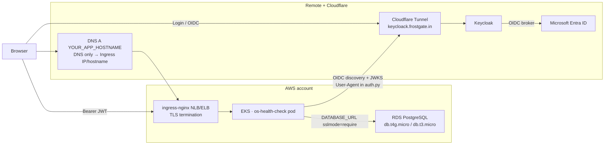

# AWS EKS Production Test Plan

> **Purpose.** An ordered, beginner-friendly path to run the same prod-like
> proof on **AWS** that we already validated on Azure: **EKS** + **RDS
> PostgreSQL** + remote Keycloak (`keycloack.frostgate.in`, Cloudflare Tunnel)
> + app HTTPS on a hostname **you** choose + existing Keycloak **Entra**
> federation (no Cognito required for this test).
>
> **Azure counterpart.** [`AZURE_AKS_PRODUCTION_TEST_PLAN.md`](AZURE_AKS_PRODUCTION_TEST_PLAN.md)
> — same app, same Keycloak; swap AKS/Flexible Server for EKS/RDS.
>
> **What you are proving.** Browser login (HTTPS) → Keycloak JWT → EKS app
> validates JWKS → Postgres read/write → publisher role works.
>
> **Companions.** [`k8s/README.md`](k8s/README.md) · [`k8s/ingress.yaml`](k8s/ingress.yaml) ·
> [`KEYCLOAK_SETUP.md`](KEYCLOAK_SETUP.md) · [`.env.example`](.env.example)

---

## Table of contents

1. [Target architecture](#1-target-architecture)
2. [Cost fit](#2-cost-fit)
3. [What you need before Day 1](#3-what-you-need-before-day-1)
4. [Order of work](#4-order-of-work)
5. [Phase 0 — AWS account, tools, naming](#5-phase-0--aws-account-tools-naming)
6. [Phase 1 — Keycloak (reuse Azure setup)](#6-phase-1--keycloak-reuse-azure-setup)
7. [Phase 2 — Region + tags](#7-phase-2--region--tags)
8. [Phase 3 — RDS PostgreSQL](#8-phase-3--rds-postgresql)
9. [Phase 4 — Create EKS](#9-phase-4--create-eks)
10. [Phase 5 — Let EKS reach RDS](#10-phase-5--let-eks-reach-rds)
11. [Phase 6 — Build image, deploy app](#11-phase-6--build-image-deploy-app)
12. [Phase 7 — App HTTPS (Ingress + cert-manager + DNS)](#12-phase-7--app-https-ingress--cert-manager--dns)
13. [Phase 8 — Keycloak redirects + first login](#13-phase-8--keycloak-redirects--first-login)
14. [Phase 9 — Entra federation check](#14-phase-9--entra-federation-check)
15. [Phase 10 — End-to-end checklist](#15-phase-10--end-to-end-checklist)
16. [Phase 11 — Tear down](#16-phase-11--tear-down)
17. [Decision log](#17-decision-log)
18. [Command cheat sheet](#18-command-cheat-sheet)
19. [Azure → AWS map](#19-azure--aws-map)

---

## 1. Target architecture



| Piece | Where | Notes (from Azure lessons) |
|---|---|---|
| App | EKS, 1 replica, Service **ClusterIP** | Public entry is Ingress, not `LoadBalancer` on the app Service |
| App URL | `https://YOUR_APP_HOSTNAME` | Required for PKCE (`crypto.subtle` needs HTTPS) — **not** hard-coded in repo |
| DB | RDS Postgres 16, small instance | Publicly reachable for short test, or SG-locked to EKS |
| Keycloak | Reuse `https://keycloack.frostgate.in` | Keep Tunnel **proxied**; do not grey-cloud this host |
| Image | Docker Hub `linux/amd64` | Apple Silicon: `docker build --platform linux/amd64` |
| IdP | Existing Entra → Keycloak broker | Same as Azure test; app never talks to AWS Cognito |

---

## 2. Cost fit

EKS + a small node + RDS will burn money while running (control plane alone is ~\$0.10/hour). Treat this like the Azure credit test: **short window, then tear down**.

| Resource | Suggested for this test |
|---|---|
| EKS control plane | 1 cluster (always billed while exists) |
| Node group | **1 × `t3.medium`** or **`t3.small`** (amd64). Prefer `t3.medium` if pods + Ingress feel tight on `small` |
| RDS | **`db.t4g.micro`** (Graviton) or **`db.t3.micro`**, 20 GB gp3, single-AZ |
| LBs | **One** for ingress-nginx (app Service = ClusterIP) |
| ECR | Skip — use Docker Hub |
| ElastiCache / Redis | **Do not create** |

Hard rules:

1. Tag everything `Project=oshealth-eks-prodtest` for find/delete.
2. Set an **AWS Budget** alert (Billing → Budgets).
3. Prefer **`ap-south-1`** (Mumbai) if you are in India — lower latency to Keycloak/you; change if you prefer.
4. Delete the cluster + RDS when idle for more than a few hours.

---

## 3. What you need before Day 1

| Need | Notes |
|---|---|
| AWS account | Free tier / credits help but **EKS is not free** |
| `aws` CLI v2 + credentials | `aws configure` or SSO |
| **eksctl** | Simplest path to a one-node EKS cluster |
| `kubectl`, Docker, **Helm**, Docker Hub login | Same as Azure |
| Cloudflare zone `frostgate.in` | New A/CNAME for **your** app hostname |
| Keycloak already set up | Reuse realm/client/users from Azure plan §6 |
| This repo | Build from directory that contains `Dockerfile` |

```bash
brew install awscli kubectl helm eksctl
aws sts get-caller-identity
eksctl version
```

---

## 4. Order of work

| Step | Done when |
|---|---|
| 0 Tools + names | `aws sts get-caller-identity` works; names written down |
| 1 Keycloak ready | Local `publisher` / `editor` + issuer URL known |
| 2 Region + tags | Defaults exported |
| 3 RDS + security group | `psql` or app can connect with `sslmode=require` |
| 4 EKS | `kubectl get nodes` → Ready |
| 5 SG path EKS → RDS | Postgres port 5432 allowed from node/cluster SG |
| 6 Build amd64 + deploy | Pod Running; seed log present |
| 7 Ingress + TLS + DNS | `https://YOUR_APP_HOSTNAME` → 200 |
| 8 Keycloak redirects + login | Local publisher uses the app |
| 9 Entra check | Optional smoke of Microsoft login |
| 10 Checklist + tear down | Cluster + RDS gone |

---

## 5. Phase 0 — AWS account, tools, naming

1. Create a **Budget** (e.g. \$100–\$150) with email alerts.
2. Fix these names (examples — change as you like):

| Name | Example value |
|---|---|
| Region | `ap-south-1` |
| EKS cluster | `eks-oshealth-test` |
| Node instance type | `t3.medium` |
| RDS instance id | `rds-oshealth-test` |
| DB name | `oshealth` |
| Master username | `oshealthadmin` |
| `DEPLOYMENT_ID` | `aws-eks-prodtest` |
| Keycloak realm / client | `os-health-check` / `os-health-check-web` |
| Publisher role | `lookup-publisher` |
| Keycloak URL | `https://keycloack.frostgate.in` |
| App hostname | **`YOUR_APP_HOSTNAME`** (e.g. `oshealth-aws.frostgate.in`) — pick before Phase 7 |
| Docker Hub image | `jibingeorge/os-health-check:v1` (or your user) |
| Common tag | `Project=oshealth-eks-prodtest` |

```bash
export AWS_REGION=ap-south-1
export AWS_DEFAULT_REGION=$AWS_REGION
aws configure set region "$AWS_REGION"
aws sts get-caller-identity
```

---

## 6. Phase 1 — Keycloak (reuse Azure setup)

If you already completed Keycloak for the Azure test, **skip creating a new realm**. Confirm:

```bash
curl -fsS "https://keycloack.frostgate.in/realms/os-health-check/.well-known/openid-configuration" | head
```

Issuer must be exactly:

```text
https://keycloack.frostgate.in/realms/os-health-check
```

You still need:

- Public client `os-health-check-web`, PKCE **S256**
- Realm role `lookup-publisher` on user `publisher` (**Filter by realm roles** when assigning)
- Entra IdP already configured (Phase 9 only re-checks)

You will **add** a new Valid redirect URI / Web origin for `https://YOUR_APP_HOSTNAME` in Phase 8 (keep Azure host entries only if that stack still exists).

---

## 7. Phase 2 — Region + tags

```bash
export AWS_REGION=ap-south-1
export CLUSTER_NAME=eks-oshealth-test
export RDS_ID=rds-oshealth-test
export PROJECT_TAG=oshealth-eks-prodtest
```

All create commands below should include tags where the API supports them (`--tags Key=Project,Value=$PROJECT_TAG`).

---

## 8. Phase 3 — RDS PostgreSQL

Put comments on their own `#` lines (Unicode dashes in pasted comments can break `export` in zsh).

### 8.1 Password + create instance

```bash
export PG_ADMIN=oshealthadmin
export PG_PASSWORD='REPLACE_WITH_LONG_RANDOM_PASSWORD'
export RDS_ID=rds-oshealth-test

# Create a dedicated SG for RDS (simplest public test path).
# You will tighten / attach EKS node SGs in Phase 5.
RDS_SG_ID=$(aws ec2 create-security-group \
  --group-name oshealth-rds-sg \
  --description "OS Health Check RDS prodtest" \
  --tag-specifications "ResourceType=security-group,Tags=[{Key=Project,Value=$PROJECT_TAG}]" \
  --query GroupId --output text)
echo "RDS_SG_ID=$RDS_SG_ID"

# Temporary: open Postgres to the world for a short throwaway test.
# Prefer restricting to your IP + EKS node SG (Phase 5) before any real data.
aws ec2 authorize-security-group-ingress \
  --group-id "$RDS_SG_ID" \
  --protocol tcp --port 5432 --cidr 0.0.0.0/0
```

```bash
aws rds create-db-instance \
  --db-instance-identifier "$RDS_ID" \
  --db-instance-class db.t4g.micro \
  --engine postgres \
  --engine-version 16 \
  --master-username "$PG_ADMIN" \
  --master-user-password "$PG_PASSWORD" \
  --allocated-storage 20 \
  --storage-type gp3 \
  --db-name oshealth \
  --vpc-security-group-ids "$RDS_SG_ID" \
  --publicly-accessible \
  --no-multi-az \
  --backup-retention-period 1 \
  --tags Key=Project,Value=$PROJECT_TAG
```

If `db.t4g.micro` is unavailable in the region, use `--db-instance-class db.t3.micro`.

Wait until available:

```bash
aws rds wait db-instance-available --db-instance-identifier "$RDS_ID"
aws rds describe-db-instances \
  --db-instance-identifier "$RDS_ID" \
  --query 'DBInstances[0].Endpoint.Address' \
  --output text
```

Save the endpoint hostname. Connection string:

```text
postgresql://oshealthadmin:YOUR_PASSWORD@<RDS-ENDPOINT>:5432/oshealth?sslmode=require
```

RDS requires TLS for many setups; always use `sslmode=require` like Azure Flexible Server.

Optional overnight cost cut (instance still exists; storage bills):

```bash
aws rds stop-db-instance --db-instance-identifier "$RDS_ID"
# later:
aws rds start-db-instance --db-instance-identifier "$RDS_ID"
```

(Stop is not available for all classes/states; if the API rejects it, delete instead.)

---

## 9. Phase 4 — Create EKS

### 9.1 Create a small cluster with eksctl

`eksctl` creates a VPC + managed node group. This takes **15–25 minutes**.

```bash
eksctl create cluster \
  --name "$CLUSTER_NAME" \
  --region "$AWS_REGION" \
  --version 1.31 \
  --nodegroup-name ng-oshealth \
  --node-type t3.medium \
  --nodes 1 \
  --nodes-min 1 \
  --nodes-max 1 \
  --managed \
  --tags "Project=$PROJECT_TAG"
```

Point kubectl (eksctl usually does this automatically):

```bash
aws eks update-kubeconfig --region "$AWS_REGION" --name "$CLUSTER_NAME"
kubectl config current-context
kubectl get nodes
```

One node `Ready`. If an old Minikube context was active, `update-kubeconfig` / `current-context` must show the EKS cluster (not `127.0.0.1`).

### 9.2 Note node security group (for RDS)

```bash
# Shared / cluster / node SGs vary by eksctl version — list ENI SGs on the node:
kubectl get nodes -o wide
INSTANCE_ID=$(aws ec2 describe-instances \
  --filters "Name=tag:eks:cluster-name,Values=$CLUSTER_NAME" "Name=instance-state-name,Values=running" \
  --query 'Reservations[0].Instances[0].InstanceId' --output text)
echo "INSTANCE_ID=$INSTANCE_ID"
aws ec2 describe-instances --instance-ids "$INSTANCE_ID" \
  --query 'Reservations[0].Instances[0].SecurityGroups' --output table
```

Save the node security group id(s) for Phase 5.

---

## 10. Phase 5 — Let EKS reach RDS

If you opened `0.0.0.0/0` on 5432 for the throwaway test, pods can reach RDS already. Better (still simple):

```bash
# Replace with your node / cluster SG id from Phase 9.2
NODE_SG_ID=sg-xxxxxxxx

aws ec2 authorize-security-group-ingress \
  --group-id "$RDS_SG_ID" \
  --protocol tcp --port 5432 \
  --source-group "$NODE_SG_ID"
```

Then remove the wide-open rule when ready:

```bash
aws ec2 revoke-security-group-ingress \
  --group-id "$RDS_SG_ID" \
  --protocol tcp --port 5432 --cidr 0.0.0.0/0
```

Connectivity matrix:

| Path | Requirement |
|---|---|
| Pod → RDS `:5432` | SG allows EKS; `sslmode=require` |
| Pod → Keycloak HTTPS | Tunnel reachable from AWS egress |
| Browser → Keycloak | Same issuer as ConfigMap |
| Browser → app | After Phase 7: `https://YOUR_APP_HOSTNAME` |

Leave `KEYCLOAK_INTERNAL_URL` unset unless the pod must use a different URL than the browser (token `iss` still must match `KEYCLOAK_ISSUER_URL`).

---

## 11. Phase 6 — Build image, deploy app

### 11.1 Build and push (amd64, repo root)

```bash
cd /path/to/OS-Health-Check
export DOCKERHUB_USER=youruser

docker build --platform linux/amd64 -t "$DOCKERHUB_USER/os-health-check:v1" .
docker push "$DOCKERHUB_USER/os-health-check:v1"
```

Use an image that includes current `auth.py` (browser-like User-Agent on OIDC discovery/JWKS). Without it, Cloudflare Tunnel often returns **403** to Python while `curl` from the pod returns **200**, and every `/api/*` call fails after login.

Docker Hub repo should be **Public** (or configure an imagePullSecret).

### 11.2 Manifests

`k8s/deployment.yaml`:

```yaml
image: docker.io/<you>/os-health-check:v1
imagePullPolicy: Always
```

`k8s/configmap.yaml`:

```yaml
DEPLOYMENT_ID: "aws-eks-prodtest"
KEYCLOAK_ISSUER_URL: "https://keycloack.frostgate.in/realms/os-health-check"
KEYCLOAK_AUDIENCE: "os-health-check-web"
KEYCLOAK_PUBLISHER_ROLE: "lookup-publisher"
LOOKUP_DB_ENABLED: "true"
```

Prefer editing `k8s/service.yaml` to **`ClusterIP`** before apply if you will add Ingress next (avoids a second public LB). Otherwise patch in Phase 7.

### 11.3 Apply

```bash
cd k8s
kubectl apply -f namespace.yaml

kubectl create secret generic os-health-check-secrets \
  --namespace os-health-check \
  --from-literal=DATABASE_URL='postgresql://oshealthadmin:YOUR_PASSWORD@<RDS-ENDPOINT>:5432/oshealth?sslmode=require' \
  --from-literal=OPENAI_API_KEY='' \
  --from-literal=GEMINI_API_KEY='' \
  --from-literal=OPENROUTER_API_KEY=''

kubectl apply -f configmap.yaml -f pvc.yaml -f deployment.yaml -f service.yaml

kubectl -n os-health-check get pods -w
kubectl -n os-health-check logs -f deployment/os-health-check
```

Expect seed import or `already has 'data' rows -- skipping import`.

`service.yaml` maps **port 80 → container 8000**. Never put `:8000` on the public hostname.

---

## 12. Phase 7 — App HTTPS (Ingress + cert-manager + DNS)

Plain `http://<ELB hostname>` cannot run PKCE login. Use HTTPS on **your** DNS name.

Pick `YOUR_APP_HOSTNAME` now (example only: `oshealth-aws.frostgate.in`). It must match Cloudflare DNS, Ingress hosts, and Keycloak redirects.

### 12.1 ingress-nginx

```bash
helm repo add ingress-nginx https://kubernetes.github.io/ingress-nginx
helm repo update

helm upgrade --install ingress-nginx ingress-nginx/ingress-nginx \
  --namespace ingress-nginx \
  --create-namespace \
  --set controller.service.annotations."service\.beta\.kubernetes\.io/aws-load-balancer-type"=nlb

kubectl -n ingress-nginx get svc ingress-nginx-controller -w
```

Wait until `EXTERNAL-IP` is an AWS hostname (NLB) or address. Resolve it:

```bash
INGRESS_HOST=$(kubectl -n ingress-nginx get svc ingress-nginx-controller -o jsonpath='{.status.loadBalancer.ingress[0].hostname}')
echo "$INGRESS_HOST"
dig +short "$INGRESS_HOST"
```

### 12.2 cert-manager + ClusterIssuer

```bash
kubectl apply -f https://github.com/cert-manager/cert-manager/releases/download/v1.17.2/cert-manager.yaml
kubectl -n cert-manager wait --for=condition=Available deploy --all --timeout=120s

kubectl apply -f - <<'EOF'
apiVersion: cert-manager.io/v1
kind: ClusterIssuer
metadata:
  name: letsencrypt-prod
spec:
  acme:
    email: you@example.com
    server: https://acme-v02.api.letsencrypt.org/directory
    privateKeySecretRef:
      name: letsencrypt-prod
    solvers:
      - http01:
          ingress:
            class: nginx
EOF
```

### 12.3 Cloudflare DNS

| Type | Name | Content | Proxy |
|---|---|---|---|
| CNAME or A | your app label | Ingress NLB hostname or IP | **DNS only** (grey) for Let’s Encrypt HTTP-01 |

Do **not** grey-cloud Keycloak’s Tunnel hostname.

```bash
dig +short YOUR_APP_HOSTNAME
# must resolve to the Ingress LB — not Cloudflare anycast 104.x / 172.x while issuing the cert
```

### 12.4 ClusterIP + Ingress manifest

```bash
kubectl -n os-health-check patch svc os-health-check -p '{"spec":{"type":"ClusterIP"}}'
```

Edit [`k8s/ingress.yaml`](k8s/ingress.yaml):

1. Replace **both** `YOUR_APP_HOSTNAME.example.com` placeholders with **your** real hostname.
2. Keep `nginx.ingress.kubernetes.io/proxy-body-size: "50m"` — default ~1m causes **413** on Edit Data / Excel / Parquet export (POSTs the full row set).

```bash
cd /path/to/OS-Health-Check/k8s
kubectl apply -f ingress.yaml
kubectl -n os-health-check get certificate -w
```

If Ingress already exists without the body limit:

```bash
kubectl -n os-health-check annotate ingress os-health-check \
  nginx.ingress.kubernetes.io/proxy-body-size=50m --overwrite
```

Smoke:

```bash
curl -fsS -o /dev/null -w "%{http_code}\n" https://YOUR_APP_HOSTNAME/
# expect 200  (HEAD/-I may be 405 — app allows GET)
```

---

## 13. Phase 8 — Keycloak redirects + first login

Keycloak client **`os-health-check-web`**:

| Field | Value |
|---|---|
| Valid redirect URIs | `https://YOUR_APP_HOSTNAME/*` |
| Web origins | `https://YOUR_APP_HOSTNAME` |

Open `https://YOUR_APP_HOSTNAME`, login as **`publisher`**.

Healthy:

- URL cleans to `/` after login (no lingering `session_state` / `iss` — current `auth.js` strips them)
- `/api/auth/me` and `/api/lookup?source=data` → **200**
- Data rows visible; Edit Data / Export do not 413

If APIs 401 with JWKS **403** from Python: confirm image includes `auth.py` User-Agent fix; rebuild/push/restart. Do not grey-cloud the Keycloak Tunnel hostname.

---

## 14. Phase 9 — Entra federation check

Reuse the Entra app + Keycloak IdP from the Azure plan. No new app registration is required if the broker redirect URI is still:

```text
https://keycloack.frostgate.in/realms/os-health-check/broker/microsoft/endpoint
```

Smoke:

1. App login → Microsoft  
2. Entra user returns with a Keycloak JWT  
3. Assign `lookup-publisher` (realm-role filter) if they should publish  

---

## 15. Phase 10 — End-to-end checklist

### Infrastructure

- [ ] `kubectl get nodes` → Ready  
- [ ] Pod Running; DB seed/skip in logs  
- [ ] `https://YOUR_APP_HOSTNAME` → 200  
- [ ] Certificate Ready  

### Auth

- [ ] Local `editor` / `publisher` behaviour  
- [ ] APIs 200 after login  
- [ ] Microsoft login (if testing Entra)  

### Data

- [ ] Edit Data works (no 413)  
- [ ] Export Excel/Parquet works  
- [ ] Pod restart keeps Postgres data  

---

## 16. Phase 11 — Tear down

Order matters: delete Ingress Service LBs before or with the cluster; delete RDS; delete orphan SGs if left behind.

```bash
# App + Ingress from cluster (optional before cluster delete)
kubectl delete namespace os-health-check --ignore-not-found
kubectl delete namespace ingress-nginx --ignore-not-found
kubectl delete namespace cert-manager --ignore-not-found

# EKS + VPC created by eksctl (several minutes)
eksctl delete cluster --name "$CLUSTER_NAME" --region "$AWS_REGION" --wait

# RDS (create final snapshot only if you need it — skip for a throwaway test)
aws rds delete-db-instance \
  --db-instance-identifier "$RDS_ID" \
  --skip-final-snapshot \
  --delete-automated-backups

aws rds wait db-instance-deleted --db-instance-identifier "$RDS_ID"

# RDS security group (after RDS is gone)
aws ec2 delete-security-group --group-id "$RDS_SG_ID"
```

Confirm in **EC2 → Load Balancers**, **VPC**, and **RDS** that nothing tagged `Project=oshealth-eks-prodtest` remains.

**Does not delete:** Keycloak, Cloudflare Tunnel / DNS for Keycloak, Entra app, Docker Hub tags, your app DNS record (remove A/CNAME in Cloudflare manually).

---

## 17. Decision log

| Decision | Choice | Why |
|---|---|---|
| Cluster | EKS via **eksctl** | Fastest one-node path for a credit/cost-limited test |
| Node | 1 × `t3.medium` | Fits app + Ingress sidecars |
| DB | RDS Postgres 16 `db.t4g.micro` | Managed + small |
| App entry | Ingress + Let’s Encrypt + **your** hostname | PKCE needs HTTPS |
| App Service | ClusterIP | One cloud LB |
| Image | Docker Hub amd64 | Skip ECR cost |
| Keycloak | Reuse Tunnel host | Same as Azure |
| IdP | Existing Entra broker | No Cognito work for this pass |
| JWKS from EKS | User-Agent in `auth.py` | Cloudflare blocks default Python UA |
| Ingress body | `proxy-body-size: 50m` | Avoid 413 on draft/export |

---

## 18. Command cheat sheet

```bash
export AWS_REGION=ap-south-1
export CLUSTER_NAME=eks-oshealth-test
export RDS_ID=rds-oshealth-test

aws sts get-caller-identity
aws eks update-kubeconfig --region "$AWS_REGION" --name "$CLUSTER_NAME"
kubectl config current-context

kubectl -n os-health-check get pods,svc,ingress,certificate
kubectl -n os-health-check logs -f deployment/os-health-check
curl -fsS -o /dev/null -w "%{http_code}\n" https://YOUR_APP_HOSTNAME/

# Rebuild
export DOCKERHUB_USER=jibingeorge
docker build --platform linux/amd64 -t "$DOCKERHUB_USER/os-health-check:v1" .
docker push "$DOCKERHUB_USER/os-health-check:v1"
kubectl -n os-health-check rollout restart deployment/os-health-check

# JWKS from pod
kubectl -n os-health-check exec deploy/os-health-check -- \
  curl -fsS -o /dev/null -w "%{http_code}\n" \
  "https://keycloack.frostgate.in/realms/os-health-check/protocol/openid-connect/certs"

# Teardown (see Phase 11 for full sequence)
eksctl delete cluster --name "$CLUSTER_NAME" --region "$AWS_REGION" --wait
```

---

## 19. Azure → AWS map

| Azure test | AWS test |
|---|---|
| Resource group `rg-oshealth-prodtest` | Tags `Project=oshealth-eks-prodtest` + eksctl VPC |
| AKS `Standard_B2s_v2` | EKS managed node `t3.medium` |
| Flexible Server B1ms | RDS `db.t4g.micro` / `db.t3.micro` |
| Postgres firewall rules | Security groups |
| `az aks get-credentials` | `aws eks update-kubeconfig` / eksctl |
| Azure LB EXTERNAL-IP | NLB hostname on Ingress Service |
| Tear down: `az group delete` | `eksctl delete cluster` + `aws rds delete-db-instance` |
| App hostname in Azure plan | **Your** hostname here (placeholder in `k8s/ingress.yaml`) |

Lessons carried over (do not re-learn the hard way):

1. Build **`linux/amd64`** from **repo root**.  
2. App login needs **HTTPS** hostname, not raw LB HTTP.  
3. Ingress **`proxy-body-size` ≥ 50m** or Edit Data / export 413.  
4. Keep Keycloak Tunnel; fix JWKS via **auth.py User-Agent**, not grey-cloud.  
5. Assign `lookup-publisher` with **Filter by realm roles**.  
6. Strip OIDC callback junk from the URL (`auth.js` — redeploy if you still see `?session_state=`).

---

## What “success” looks like

1. Colleague opens **`https://YOUR_APP_HOSTNAME`**.  
2. Logs in via Keycloak (local or Microsoft).  
3. Sees Lookup Data; Edit Data and Export work.  
4. Publisher can publish; editor cannot.  
5. Data survives pod restart (RDS).

That validates EKS + RDS + remote Keycloak + app HTTPS + JWT validation from AWS — the same production-shaped path as the Azure test.
