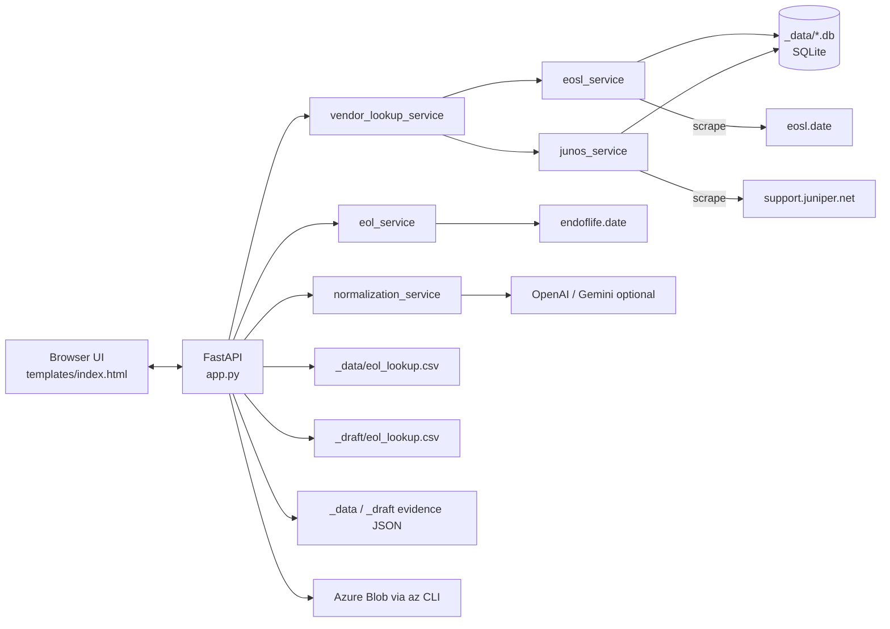
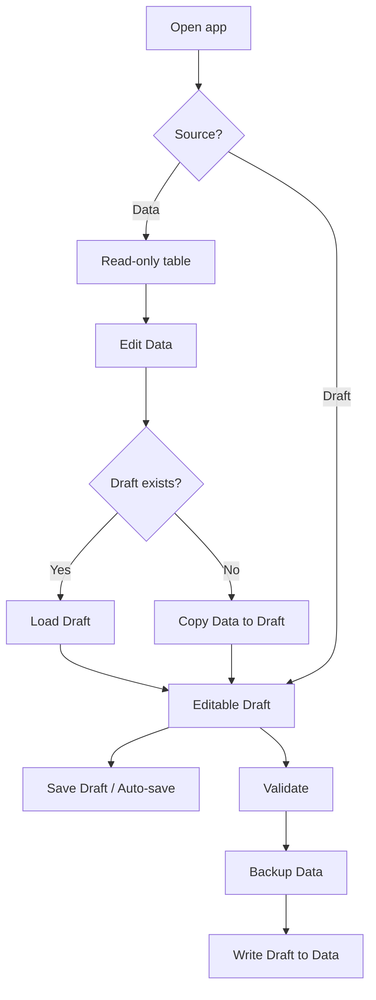
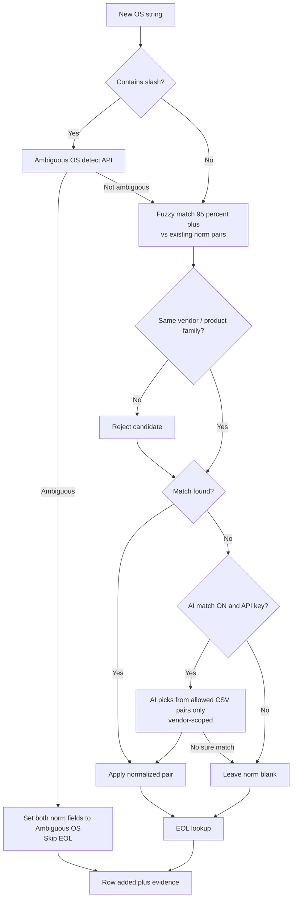
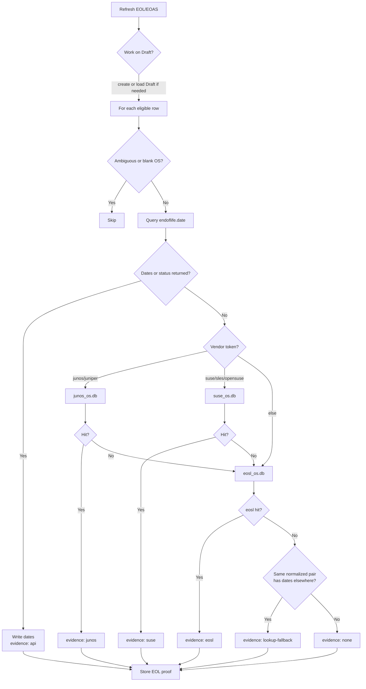
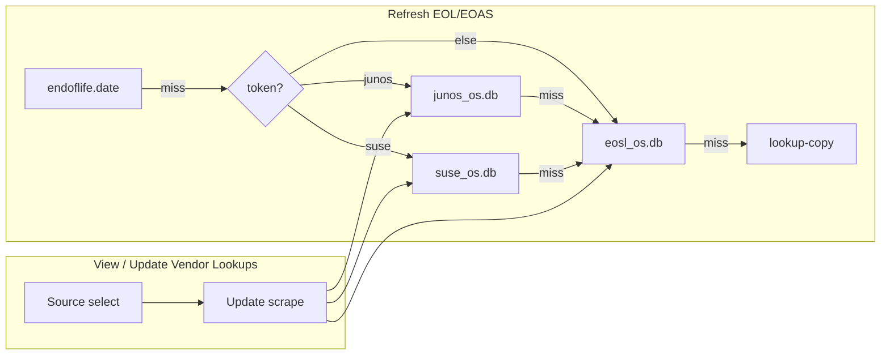
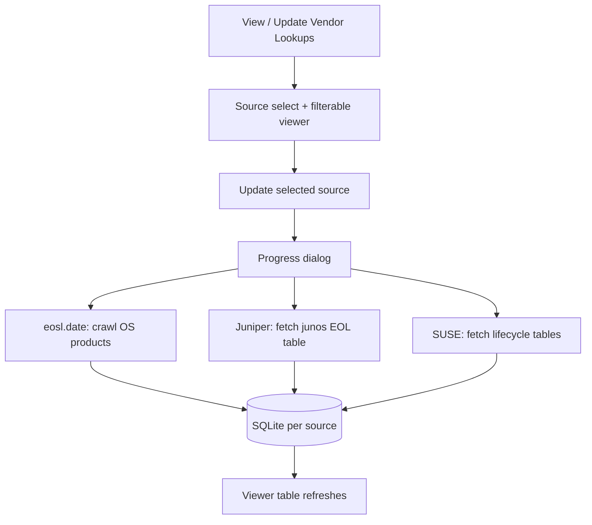

# OS Health Check

Web UI for maintaining an **OS normalization and lifecycle lookup** CSV (`eol_lookup.csv`).

Use it to:

- Search and browse existing OS lookup rows
- Add one or many OS strings with fuzzy (and optional AI) matching
- Refresh EOL / EOAS dates from [endoflife.date](https://endoflife.date)
- Refresh EOL / EOAS from local **Vendor Lookups** ([eosl.date](https://eosl.date) OS scrape, [Juniper Junos](https://support.juniper.net/support/eol/software/junos/) scrape, [SUSE lifecycle](https://www.suse.com/lifecycle/))
- Keep match/EOL **evidence** (proof) in a JSON sidecar
- Promote Draft → Data via Validate, then optionally upload Data to Azure Blob

## Stack

- **FastAPI** — API, CSV/evidence I/O, Azure upload
- **Jinja2** — app shell
- **Vanilla HTML / CSS / JS** — table UI and workflows
- **OpenAI** (optional) — AI match + Ambiguous OS detection
- **endoflife.date API** — lifecycle dates
- **Vendor Lookups (SQLite)** — local scrapes: eosl.date (OS) + Juniper Junos Dates & Milestones

## Run locally

```bash
python -m pip install -r requirements.txt
# optional: set AI keys in .env
# OPENAI_API_KEY=...
# GEMINI_API_KEY=...   # or GOOGLE_API_KEY
python -m uvicorn app:app --reload
```

Open [http://127.0.0.1:8000](http://127.0.0.1:8000).

| Variable | Required? | Purpose |
|----------|-----------|---------|
| `OPENAI_API_KEY` | For OpenAI AI match / Ambiguous detect | Enables OpenAI provider |
| `OPENAI_MODEL` | Optional | Defaults to `gpt-4o-mini` |
| `GEMINI_API_KEY` | For Gemini AI match / Ambiguous detect | Enables Gemini provider (`GOOGLE_API_KEY` also accepted) |
| `GEMINI_MODEL` | Optional | Defaults to `gemini-2.0-flash` |

In Edit mode, choose **OpenAI** or **Gemini** next to **AI match**. AI match is off by default. Azure upload uses Azure CLI (`az login`), not app secrets.

---

## CSV schema

Lookup CSV has exactly these 7 columns:

| Column | Meaning |
|--------|---------|
| `os_string` | Raw OS as seen in inventory |
| `normalized_os_detailed_name` | Detailed normalized name |
| `normalized_os` | Short normalized name |
| `eol_date` | End of life (Unix epoch string, or empty) |
| `eol_status` | `true` / `false` / empty (only when date missing) |
| `eoas_date` | End of active support (epoch, or empty) |
| `eoas_status` | `true` / `false` / empty |

UI-only fields (auto flags, proof) are **not** stored in the CSV.

---

## Project layout

```
OS-Health-Check/
├── app.py                      # FastAPI routes
├── normalization_service.py    # Vendor tags, fuzzy helpers, AI match
├── eol_service.py              # endoflife.date lookup
├── eosl_service.py             # eosl.date scraper + SQLite cache (OS only)
├── junos_service.py            # Juniper Junos Dates & Milestones scraper
├── suse_service.py             # SUSE lifecycle scraper (suse.com/lifecycle)
├── vendor_lookup_service.py    # Registry + routed vendor fallback lookup
├── os_import_service.py        # Bulk import from CSV/XLSX
├── templates/index.html        # UI + client workflows
├── static/                     # CSS, favicon
├── _data/
│   ├── eol_lookup.csv          # Canonical published lookup
│   ├── eol_lookup_evidence.json
│   ├── eosl_os.db              # SQLite cache of eosl.date OS data (gitignored)
│   ├── junos_os.db             # SQLite cache of Junos EOL table (gitignored)
│   └── suse_os.db              # SQLite cache of SUSE lifecycle (gitignored)
├── _draft/                     # Working editable copy (+ evidence)
├── _config/                    # Local settings (gitignored)
│   ├── app_settings.json       # ai_enabled, ai_provider (openai|gemini)
│   └── azure.json
└── _backup/                    # Timestamped backups on Validate
```

---

## High-level architecture



---

## Modes: Data vs Draft

The **Source** dropdown switches between the published lookup and the editable working copy. Scraped vendor data is viewed under **Vendor Lookups** — see [Vendor Lookups](#vendor-lookups-local-scraped-databases).

| | **Data** (read-only) | **Draft** (editable) |
|--|----------------------|----------------------|
| Purpose | Published lookup | Working copy |
| Edit Data | Shown | Hidden |
| Add OS / bulk / delta | Hidden | Shown |
| Auto-save, AI match, Save, Validate, Revert, Delete draft | Hidden | Shown |
| Azure Settings / Upload | Shown | Hidden |
| Refresh EOL/EOAS | Opens/uses Draft first | Refreshes in place |

**Edit Data** loads an existing Draft if present, otherwise copies Data → Draft.



---

## Add OS flow

**Add OS** — one string.  
**Add multiple OS** — paste lines, or import CSV/XLSX (pick columns → distinct values).

Duplicates (same `os_string`) are skipped.



### Matching rules (simple)

1. **Fuzzy first** — compare the OS string to existing `normalized_os_detailed_name` / `normalized_os` (not other raw `os_string`s). Score must be high (≥ 95%).
2. **Vendor guardrails** — keyword brands (Oracle, AlmaLinux, Cisco, Apple, Windows, …). Different brands cannot match (e.g. Oracle Linux ≠ AlmaLinux).
3. **AI match** — **off by default**. When enabled and the selected provider’s API key is set (`OPENAI_API_KEY` or `GEMINI_API_KEY`), AI may choose only from existing CSV pairs; never invents names. Batches are grouped by vendor so Oracle items don’t see AlmaLinux pairs in the same prompt. Accepted picks must also pass code checks: confidence ≥ threshold, same vendor, compatible version family, and no extra Windows SKU words (e.g. Pro must not become Pro Enterprise). OpenAI gets a stricter “prefer null over guess” instruction because `gpt-4o-mini` tends to over-match compared with Gemini.
4. **Conservative** — if unsure → no match (better blank than wrong).

**Example:** `Oracle Linux Server 9.5` → fuzzy/AI can map to `Oracle Linux 9`, but must **not** map to `AlmaLinux OS 9`.

---

## EOL / EOAS refresh flow

**Refresh EOL/EOAS** fills dates per row in this order. Vendor DBs are **fallbacks after the API misses**, routed by OS tokens (Junos → junos then eosl; SUSE → suse then eosl; else eosl).

### Per-row decision order

1. **endoflife.date API** — always tried first (same query preference as below). Release matching is **conservative**: no version (or only bitness / `SP3`-style pack digits used alone as a version) → **no match** (never guess the latest release); bare major like `11` does not pick `11.4`; only a strong version hit populates dates/names. (SUSE Vendor Lookup still understands `11 SP3` as a full release identity.)
2. **If the API returned dates/status** → write them (evidence `api` / `eol`). **Stop.** Vendor DBs are **not** consulted.
3. **If the API missed (or failed)** → call **Vendor Lookups** (`POST /api/vendor-lookup`):
   - **`junos` / `juniper` token** → `_data/junos_os.db` first (evidence `junos`); on miss → eosl.date
   - **`suse` / `sles` / `opensuse` token** → `_data/suse_os.db` first (evidence `suse`); on miss → eosl.date
   - **Otherwise** → `_data/eosl_os.db` only (evidence `eosl`)
4. **If vendor DBs also miss** → copy dates from another row with the same normalized pair when possible (evidence `lookup-fallback`).
5. **Still nothing** → leave blank (evidence `none`).

**Query preference** (for API and vendor lookup): try `normalized_os` → `normalized_os_detailed_name` → `os_string`, but **skip** a normalized value if its vendor doesn’t match the raw OS.

**Product slug detection** (endoflife.date): the v1 product catalog (`GET /api/v1/products`) is cached and indexed by slug, label, and aliases. Inventory strings are normalized first (letter/digit boundaries, glued names like `UbuntuLinux`), then matched longest-phrase-first against that index, with a small regex override table for ambiguous families (e.g. `windows-server` vs `windows`, RHEL vs OpenShift).

**Important:** scraping / **Update** under Vendor Lookups only rebuilds the local SQLite DBs. It does **not** apply dates to your CSV. Dates are applied only by **Refresh EOL/EOAS** (or equivalent lookup APIs).



### When are vendor DBs checked?

| Situation | Junos | SUSE | eosl |
|-----------|-------|------|------|
| API hit | No | No | No |
| `Junos OS 24.2`, API miss | Yes (first) | No | If Junos misses |
| `SUSE Linux 11 SP3`, API miss | No | Yes (first) | If SUSE misses |
| Ubuntu / other, API miss | No | No | Yes |
| Update scrape only | No CSV write | No CSV write | No CSV write |

Example: `SUSE Linux 11 SP3` → API conservative miss → SUSE DB → General Ends → EOL, LTSS Ends → EOAS → evidence `suse`.

Dates are stored as Unix epoch. Status `true`/`false` is only used when a date is missing.

---

## Vendor Lookups (local scraped databases)

Umbrella for **offline** lifecycle scrapers used as the Refresh fallback above. **View / Update Vendor Lookups** opens a read-only modal with a **Source** selector (browse + rebuild DB only).

| Source | Origin | Local DB | Date mapping | Used on Refresh when… |
|--------|--------|----------|--------------|------------------------|
| **eosl.date** | [eosl.date](https://eosl.date) OS category | `_data/eosl_os.db` | EOAS = earliest support date, EOL = latest | API missed; also after Junos/SUSE miss |
| **Juniper Junos** | [Junos Dates & Milestones](https://support.juniper.net/support/eol/software/junos/) (**that table only**) | `_data/junos_os.db` | **EOE → `eol_date`**, **EOS → `eoas_date`**, FRS → released | API missed **and** `junos`/`juniper` token |
| **SUSE Lifecycle** | [suse.com/lifecycle](https://www.suse.com/lifecycle/) | `_data/suse_os.db` | **General Ends → `eol_date`**, **LTSS Ends → `eoas_date`**, FCS → released | API missed **and** `suse`/`sles`/`opensuse` token |



### eosl.date notes

- Support-column labels vary; any non-metadata date column feeds earliest/latest EOAS/EOL.
- Strong product **and** release score required; vague `Other … Linux` / bitness / `N.x` false matches are rejected.
- Requests are throttled; scrapes are serialized server-side.

### Junos notes

- One page scrape; table HTML is embedded in the Juniper CMS payload (`sw-eol-table`).
- Product cells like `Junos OS 24.2` (sometimes with trailing maintenance markers) split into product `Junos OS` + release `24.2` / `15.1X53`.
- For Junos rows, EOE is often **before** EOS, so **EOL may be earlier than EOAS** in the app (intentional naming).
- Matching: token gate first, then strong version score. Family-only versions (e.g. `15.1`) do **not** guess an X-train (`15.1X53`); if unsure, blank.

### SUSE notes

- Scrapes [suse.com/lifecycle](https://www.suse.com/lifecycle/) tables that include **General Ends** / **General Support Ends** and **LTSS Ends**.
- **General Ends → `eol_date`**, **LTSS Ends → `eoas_date`**, FCS → released.
- Releases keep SP identity (`11 SP3`, `15 SP4`); generic `SUSE`/`SLES` prefers **SUSE Linux Enterprise Server** (not Desktop/SAP/HPC unless named).
- Conservative: no SP/version → no match; bare `11` does not pick `11 SP3`.



---

## Evidence (proof)

Sidecar JSON next to the CSV (not in the CSV itself):

- `_data/eol_lookup_evidence.json`
- `_draft/eol_lookup_evidence.json`

Shape:

```json
{
  "updated_at": "2026-07-14T12:00:00",
  "by_os": {
    "Oracle Linux Server 9.5": {
      "detailed": { "method": "fuzzy" },
      "normalized": { "method": "fuzzy" },
      "eol": {
        "method": "api",
        "queryUsed": "Oracle Linux 9",
        "queryField": "normalized_os",
        "productSlug": "oracle-linux",
        "apiNote": ""
      }
    }
  }
}
```

Proof methods include: `fuzzy`, `ai`, `fuzzy+ai`, `eol` / `api`, `eosl`, `junos`, `suse`, `lookup-fallback`, `ambiguous`, `manual`, `none`.

The Actions column filter can narrow rows by: Fuzzy, AI, Fuzzy + AI, Manual, EOL API, eosl.date, Juniper Junos, SUSE Lifecycle, Lookup copy, Ambiguous, or NULL.

---

## Toolbar features

| Control | Default / notes |
|---------|-----------------|
| **Auto-save** | On by default; debounced save to Draft |
| **AI match** | **Off by default**; Edit mode only; choose OpenAI or Gemini; needs that provider’s API key |
| **Save Draft** | Manual draft + evidence write |
| **Validate** | Backup Data → write Draft into Data |
| **Revert** | Reset Draft rows (+ evidence) to the Data baseline and **save `_draft/`** immediately |
| **Delete draft** | Remove Draft (+ evidence), return to Data |
| **Show Delta / Download Delta** | Draft-only change view |
| **View / Update Vendor Lookups** | Read-only viewer for eosl.date / Juniper Junos / SUSE Lifecycle DBs; update/re-scrape per source |
| **Azure** | Data mode: settings + upload via `az storage blob upload` |

---

## Main API endpoints

| Method | Path | Purpose |
|--------|------|---------|
| `GET` / `POST` | `/api/lookup` | Load / save CSV (+ evidence) |
| `DELETE` | `/api/lookup/draft` | Delete draft |
| `POST` | `/api/normalize-suggest` | AI normalization (if enabled) |
| `POST` | `/api/ambiguous-os-detect` | Detect ambiguous `/` OS strings |
| `POST` | `/api/eol-lookup` | Batch EOL/EOAS from endoflife.date |
| `POST` | `/api/vendor-lookup` | Routed vendor fallback (Junos or eosl.date) |
| `GET` | `/api/vendor-lookups/sources` | List vendor lookup sources |
| `GET` | `/api/vendor-lookups/{source}/rows` | Viewer rows + status (`eosl` \| `junos`) |
| `GET` | `/api/vendor-lookups/{source}/status` | DB status for a source |
| `POST` | `/api/vendor-lookups/{source}/sync` | Re-scrape and rebuild that source’s DB |
| `POST` | `/api/eosl-lookup` | Batch from eosl.date only (compat) |
| `GET` / `POST` | `/api/eosl/*` | eosl.date status / rows / sync (compat) |
| `POST` | `/api/junos-lookup` | Batch from Junos DB only |
| `GET` / `POST` | `/api/junos/*` | Junos status / rows / sync |
| `POST` | `/api/suse-lookup` | Batch from SUSE DB only |
| `GET` / `POST` | `/api/suse/*` | SUSE status / rows / sync |
| `GET` / `PUT` | `/api/settings` | Persist `ai_enabled` + `ai_provider` |

---

## Validate and publish flow


---

## Design choices worth knowing

- **Fuzzy before AI** — fast, local, no API key required.
- **AI opt-in** — avoids surprise wrong matches; toggle in Edit mode when needed.
- **EOL release matching** — if unsure, don’t populate (no version / weak major / bitness → blank; never default to latest release).
- **Vendor keywords** — guardrails for known traps (Oracle/AlmaLinux, Cisco/Apple iOS). Not a full brand encyclopedia; AI + “unsure = no match” covers unknown brands.
- **Draft vs Data** — safe editing; Validate is the promote step; Refresh never silently wipes an existing Draft.
- **Evidence sidecar** — audit trail without changing CSV schema.
