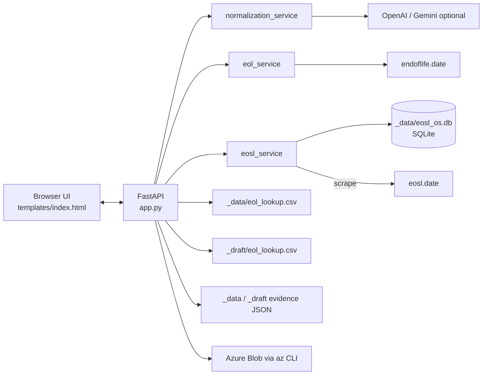
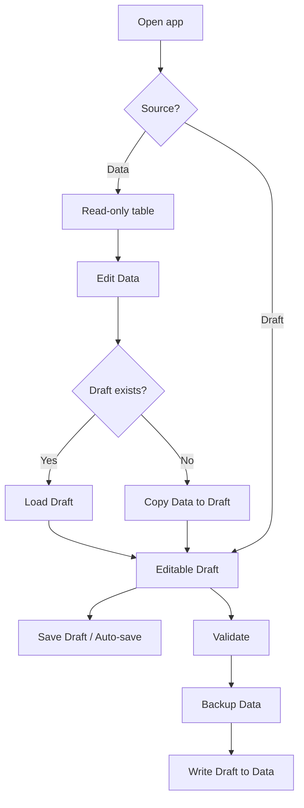
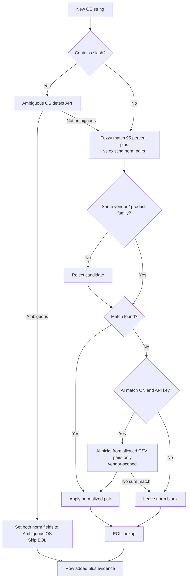
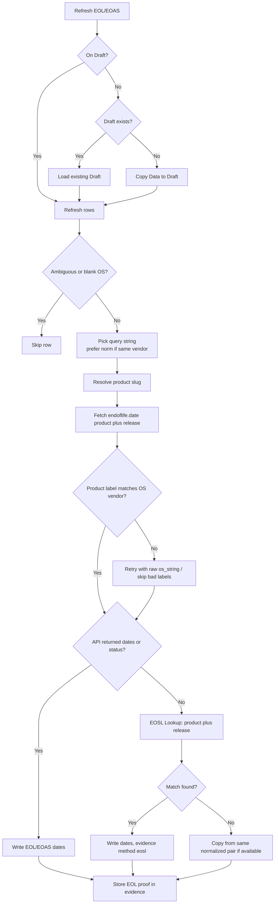
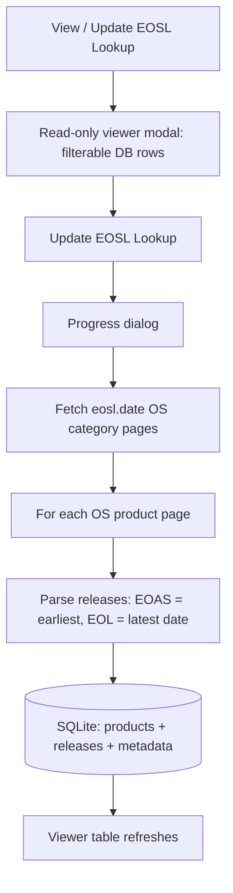

# OS Health Check

Web UI for maintaining an **OS normalization and lifecycle lookup** CSV (`eol_lookup.csv`).

Use it to:

- Search and browse existing OS lookup rows
- Add one or many OS strings with fuzzy (and optional AI) matching
- Refresh EOL / EOAS dates from [endoflife.date](https://endoflife.date)
- Refresh EOL / EOAS dates from a local [eosl.date](https://eosl.date) database (scraped, OS category only)
- Keep match/EOL **evidence** (proof) in a JSON sidecar
- Promote Draft → Data via Validate, then optionally upload Data to Azure Blob

## Stack

- **FastAPI** — API, CSV/evidence I/O, Azure upload
- **Jinja2** — app shell
- **Vanilla HTML / CSS / JS** — table UI and workflows
- **OpenAI** (optional) — AI match + Ambiguous OS detection
- **endoflife.date API** — lifecycle dates
- **eosl.date scraper + SQLite** — alternative local lifecycle source (OS category)

## Run locally

```bash
python -m pip install -r requirements.txt
# optional: set AI keys in .env
# OPENAI_API_KEY=...
# GEMINI_API_KEY=...   # or GOOGLE_API_KEY
python -m uvicorn app:app --reload
```

Open [http://127.0.0.1:8000](http://127.0.0.1:8000).

| Variable | Required? | Purpose |
|----------|-----------|---------|
| `OPENAI_API_KEY` | For OpenAI AI match / Ambiguous detect | Enables OpenAI provider |
| `OPENAI_MODEL` | Optional | Defaults to `gpt-4o-mini` |
| `GEMINI_API_KEY` | For Gemini AI match / Ambiguous detect | Enables Gemini provider (`GOOGLE_API_KEY` also accepted) |
| `GEMINI_MODEL` | Optional | Defaults to `gemini-2.0-flash` |

In Edit mode, choose **OpenAI** or **Gemini** next to **AI match**. AI match is off by default. Azure upload uses Azure CLI (`az login`), not app secrets.

---

## CSV schema

Lookup CSV has exactly these 7 columns:

| Column | Meaning |
|--------|---------|
| `os_string` | Raw OS as seen in inventory |
| `normalized_os_detailed_name` | Detailed normalized name |
| `normalized_os` | Short normalized name |
| `eol_date` | End of life (Unix epoch string, or empty) |
| `eol_status` | `true` / `false` / empty (only when date missing) |
| `eoas_date` | End of active support (epoch, or empty) |
| `eoas_status` | `true` / `false` / empty |

UI-only fields (auto flags, proof) are **not** stored in the CSV.

---

## Project layout

```
OS-Health-Check/
├── app.py                      # FastAPI routes
├── normalization_service.py    # Vendor tags, fuzzy helpers, AI match
├── eol_service.py              # endoflife.date lookup
├── eosl_service.py             # eosl.date scraper + SQLite cache (OS only)
├── os_import_service.py        # Bulk import from CSV/XLSX
├── templates/index.html        # UI + client workflows
├── static/                     # CSS, favicon
├── _data/
│   ├── eol_lookup.csv          # Canonical published lookup
│   ├── eol_lookup_evidence.json
│   └── eosl_os.db              # SQLite cache of eosl.date OS data (gitignored)
├── _draft/                     # Working editable copy (+ evidence)
├── _config/                    # Local settings (gitignored)
│   ├── app_settings.json       # ai_enabled, ai_provider (openai|gemini)
│   └── azure.json
└── _backup/                    # Timestamped backups on Validate
```

---

## High-level architecture



---

## Modes: Data vs Draft

The **Source** dropdown switches between the published lookup and the editable working copy. (The scraped eosl.date data is viewed separately in its own modal — see [EOSL lookup](#eosl-lookup-local-eosldate-database).)

| | **Data** (read-only) | **Draft** (editable) |
|--|----------------------|----------------------|
| Purpose | Published lookup | Working copy |
| Edit Data | Shown | Hidden |
| Add OS / bulk / delta | Hidden | Shown |
| Auto-save, AI match, Save, Validate, Revert, Delete draft | Hidden | Shown |
| Azure Settings / Upload | Shown | Hidden |
| Refresh EOL/EOAS | Opens/uses Draft first | Refreshes in place |

**Edit Data** loads an existing Draft if present, otherwise copies Data → Draft.



---

## Add OS flow

**Add OS** — one string.  
**Add multiple OS** — paste lines, or import CSV/XLSX (pick columns → distinct values).

Duplicates (same `os_string`) are skipped.



### Matching rules (simple)

1. **Fuzzy first** — compare the OS string to existing `normalized_os_detailed_name` / `normalized_os` (not other raw `os_string`s). Score must be high (≥ 95%).
2. **Vendor guardrails** — keyword brands (Oracle, AlmaLinux, Cisco, Apple, Windows, …). Different brands cannot match (e.g. Oracle Linux ≠ AlmaLinux).
3. **AI match** — **off by default**. When enabled and the selected provider’s API key is set (`OPENAI_API_KEY` or `GEMINI_API_KEY`), AI may choose only from existing CSV pairs; never invents names. Batches are grouped by vendor so Oracle items don’t see AlmaLinux pairs in the same prompt. Accepted picks must also pass code checks: confidence ≥ threshold, same vendor, compatible version family, and no extra Windows SKU words (e.g. Pro must not become Pro Enterprise). OpenAI gets a stricter “prefer null over guess” instruction because `gpt-4o-mini` tends to over-match compared with Gemini.
4. **Conservative** — if unsure → no match (better blank than wrong).

**Example:** `Oracle Linux Server 9.5` → fuzzy/AI can map to `Oracle Linux 9`, but must **not** map to `AlmaLinux OS 9`.

---

## EOL / EOAS refresh flow

Uses [endoflife.date](https://endoflife.date) product API first, then falls back to the local [EOSL Lookup](#eosl-lookup-local-eosldate-database) (product + release) when the API has no match.

**Query preference:** try `normalized_os` → `normalized_os_detailed_name` → `os_string`, but **skip** a normalized value if its vendor doesn’t match the raw OS (wrong brand leftover).



Dates are stored as Unix epoch. Status `true`/`false` is only used when a date is missing.

---

## EOSL lookup (local eosl.date database)

An alternative lifecycle source scraped from [eosl.date](https://eosl.date), limited to the **OS** category. It is stored in a local SQLite DB (`_data/eosl_os.db`) so lookups are offline and fast.

The **View / Update EOSL Lookup** button (next to **Refresh EOL/EOAS**) opens a **read-only viewer modal** showing the scraped data in the database's own columns — **Product, Release, Released, EOL date, EOAS date, Supported** (not the lookup CSV's columns). In the modal you can:

- **Filter** the records with a search box (product / release / dates), just like the main table.
- **Update EOSL Lookup** — re-scrape eosl.date and rebuild the DB. This opens a separate progress dialog; when it finishes the viewer table refreshes automatically. The header shows the last-updated timestamp and product/release counts.

The scraped dates can also be applied to your lookup rows through the batch endpoint `POST /api/eosl-lookup` (same row/vendor guardrails as the endoflife.date refresh).

**Refresh EOL/EOAS** uses this as a fallback: when endoflife.date returns no match for a row, the app tries the local EOSL database using a **product + release** match. Evidence is stored as method `eosl` so you can filter those rows in the Actions column.

Scraping and matching notes:

- Column labels differ per vendor, so instead of matching label names the scraper treats every support-date column as a lifecycle date and derives **EOAS = earliest** end date, **EOL = latest** end date.
- Release matching is dot-aware on the numeric version (e.g. `22.04.3` → `22.04`) and ignores the release-date digits in the "Latest" column. A strong product **and** release score is required — the first release is never guessed. Vague strings like `Other 3.x or later Linux (64-bit)` are rejected (no `N.x` / bitness false matches, and generic `linux` kernel only matches clear kernel queries like `Linux 6.13`).
- Vendor compatibility is enforced the same way as the API path (e.g. Oracle Linux never resolves to AlmaLinux).
- Requests are throttled (short delay per page) and serialized server-side so only one scrape runs at a time.



---

## Evidence (proof)

Sidecar JSON next to the CSV (not in the CSV itself):

- `_data/eol_lookup_evidence.json`
- `_draft/eol_lookup_evidence.json`

Shape:

```json
{
  "updated_at": "2026-07-14T12:00:00",
  "by_os": {
    "Oracle Linux Server 9.5": {
      "detailed": { "method": "fuzzy" },
      "normalized": { "method": "fuzzy" },
      "eol": {
        "method": "api",
        "queryUsed": "Oracle Linux 9",
        "queryField": "normalized_os",
        "productSlug": "oracle-linux",
        "apiNote": ""
      }
    }
  }
}
```

Proof methods include: `fuzzy`, `ai`, `fuzzy+ai`, `eol` / `api`, `eosl`, `lookup-fallback`, `ambiguous`, `manual`, `none`.

The Actions column filter can narrow rows by: Fuzzy, AI, Fuzzy + AI, Manual, EOL API, EOSL Lookup, Lookup copy, Ambiguous, or NULL.

---

## Toolbar features

| Control | Default / notes |
|---------|-----------------|
| **Auto-save** | On by default; debounced save to Draft |
| **AI match** | **Off by default**; Edit mode only; choose OpenAI or Gemini; needs that provider’s API key |
| **Save Draft** | Manual draft + evidence write |
| **Validate** | Backup Data → write Draft into Data |
| **Revert** | Reset Draft rows (+ evidence) to the Data baseline and **save `_draft/`** immediately |
| **Delete draft** | Remove Draft (+ evidence), return to Data |
| **Show Delta / Download Delta** | Draft-only change view |
| **View / Update EOSL Lookup** | Opens read-only viewer of the local eosl.date DB (filterable); update/re-scrape from there |
| **Azure** | Data mode: settings + upload via `az storage blob upload` |

---

## Main API endpoints

| Method | Path | Purpose |
|--------|------|---------|
| `GET` / `POST` | `/api/lookup` | Load / save CSV (+ evidence) |
| `DELETE` | `/api/lookup/draft` | Delete draft |
| `POST` | `/api/normalize-suggest` | AI normalization (if enabled) |
| `POST` | `/api/ambiguous-os-detect` | Detect ambiguous `/` OS strings |
| `POST` | `/api/eol-lookup` | Batch EOL/EOAS from endoflife.date |
| `POST` | `/api/eosl-lookup` | Batch EOL/EOAS from local eosl.date DB |
| `GET` | `/api/eosl/rows` | All scraped releases (DB-native columns) + status, for the viewer |
| `GET` | `/api/eosl/status` | Local EOSL DB status (last updated, counts) |
| `POST` | `/api/eosl/sync` | Re-scrape eosl.date and rebuild local DB |
| `GET` / `PUT` | `/api/settings` | Persist `ai_enabled` + `ai_provider` |

---

## Validate and publish flow


---

## Design choices worth knowing

- **Fuzzy before AI** — fast, local, no API key required.
- **AI opt-in** — avoids surprise wrong matches; toggle in Edit mode when needed.
- **Vendor keywords** — guardrails for known traps (Oracle/AlmaLinux, Cisco/Apple iOS). Not a full brand encyclopedia; AI + “unsure = no match” covers unknown brands.
- **Draft vs Data** — safe editing; Validate is the promote step; Refresh never silently wipes an existing Draft.
- **Evidence sidecar** — audit trail without changing CSV schema.
