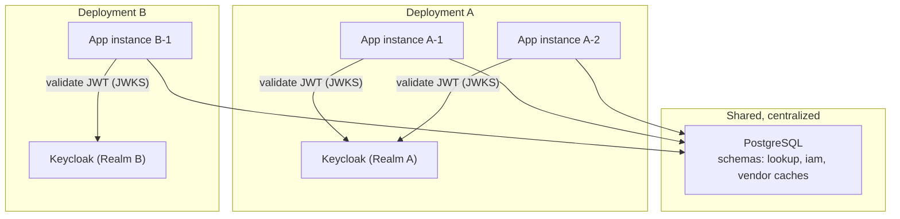
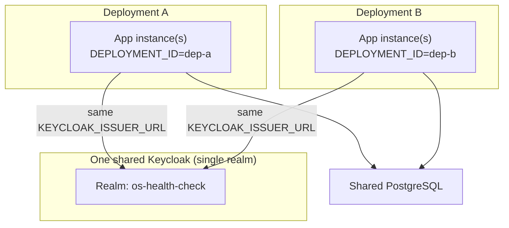
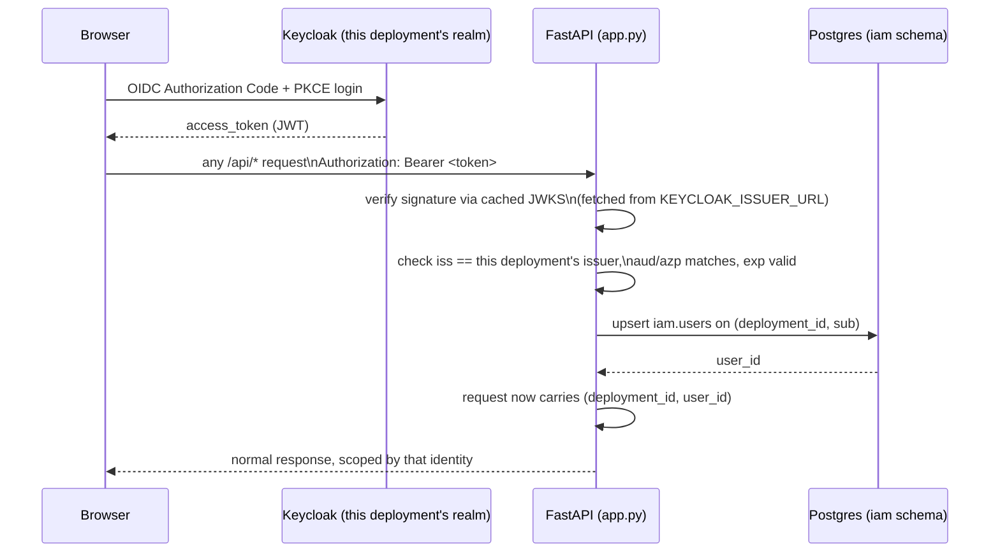

# User-Specific Drafts + Keycloak Auth — Architecture Plan

> **Status**: Implemented (Phases 1-3 of §12, combined into one pass) and
> verified end-to-end against a throwaway local Keycloak realm built exactly
> per [KEYCLOAK_SETUP.md](KEYCLOAK_SETUP.md) — real login, per-user draft
> isolation, and publish role-gating all confirmed working. This document is
> kept as the design record; ARCHITECTURE.md §6/§7 documents the resulting
> code, and KEYCLOAK_SETUP.md is the practical guide for standing up
> Keycloak itself. Remaining before this is live for you: point
> `KEYCLOAK_ISSUER_URL`/`KEYCLOAK_AUDIENCE`/`DEPLOYMENT_ID` at your real
> Keycloak once it's ready (§14's open decisions), and decide the
> legacy-draft handling in §9 if any deployment has a real in-progress
> draft today.
>
> Companion docs: [ARCHITECTURE.md](ARCHITECTURE.md) describes the current
> system this plan modifies — particularly §6 (Data/Draft/Publish lifecycle),
> §7 (Storage layer), and §11 (Concurrency & safety mechanisms).
> [KEYCLOAK_SETUP.md](KEYCLOAK_SETUP.md) is the step-by-step "how" for
> standing up Keycloak itself — dev now, Azure AD federation later — plus a
> troubleshooting section for gotchas actually hit while verifying this.

---

## 1. Problem statement

Today (see `ARCHITECTURE.md` §6-§7):

- There is **exactly one Draft**, globally, per Postgres database
  (`lookup.rows`/`lookup.evidence` keyed by `(source, row_order)` where
  `source ∈ {'data','draft'}` — `lookup_db.py:38-56`). Two people editing at
  the same time step on each other's work.
- There is **no user/session/identity concept anywhere** in the app — every
  API call is anonymous (`app.py`, verified: no auth middleware, no cookie,
  no `Authorization` header handling).
- A "deployment" today is implicit — whichever `DATABASE_URL` an app
  instance's environment points at. Multiple **instances** (replicas) are
  expected to share one deployment's database (the cross-instance vendor-sync
  lock in `lookup_db.py` / ARCHITECTURE.md §7 already anticipates this), and
  the k8s manifest additionally documents that **multiple deployments can
  point at the same shared Postgres too** (`k8s/deployment.yaml:1-4`,
  `k8s/pvc.yaml:15-19`).

Goal: introduce real user identity via **Keycloak**, and make **Draft**
user-specific, in a world where:

- **Keycloak may be deployed per-deployment** (each deployment could have its
  own realm/issuer — e.g. a separate on-prem IdP per customer/environment).
- **The database stays centralized/shared**, independent of where Keycloak
  lives — i.e., you cannot assume "one Keycloak" and "one DB" are co-located
  or 1:1.

## 2. Decisions locked in for this plan

These were confirmed explicitly before designing the schema/API changes
below, because each one materially changes the data model:

| Decision | Choice |
|---|---|
| Tenant scoping | **Multi-tenant isolation** — add an explicit `deployment_id` boundary. Users and drafts belonging to deployment A are invisible to deployment B, even though both rows live in the same shared Postgres. |
| Published `data` | **Stays global** — one shared canonical EOL/EOAS table for everyone, exactly as today. Only `draft` becomes scoped. |
| Draft model | **One private draft per user.** Mirrors today's single-draft-per-database model, just scoped to `(deployment_id, user_id)` instead of being a singleton. |
| Auth validation style | **Stateless Bearer JWT.** The backend validates an OIDC access token from that deployment's Keycloak on every request (signature, `iss`, `aud`, `exp`) — no server-side session store. |
| Keycloak topology | **Both supported, unchanged code either way.** A single Keycloak shared by every deployment (one realm, or one realm per deployment on the same server) and fully separate Keycloak instances per deployment all work with this design as-is — see §3. `DEPLOYMENT_ID` is deliberately kept independent of `KEYCLOAK_ISSUER_URL` so the two can vary together or separately without any app change. |

## 3. Target topology



Key implication: **every app instance already knows which deployment it is**
(it's configured with one specific Keycloak issuer and one `DEPLOYMENT_ID` —
see §5.1). `deployment_id` is never inferred from a client-supplied value; it
comes from that instance's own environment config, the same way `source`
today is a fixed literal rather than something the caller passes arbitrarily.

### 3.1 This works whether Keycloak is per-deployment or shared

The diagram above shows fully separate Keycloak instances per deployment,
but that's just one of three topologies this design supports **without any
code difference** — because `DEPLOYMENT_ID` (this app's tenant key) and
`KEYCLOAK_ISSUER_URL` (which Keycloak realm validates a given instance's
tokens) are two independent config values, never derived from each other:

1. **Fully separate Keycloak per deployment** (diagram above) — each
   deployment's `KEYCLOAK_ISSUER_URL` points at its own Keycloak host.
2. **One Keycloak server, one realm per deployment** — same host, and
   `KEYCLOAK_ISSUER_URL` differs only by realm path (`.../realms/dep-a` vs
   `.../realms/dep-b`). **Recommended default** (see
   [KEYCLOAK_SETUP.md](KEYCLOAK_SETUP.md) §1) — a realm is
   Keycloak's own native tenant-isolation primitive, and lining it up 1:1
   with the app's `deployment_id` boundary gives you separate user pools,
   roles, and (later) separate federation config per deployment, while still
   only operating one Keycloak server.
3. **One Keycloak server, one realm shared by every deployment** — every
   deployment's app instance points at the exact same `KEYCLOAK_ISSUER_URL`
   and client. Works correctly with no change: `deployment_id` still comes
   only from each app instance's own env var, never from the token, so a
   user's `sub` in that one shared realm still gets partitioned into a
   separate `iam.users` row per `(deployment_id, sub)` pair (§5.2). The only
   practical difference from option 2 is that users/roles/groups live in one
   shared Keycloak admin console instead of being split per realm — and, per
   the isolation decision in §2, the same physical person logging into two
   different deployments is correctly treated as two unrelated app users
   with two unrelated drafts.



Pick whichever topology matches what you already have running — nothing in
§5-§7 changes based on this choice.

## 4. What doesn't change

- Published **Data** stays exactly as it is: one shared table, one
  `data_revision` counter in `meta`, no per-user/per-deployment split. Two
  different deployments sharing this DB would see the **same** published EOL
  data — which is consistent with EOL/EOAS lifecycle facts being objective,
  not tenant-specific.
- The matching pipeline (§4 of ARCHITECTURE.md), vendor caches
  (`vendor_lookups/*`), Settings (`_config/`), and Deploy (Azure/AWS upload)
  are all untouched by this plan. They're either already global/shared
  (matching pipeline, vendor caches) or already file-based per-instance
  (Settings) — neither is in scope here.
- `rows`/`evidence` for `source='data'` keep their current shape and API
  (`GET /api/lookup?source=data`, diff, download, refresh).

## 5. New identity model

### 5.1 Deployment identity

Each running app instance gets two new required env vars, alongside the
existing `DATABASE_URL`/`LOOKUP_DB_ENABLED`:

| Env var | Purpose |
|---|---|
| `DEPLOYMENT_ID` | A stable slug identifying this deployment as a tenant in the shared DB (e.g. `acme-prod`, `internal-staging`). Set once per deployment, shared by every instance/replica of that deployment. **Not derived from Keycloak** — kept as an explicit, independent value so the tenant boundary doesn't silently shift if Keycloak infrastructure is ever migrated, re-pointed, or a deployment temporarily shares an IdP with another. |
| `KEYCLOAK_ISSUER_URL` | This deployment's Keycloak realm issuer, e.g. `https://kc.acme.example/realms/os-health-check`. Used for OIDC discovery (`/.well-known/openid-configuration`) to fetch the JWKS endpoint and expected `iss`. **May be identical across every deployment's env** if you're using one shared realm (§3.1, option 3), or unique per deployment if using separate realms/instances (§3.1, options 1-2) — this value only drives token validation, it never determines `deployment_id`. |
| `KEYCLOAK_AUDIENCE` (or client id) | Expected `aud`/`azp` claim to validate against, so a token minted for some other client in the same realm isn't accepted. |

At startup, resolve `deployment_id → deployments` row (create if missing —
first-boot registration, same spirit as the existing
`import_from_files_if_empty` auto-seed in `lookup_db.py`). Fail loudly if
`DEPLOYMENT_ID`/`KEYCLOAK_ISSUER_URL` are unset, exactly like the existing
`DATABASE_URL`/`LOOKUP_DB_ENABLED` check at `app.py:86-101` — no silent
"auth disabled" fallback.

### 5.2 User identity

A Keycloak `sub` claim is only unique **within one realm**. Since different
deployments may run entirely separate Keycloak instances/realms while
sharing one Postgres, `sub` alone is not a safe global key — two different
realms could (in principle) issue the same `sub`. The natural key is
therefore the composite **`(deployment_id, sub)`**, which is also exactly
the right shape given the multi-tenant decision in §2.

New schema `iam` (separate from `lookup` and the per-vendor schemas —
identity is a distinct concern, not a lookup-data concern):

```sql
CREATE TABLE iam.deployments (
    deployment_id   TEXT PRIMARY KEY,      -- from DEPLOYMENT_ID env var
    keycloak_issuer TEXT NOT NULL,         -- expected `iss`, defense in depth
    display_name    TEXT,
    created_at      TIMESTAMPTZ NOT NULL DEFAULT now()
);

CREATE TABLE iam.users (
    id              UUID PRIMARY KEY DEFAULT gen_random_uuid(),
    deployment_id   TEXT NOT NULL REFERENCES iam.deployments(deployment_id),
    keycloak_sub    TEXT NOT NULL,          -- JWT `sub`
    username        TEXT,                   -- JWT `preferred_username`, display only
    email           TEXT,
    created_at      TIMESTAMPTZ NOT NULL DEFAULT now(),
    last_login_at   TIMESTAMPTZ,
    UNIQUE (deployment_id, keycloak_sub)
);
```

Users are **JIT-provisioned**: the first time a validated token is seen for
a given `(deployment_id, sub)`, insert the row (upsert `username`/`email`/
`last_login_at` on every subsequent login). No separate user-management
UI/API is needed for this plan.

### 5.3 Request-time auth flow



Implemented as a FastAPI dependency, e.g. `get_current_user(request) ->
CurrentUser(deployment_id, user_id, username)`, added to every `/api/*`
route. JWKS fetched via OIDC discovery and cached with a TTL; refetch on an
unrecognized `kid` (handles Keycloak key rotation without a restart).

## 6. Data model changes for Draft

### 6.1 Why a new table instead of widening `rows`/`evidence`

Two options were considered:

- **(A) Widen existing tables** — add nullable `deployment_id`/`owner_user_id`
  columns to `lookup.rows`/`lookup.evidence`, always `NULL` for
  `source='data'`, required for `source='draft'`.
- **(B) Dedicated draft tables** — new `lookup.draft_rows` /
  `lookup.draft_evidence` / `lookup.draft_meta`, leaving `lookup.rows`/
  `lookup.evidence` exactly as they are today (used for `data` only).

**Recommendation: (B).** Draft and Data now have genuinely different
lifecycles and ownership shapes (one row per `(deployment_id, user_id,
row_order)` vs. one global row per `row_order`) — forcing both into one
table via mostly-null columns and a widened composite key adds ambiguity for
no real benefit, and it keeps every existing `data`-only code path
(`db_load_rows`, diff, download, `_apply_lifecycle_result`, etc.) completely
untouched. It also leaves room for draft lifecycle features later (staleness
cleanup, per-user draft metadata) without ever touching the published-data
path.

### 6.2 New tables

```sql
CREATE TABLE lookup.draft_rows (
    deployment_id                 TEXT NOT NULL,
    owner_user_id                 UUID NOT NULL,
    row_order                     INT  NOT NULL,
    os_string                     TEXT NOT NULL,
    normalized_os_detailed_name   TEXT,
    normalized_os                 TEXT,
    eol_date                      TEXT,
    eol_status                    TEXT,
    eoas_date                     TEXT,
    eoas_status                   TEXT,
    PRIMARY KEY (deployment_id, owner_user_id, row_order)
);

CREATE TABLE lookup.draft_evidence (
    deployment_id  TEXT NOT NULL,
    owner_user_id  UUID NOT NULL,
    payload        JSONB NOT NULL,
    updated_at     TIMESTAMPTZ,
    PRIMARY KEY (deployment_id, owner_user_id)
);

CREATE TABLE lookup.draft_meta (
    deployment_id         TEXT NOT NULL,
    owner_user_id         UUID NOT NULL,
    based_on_revision     INT NOT NULL,   -- replaces the global meta.draft_based_on_revision
    updated_at            TIMESTAMPTZ,
    PRIMARY KEY (deployment_id, owner_user_id)
);
```

`lookup.meta`'s existing `data_revision`/`published_at` stay exactly as they
are (still global — §4). Only `draft_based_on_revision` moves out of `meta`
and becomes per-user, in `draft_meta.based_on_revision`, since "which
revision was my draft based on" is now a per-user fact, not a global one.

### 6.3 Publish flow changes

Today (`lookup_db.db_publish`, `lookup_db.py:255-319`): takes
`expected_revision`, serializes via `pg_advisory_xact_lock`, compares against
`meta.data_revision`, and on success snapshots pre-publish `data` into
`backups`, deletes the (single, global) `draft`, bumps `data_revision`.

Going forward, "publish" means **a specific user's** private draft
overwrites the shared global `data` for that deployment. That is a bigger
behavioral change than the schema alone captures — it turns "publish" from
an operational action into something that needs **authorization**, since any
authenticated user's personal draft could otherwise overwrite the canonical
dataset for an entire deployment.

**Recommendation** (flagging this as a decision this plan makes but that
should be confirmed before implementation): gate the publish endpoint
(`POST /api/lookup/validate` today, `app.py:1897`) behind a Keycloak
realm/client role — e.g. `lookup-publisher` — read from the validated JWT's
`realm_access.roles` (or `resource_access.<client>.roles`). Any authenticated
user can still create/edit/save their own private draft; only role-holders
can publish it into the shared `data`.

Mechanically, `db_publish` changes from "delete the one global draft" to
"delete `draft_rows`/`draft_evidence`/`draft_meta` rows for
`(deployment_id, owner_user_id)` of the *publishing* user" — other users'
drafts are untouched by someone else's publish. Add `published_by_user_id`
to the `backups` snapshot (and to `meta`, alongside `published_at`) for
audit — "who published this" is a reasonable question to be able to answer
that doesn't exist today.

The staleness banner (`static/js/staleness.js`, ARCHITECTURE.md §6) keeps
working unchanged in spirit: it already compares `data_revision` against
`state.draftBasedOnRevision`; that comparison value now comes from the
caller's own `draft_meta.based_on_revision` instead of the old global
`meta.draft_based_on_revision`.

## 7. API surface changes

Every `/api/lookup/...` route gains `Depends(get_current_user)`. Only the
**draft** routes change *scoping behavior*; the **data** routes gain
*authentication* (no anonymous access at all, now that auth exists) but keep
their existing global semantics.

| Route | Today | After this plan |
|---|---|---|
| `GET /api/lookup?source=data` (`app.py:1797`) | anonymous, global | requires auth; still global, unscoped by user |
| `GET /api/lookup?source=draft` | anonymous, global singleton | requires auth; returns caller's own `draft_rows` |
| `POST /api/lookup?source=draft` (`app.py:1842`) | anonymous, writes the global draft | requires auth; writes to `(deployment_id, caller.user_id)` |
| `DELETE /api/lookup/draft` (`app.py:2086`) | anonymous, deletes global draft | requires auth; deletes only the caller's draft |
| `GET /api/lookup/evidence`, `/diff` | anonymous | requires auth; draft side resolves to caller's own draft |
| `POST /api/lookup/validate` (publish, `app.py:1897`) | anonymous | requires auth **+ `lookup-publisher` role** (§6.3) |
| `/validate/check`, `/validate/stream`, row/rows refresh, refresh/stream | anonymous | requires auth; operates on caller's own draft |
| `GET /api/lookup/download` | anonymous | requires auth (downloads `data`, unchanged semantics otherwise) |

New route: `GET /api/auth/me` — returns `{deployment_id, user_id, username,
roles}` for the frontend to render "logged in as" / decide whether to show
publish controls.

No caller-supplied `deployment_id`/`user_id` is ever accepted on any
request — both always come from server-side config + validated token,
never from the request body/query string. This is the same trust boundary
principle the app already applies elsewhere (e.g. `expected_revision`
being compared server-side rather than trusted from the client wholesale).

## 8. Frontend changes

The frontend is server-rendered Jinja2 + vanilla ES modules, not a SPA
(`ARCHITECTURE.md` §2) — no bundler, no framework. The lightest-weight OIDC
fit for that shape:

- A small OIDC client library (e.g. Keycloak's own JS adapter, or
  `oidc-client-ts`) run from a new `static/js/auth.js`, doing Authorization
  Code + PKCE entirely in-browser against this deployment's
  `KEYCLOAK_ISSUER_URL`/public client id (both injected into the page —
  same pattern as any other server-side template value).
- Access token kept in memory (not `localStorage`, to limit XSS blast
  radius), refreshed silently via the adapter's standard iframe/refresh-token
  flow.
- `static/js/api.js`'s fetch wrapper (`api.js:56-58` and everywhere else)
  attaches `Authorization: Bearer <token>` to every call.
- Unauthenticated visitors are redirected into Keycloak's login page before
  the app shell loads; a `/logout` action redirects to Keycloak's
  end-session endpoint.
- `static/js/state.js`'s singleton draft state (`state.js:21-80`) needs no
  new "which user" dimension — the backend already scopes "my draft" by the
  authenticated caller, so the client-side model is unchanged; only the
  token attachment is new.
- Publish UI (in `editor.js`/`modals.js`) should hide/disable the
  Validate & Publish action for users without the `lookup-publisher` role,
  read from the new `GET /api/auth/me` response — a UX nicety on top of the
  server-side enforcement in §6.3/§7, not a substitute for it.

## 9. Migrating today's single global draft

Right now there is exactly one legacy global draft (if any deployment has
one in progress). It has no owner, so it cannot be mechanically assigned to
"the right" user. Recommended handling at cutover, per deployment:

1. Before the schema migration runs, snapshot whatever is currently in
   `lookup.rows`/`lookup.evidence` for `source='draft'` into `lookup.backups`
   (same shape `db_publish` already uses for pre-publish snapshots) or a
   one-off export file, purely so the content isn't silently lost.
2. Do **not** attempt to auto-assign it to a user. Drop the legacy
   `source='draft'` rows once step 1's snapshot exists.
3. **Operational checklist item, not something this plan solves
   automatically**: whoever currently owns that deployment's in-progress
   draft should be told, before cutover, to either publish it or note down
   its state — after cutover they'll start with an empty personal draft and
   can manually re-apply anything from the step-1 snapshot if needed. This
   needs a human decision per deployment at rollout time, not a generic
   migration script guess.

## 10. Deployment/infra changes

- New required env vars per deployment: `DEPLOYMENT_ID`,
  `KEYCLOAK_ISSUER_URL`, `KEYCLOAK_AUDIENCE`/client id (public client,
  Authorization Code + PKCE — no client secret to manage, since this is a
  browser app).
- `k8s/deployment.yaml`/`docker-compose.yml`: add these to the existing
  `configMapRef`/`secretRef` (`k8s/deployment.yaml:46-50`) alongside
  `DATABASE_URL`.
- Network: each app instance now also needs connectivity to its
  deployment's Keycloak (JWKS fetch + discovery), in addition to the
  existing Postgres connectivity — same shape as an existing external
  dependency (e.g. endoflife.date), not a new class of requirement.
- **This plan does not, by itself, unblock `replicas: 1`.** The
  single-global-draft concurrency problem `k8s/deployment.yaml:1-4` calls out
  is solved by this plan (drafts become per-user, not per-instance), but the
  *other* documented blocker — `_config/`'s `ReadWriteOnce` PVC
  (`k8s/pvc.yaml:15-19`, Settings being file-based) — is untouched and would
  need its own migration (e.g. Settings into Postgres) before actually
  raising `replicas` beyond 1. Worth flagging so this plan isn't mistaken for
  "now safe to scale out."

## 11. Security considerations

- Full JWT validation: signature via JWKS, `iss` matches this deployment's
  configured issuer, `aud`/`azp` matches configured client, `exp` respected,
  `alg=none` rejected outright.
- JWKS cached with a short TTL; a `kid` miss triggers one refetch (handles
  Keycloak key rotation without redeploying the app).
- Tenant isolation is enforced entirely server-side: `deployment_id` comes
  from that instance's own environment, never from request input; `user_id`
  comes only from a validated token's `(deployment_id, sub)` lookup.
- Publish authorization via realm/client role (§6.3) — prevents any
  authenticated user from unilaterally overwriting the shared `data`.
- CORS: likely unaffected if frontend and backend stay same-origin; only
  relevant if the Keycloak redirect URI is configured for a different
  origin per deployment (standard Keycloak client config, not an app-code
  concern).

## 12. Phased rollout

1. **Phase 1 — Auth only, no draft scoping change.** Add `iam` schema, JWT
   validation dependency, `GET /api/auth/me`, gate all `/api/*` routes behind
   authentication. Draft stays global (still one shared draft) during this
   phase — ships and can be verified independently of the data-model change.
2. **Phase 2 — Data model.** Add `draft_rows`/`draft_evidence`/`draft_meta`;
   update `lookup_db.py`'s draft functions to take `(deployment_id,
   owner_user_id)`; run the legacy-draft migration checklist (§9) per
   deployment.
3. **Phase 3 — API + frontend cutover.** Switch draft endpoints to the new
   scoped tables; add the `lookup-publisher` role gate on publish; ship the
   frontend OIDC login flow (`auth.js`, token attachment in `api.js`).
4. **Phase 4 — Cleanup.** Remove the now-dead single-global-draft code paths
   in `lookup_db.py`/`app.py`; update `ARCHITECTURE.md` §6/§7 to describe the
   new per-user draft model; update `../k8s/README.md` with the new env vars.

## 13. Testing / verification plan

- Unit tests for JWT validation: valid token, expired, wrong issuer, wrong
  audience, tampered signature, `alg=none`.
- Integration test: two different mocked users each get an independent
  draft; neither can read/write the other's; publish without the
  `lookup-publisher` role is rejected (403); publish with it correctly
  clears only the publisher's own draft rows.
- Migration dry-run against a copied production DB to confirm the legacy
  global draft is snapshotted (§9) before being dropped.
- Manual QA: two separate logged-in sessions (different Keycloak users, same
  deployment) confirm draft isolation and role-gated publish end-to-end in
  the actual UI, plus one cross-deployment check (two different
  `DEPLOYMENT_ID`s against the same shared DB) confirming neither users nor
  drafts leak across the tenant boundary.

## 14. Open decisions still needing an owner's input

These are called out explicitly rather than silently assumed, since they're
judgment calls beyond what this plan can decide unilaterally:

- **Exact role name/mapping for publish authorization** (§6.3) — whether
  it's a realm role, a client role, or reuses an existing Keycloak group
  structure depends on how each deployment's Keycloac realm is actually set
  up; needs input from whoever owns Keycloak provisioning per deployment.
- **Legacy in-progress draft handling** (§9) — needs a per-deployment human
  decision at cutover time about whether there's a live draft worth manually
  preserving.
- **Keycloak client type** — this plan assumes a public client with PKCE
  (no secret to manage per deployment). If deployments require a
  confidential client instead, add a client-secret env var and adjust the
  frontend flow accordingly.

## 15. Setting up Keycloak

Moved to its own document — [KEYCLOAK_SETUP.md](KEYCLOAK_SETUP.md) — since
it's a practical, click-through guide rather than an architecture decision,
and stands on its own as the thing to hand someone who just needs to stand
up Keycloak without reading the rest of this plan. It covers: which
topology to pick (§1, expanding on §3.1 above), why deferring Azure AD
federation costs nothing later (§2), a quick local/dev setup (§3), the
config values `auth.py` needs and where to find them (§4), adding
federation later (§5), a troubleshooting section for gotchas actually hit
while verifying this implementation (§6), and a production hardening
checklist for Keycloak itself (§7).
