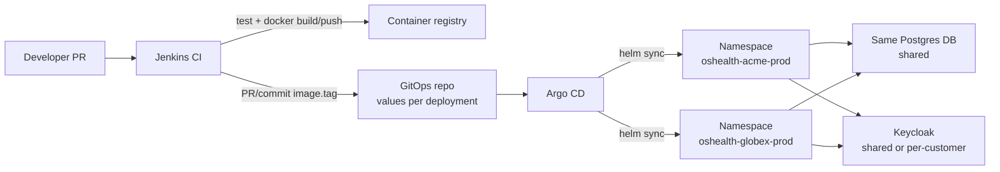

# GitOps Deployment Plan (Helm + Jenkins + Argo CD)

> **Purpose.** A phased plan to take today’s hand-edited `k8s/base` manifests
> to a multi-customer, multi-deployment delivery model: **one Helm chart**,
> **Jenkins for CI** (build/test/push), **Argo CD for CD** (GitOps sync).
>
> **Audience.** Platform / app owners who will run many customer environments,
> each with one or more isolated app deployments (`DEPLOYMENT_ID`).
>
> **Companions.** [`k8s/README.md`](../k8s/README.md) ·
> [`KEYCLOAK_SETUP.md`](KEYCLOAK_SETUP.md) ·
> [`AZURE_AKS_PRODUCTION_TEST_PLAN.md`](AZURE_AKS_PRODUCTION_TEST_PLAN.md) ·
> [`AWS_EKS_PRODUCTION_TEST_PLAN.md`](AWS_EKS_PRODUCTION_TEST_PLAN.md)

---

## Table of contents

1. [Goals and non-goals](#1-goals-and-non-goals)
2. [Target architecture](#2-target-architecture)
3. [How this maps to the app](#3-how-this-maps-to-the-app)
4. [Repository layout](#4-repository-layout)
5. [Helm chart (from today’s manifests)](#5-helm-chart-from-todays-manifests)
6. [Secrets](#6-secrets)
7. [Jenkins (CI only)](#7-jenkins-ci-only)
8. [Argo CD (CD only)](#8-argo-cd-cd-only)
9. [Phased implementation](#9-phased-implementation)
10. [Day-2 operations](#10-day-2-operations)
11. [Acceptance checklist](#11-acceptance-checklist)
12. [What stays as-is for now](#12-what-stays-as-is-for-now)

---

## 1. Goals and non-goals

### Goals

- Onboard a new customer deployment by adding **values + secrets**, not by
  editing shared YAML in this app repo.
- One container image promoted by **tag**; many clusters/namespaces consume it.
- Clear split: **Jenkins builds**, **Argo CD deploys** (no double-apply).
- Preserve app isolation at the **Kubernetes** layer: one release ↔ one
  namespace ↔ one `DEPLOYMENT_ID`. **Postgres is shared** (same database for
  deployments). **Keycloak may be shared or separate** per customer — set
  via values. See §3 for what that implies for Lookup Data.

### Non-goals (this plan)

- Replacing docker-compose / minikube for local developer loops.
- Building a full SaaS control plane UI (provisioning API can come later).
- Multi-replica app pods (PVC is ReadWriteOnce; Draft/Publish assumes one
  writer — keep `replicas: 1` until that constraint is redesigned).

---

## 2. Target architecture



**Legend**

| Label | Meaning |
|---|---|
| **Namespace** | Kubernetes isolation bucket for one app install (pods, Secret, PVC, Ingress). Each deployment gets its **own** namespace. |
| **Same Postgres DB** | All deployments use the **same** database (`DATABASE_URL` points at one shared DB). Drafts/users stay separated by `DEPLOYMENT_ID`; **published Lookup Data is shared** (see §3). |
| **Keycloak** | **Optional:** one shared Keycloak (same or different realms), **or** a different Keycloak per customer. Each deployment only needs the right `KEYCLOAK_ISSUER_URL` in its values. |

| Component | Owns |
|---|---|
| **App repo** (`OS-Health-Check`) | Source, Dockerfile, Helm chart, unit tests |
| **GitOps repo** (new, private) | Per-deployment `values.yaml`, Argo `Application` / ApplicationSet |
| **Jenkins** | CI: lint/test, build `linux/amd64` image, push, bump gitops tag |
| **Argo CD** | CD: sync chart + values into the right cluster/namespace |
| **Secret store** | `DATABASE_URL` / API keys (External Secrets, Sealed Secrets, or vault) |

**Rule:** Jenkins must **not** run `kubectl apply` / `helm upgrade` against
environments that Argo manages. If both write the same app, they fight.

---

## 3. How this maps to the app

| App concept | Ops concept |
|---|---|
| `DEPLOYMENT_ID` | Unique string per release (e.g. `acme-prod`) — set in values |
| `KEYCLOAK_ISSUER_URL` | **Shared or different** Keycloak — whatever that deployment should use ([`KEYCLOAK_SETUP.md`](KEYCLOAK_SETUP.md) §1) |
| `DATABASE_URL` | **Same shared database** for deployments (one Postgres DB; Secrets may still be per-namespace copies of the same URL) |
| Ingress hostname | Per deployment (e.g. `oshealth.acme.example.com`) |
| Image | Same chart; `image.tag` promoted per env |

**Isolation default:** one Argo Application → one namespace → one Deployment →
one PVC → one `DEPLOYMENT_ID`. Postgres DB is **shared**. Keycloak is
**whichever issuer you configure** per values.

### What shared DB isolates (and what it does not)

| Data | Scoped by `DEPLOYMENT_ID`? | With **same** DB + `lookup` schema |
|---|---|---|
| IAM users / drafts | Yes | Isolated per deployment |
| **Published Lookup Data** (`rows`/`evidence` source=`data`) | **No** | **Shared** — every deployment sees the same published table; Publish from any deployment updates that one dataset |

That matches “Keycloak flexible, DB same”: fine if deployments are meant to
share one Lookup Data (or are only separated for auth/drafts/UI hosts). If
you later need **per-customer published Data**, you must split databases
(or add schema-per-deployment support) — today’s app does not isolate Data
by `DEPLOYMENT_ID`.

---

## 4. Repository layout

### 4.1 App repo (this repository)

```text
OS-Health-Check/
  charts/os-health-check/          # NEW — Helm chart
    Chart.yaml
    values.yaml                    # safe defaults / placeholders
    templates/
      namespace.yaml               # optional if Argo creates NS
      configmap.yaml
      deployment.yaml
      service.yaml
      pvc.yaml
      ingress.yaml
      secret.yaml                  # only if using sealed-secret template
      _helpers.tpl
  k8s/                             # keep during migration (minikube + manual)
    base/
    overlays/minikube/
  docs/GITOPS_DEPLOYMENT_PLAN.md   # this file
```

### 4.2 GitOps repo (new)

```text
os-health-gitops/                  # private
  apps/
    acme-prod/
      values.yaml
    acme-staging/
      values.yaml
    globex-prod/
      values.yaml
  argocd/
    projects/os-health.yaml        # optional AppProject
    applicationset.yaml            # generates one Application per apps/*
    # or applications/*.yaml for the first few envs
  README.md
```

Example `apps/acme-prod/values.yaml`:

```yaml
deploymentId: acme-prod

image:
  repository: docker.io/YOUR_ORG/os-health-check
  tag: "1.4.2"          # bumped by Jenkins on promote
  pullPolicy: IfNotPresent

ingress:
  enabled: true
  host: oshealth.acme.example.com
  className: nginx
  clusterIssuer: letsencrypt-prod
  tlsSecretName: os-health-check-tls

keycloak:
  issuerUrl: https://keycloak.example.com/realms/acme-prod
  audience: os-health-check-web
  publisherRole: lookup-publisher

# Secret is referenced, not embedded:
# externalSecret / sealedSecret / manual Secret name:
existingSecret: os-health-check-secrets
```

---

## 5. Helm chart (from today’s manifests)

Convert [`k8s/base`](../k8s/base) into templates. Values replace the fields
people currently edit by hand:

| Today (edit in base) | Chart value |
|---|---|
| `configmap.yaml` → `DEPLOYMENT_ID` | `.Values.deploymentId` |
| `KEYCLOAK_*` | `.Values.keycloak.*` |
| `deployment.yaml` → `image:` | `.Values.image.*` |
| `ingress.yaml` hosts | `.Values.ingress.host` |
| Namespace name | `.Values.namespace` or release namespace |

**Keep fixed in chart defaults:**

- `replicas: 1`, `strategy: Recreate`
- Service `ClusterIP`, port 80 → 8000
- PVC size / accessMode (ReadWriteOnce)
- Ingress annotations (`proxy-body-size: 50m`, ssl-redirect false until cert Ready — or document the post-cert annotate step)

**Optional chart flags:**

- `ingress.enabled` (false for odd internal-only envs)
- `persistence.enabled` (almost always true)

Minikube stays on Kustomize overlay or a `values-minikube.yaml` with
`ingress.enabled: false` and a local image — do not force Argo for laptops.

---

## 6. Secrets

Never commit real `DATABASE_URL` or AI keys.

| Approach | When |
|---|---|
| **Manual Secret** (current) | First 1–2 envs while learning Argo |
| **Sealed Secrets** | GitOps-friendly; encrypt per cluster |
| **External Secrets Operator** | Org already has Vault / AWS SM / Azure Key Vault |
| **SOPS + KSOPS** | If that’s the org standard with Argo |

Secret keys must match what the Deployment already expects
(see [`k8s/secret.example.yaml`](../k8s/secret.example.yaml)):

- `DATABASE_URL` (required)
- `OPENAI_API_KEY` / `GEMINI_API_KEY` / `OPENROUTER_API_KEY` (optional)

Chart should mount `envFrom.secretRef` to `.Values.existingSecret` (default
`os-health-check-secrets`).

---

## 7. Jenkins (CI only)

### Pipeline stages (suggested)

1. Checkout app repo  
2. Install deps / run unit tests (where `DATABASE_URL` available for DB tests)  
3. `docker build --platform linux/amd64 -t $REGISTRY/os-health-check:$GIT_SHA`  
4. Push image (`$GIT_SHA` and optionally semver tag on release branches)  
5. **Promote (CD trigger):** commit to gitops repo  
   `apps/<env>/values.yaml` → `image.tag: $GIT_SHA` (or release version)  
6. Argo picks up the commit (auto-sync or manual sync per project policy)

### Branch policy (example)

| Branch / event | Jenkins action |
|---|---|
| PR | test + build (no push, or push `:pr-N` only) |
| `main` | push `:sha`, update **staging** gitops values |
| Tag `v*` / release job | push `:1.4.2`, update **prod** gitops values (PR + approval) |

### Do not

- `helm upgrade` from Jenkins into Argo-managed namespaces  
- Bake customer hostnames into the image  

---

## 8. Argo CD (CD only)

### First environments (manual Applications)

One `Application` per deployment pointing at:

- **Source 1 (or Helm path):** chart in app repo `charts/os-health-check`  
- **Value files:** gitops `apps/<name>/values.yaml`  
- **Destination:** cluster + namespace `oshealth-<name>`

### At scale (ApplicationSet)

Generate apps from folders under `apps/`:

```yaml
# Illustrative — adjust to org ApplicationSet CRD version
apiVersion: argoproj.io/v1alpha1
kind: ApplicationSet
metadata:
  name: os-health-deployments
  namespace: argocd
spec:
  generators:
    - git:
        repoURL: https://github.com/YOUR_ORG/os-health-gitops.git
        revision: main
        directories:
          - path: apps/*
  template:
    metadata:
      name: 'oshealth-{{path.basename}}'
    spec:
      project: os-health
      source:
        repoURL: https://github.com/YOUR_ORG/OS-Health-Check.git
        targetRevision: main
        path: charts/os-health-check
        helm:
          valueFiles:
            # Multi-source or ref pattern per org standard:
            # often: second source = gitops repo with values
            - $values/apps/{{path.basename}}/values.yaml
      destination:
        server: https://kubernetes.default.svc
        namespace: 'oshealth-{{path.basename}}'
      syncPolicy:
        automated:
          prune: true
          selfHeal: true
        syncOptions:
          - CreateNamespace=true
```

Exact multi-source / `$values` syntax depends on your Argo CD version —
follow the org’s existing ApplicationSet examples and mirror them.

### Sync policy

- **Staging:** auto-sync + self-heal  
- **Prod:** auto-sync after merge, or manual sync with RBAC approval  
- **Ignore differences:** only if cert-manager / LB annotations must drift;
  prefer fixing the chart over ignore rules

---

## 9. Phased implementation

### Phase 0 — Decide conventions (½ day)

- [ ] Naming: `oshealth-<customer>-<env>` namespaces and Argo app names  
- [ ] Registry and image name  
- [ ] Keycloak topology (shared realm vs realm-per-deployment)  
- [ ] Secret approach (manual → External Secrets path)  
- [ ] Which clusters Argo manages (AKS / EKS / both)

### Phase 1 — Helm chart in app repo (1–2 days)

- [ ] Add `charts/os-health-check` templated from `k8s/base`  
- [ ] `helm template` / `helm lint` locally  
- [ ] Install once onto a **throwaway** namespace (still can use
      `kubectl`/helm manually — before Argo owns it)  
- [ ] Document values in chart `README` or `values.yaml` comments  
- [ ] Keep `k8s/overlays/minikube` working unchanged

### Phase 2 — GitOps repo + first Argo Application (1–2 days)

- [ ] Create private `os-health-gitops`  
- [ ] Add `apps/lab-prodtest/values.yaml` (copy from current AKS settings)  
- [ ] Register Argo `Application` for lab  
- [ ] Create Secret in namespace (manual or sealed)  
- [ ] Sync; verify login + Edit Draft + Publish on the existing test host  
- [ ] Stop editing `k8s/base` for that environment

### Phase 3 — Jenkins CI wiring (1–3 days)

- [ ] Job: test + build + push on `main`  
- [ ] Job/step: update gitops `image.tag` (bot commit or PR)  
- [ ] Confirm Argo rolls the Deployment after tag bump  
- [ ] Ensure Jenkins has **no** deploy credentials to prod kube API
      (only registry + gitops git)

### Phase 4 — Second customer / ApplicationSet (1–2 days)

- [ ] Add `apps/<customer>-prod/values.yaml`  
- [ ] Introduce ApplicationSet **or** second manual Application  
- [ ] Shared Postgres DB Secret + DNS + Keycloak issuer (shared or dedicated) + client redirects
- [ ] Dry-run onboarding checklist (below)

### Phase 5 — Harden (ongoing)

- [ ] External Secrets / Sealed Secrets for all envs  
- [ ] Argo AppProject RBAC (who can sync prod)  
- [ ] Image provenance / cosign if org requires  
- [ ] Delete or archive obsolete hand-applied resources in lab namespaces  
- [ ] Optionally retire cloud edits to `k8s/base`; leave base as
      placeholders + minikube overlay only

---

## 10. Day-2 operations

### Onboard a new deployment

1. Confirm shared Postgres is reachable; create Secret with the shared `DATABASE_URL`  
2. DNS for app hostname; Keycloak client redirect URIs / Web origins  
3. Add `apps/<name>/values.yaml` in gitops (PR)  
4. Create Secret `os-health-check-secrets` in target namespace  
5. Argo Application appears (ApplicationSet) or is applied  
6. Sync; wait for Certificate Ready; enable ssl-redirect if still using
   the same cert-manager pattern as the Azure/AWS test plans  
7. Smoke: login → Lookup Data → Edit Draft → Publish (publisher role)

### Promote a build

1. Merge app change → Jenkins builds `:sha` / release tag  
2. Jenkins updates gitops values (staging auto; prod via PR)  
3. Argo syncs; pod restarts with new image  
4. Smoke the same path on that environment

### Rollback

- Revert the gitops commit that bumped `image.tag` (preferred), **or**  
- Argo UI → History → Rollback  
- Do **not** “hotfix” by editing the live Deployment in the cluster if
  self-heal is on (Argo will overwrite)

### Tear down a customer

1. Delete / disable Argo Application (prune)  
2. Delete namespace (PVC data gone)  
3. Remove DNS + Keycloak client/realm as needed (do **not** drop the shared DB
   unless retiring the whole product)  
4. Remove `apps/<name>/` from gitops  

---

## 11. Acceptance checklist

### Lab / first GitOps env

- [ ] `helm template` matches intent of current `k8s/base`  
- [ ] Argo app Healthy + Synced  
- [ ] ConfigMap shows correct `DEPLOYMENT_ID` and issuer (no leftover
      frostgate values hard-coded in chart defaults)  
- [ ] Ingress host + TLS work; Keycloak login works  
- [ ] Draft save and Publish work (~5k rows acceptable latency)  
- [ ] Image tag bump in gitops alone rolls the app (no Jenkins kubectl)

### Multi-deployment

- [ ] Two namespaces with different `DEPLOYMENT_ID` do not share drafts  
- [ ] Wrong issuer / redirect fails closed (auth errors, not silent mix)  
- [ ] Onboarding a third deployment is “values + secret + DNS” only  

### Org fit

- [ ] Jenkins has no prod cluster deploy role  
- [ ] Argo is the only writer for managed apps  
- [ ] Secrets are not plaintext in git  

---

## 12. What stays as-is for now

| Keep | Why |
|---|---|
| `docker compose` | Local day-to-day + Keycloak bundle |
| `k8s/overlays/minikube` | Laptop Kubernetes without Argo |
| Azure/AWS **production test plans** | Still valid for first cluster bootstrap (ingress-nginx, cert-manager, Postgres, DNS) |
| Manual `kubectl` Secret create | Until Sealed/External Secrets land |

GitOps does **not** replace those bootstrap steps; it replaces **repeating**
hand-edited ConfigMap / Ingress / image fields for every customer.

---

## Summary

1. **Chart** the app once.  
2. **Values** per customer deployment in a private gitops repo.  
3. **Jenkins** builds and bumps tags in git.  
4. **Argo CD** syncs clusters.  
5. **One namespace + one `DEPLOYMENT_ID` + Secret** per deployment; **same
   Postgres DB**; Keycloak **shared or different** per values.

That is the full implementation path from today’s `k8s/base` edits to a
scalable multi-customer delivery model.
